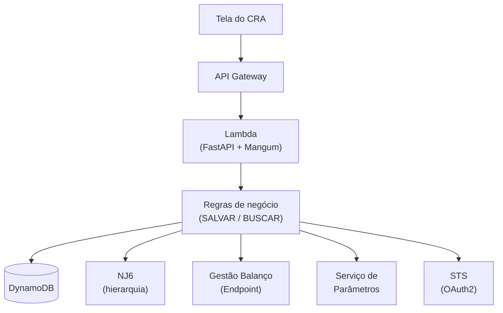

# Faturamento IRB/CV4

Lambda FastAPI (via Mangum) que serve dois fluxos de faturamento —
**SALVAR** e **BUSCAR** — para a tela de faturamento do CRA, dentro do
domínio de conglomerados/subgrupos econômicos do Itaú.

> ⚠ **Proveniência deste repositório**: todo o código aqui foi reconstruído
> por agentes de IA a partir de frames de um vídeo de gravação de tela (ver
> [`RECONSTRUCAO.md`](RECONSTRUCAO.md) para a metodologia completa e os gaps
> honestamente documentados). Não é um snapshot orgânico de produção — trate
> como tal. Uma avaliação de código detalhada, incluindo bugs que impedem o
> funcionamento no estado atual, está em
> [`docs/AVALIACAO.md`](docs/AVALIACAO.md).

## Visão geral da arquitetura

Arquitetura hexagonal: `api` (HTTP) → `domain` (regras de negócio puras) →
`adapters` (DynamoDB + integrações HTTP) → `core` (config/logging/retry). O
domínio não depende de framework nem de I/O — define `Protocol`s que os
adapters implementam.



Detalhe completo (todos os módulos, modelo de dados, classes de domínio,
infraestrutura inferida) em [`docs/ARQUITETURA.md`](docs/ARQUITETURA.md).

## Principais fluxos

- **SALVAR** (`POST /faturamento/{documento}`): valida faixa/moeda, roda um
  *gate* de divergência contra o valor já salvo, persiste no DynamoDB.
- **BUSCAR** (`GET /faturamento/{documento}`, `GET /conglomerados/{documento}/
  subgrupos`): *read-through* — combina o que já está salvo com o Endpoint
  de Faturamento, aplicando as regras de negócio R1/R2/R3.
- **BUSCAR GRUPOS** (`GET /grupos-economicos?documento=`): busca "like" no
  NJ6 (documento parcial) — devolve os grupos econômicos candidatos (cabeça +
  subgrupos, sem faturamento nenhum). É o passo de autocomplete que alimenta a
  tela antes do analista escolher o documento exato e cair no fluxo BUSCAR
  acima.

Diagramas de sequência de cada fluxo (+ autenticação OAuth2 + cascata R1/R2/R3)
em [`docs/FLUXOS.md`](docs/FLUXOS.md).

## Como rodar localmente

Ver [`SETUP.md`](SETUP.md) para o passo a passo completo (stack de mocks via
`docker-compose`, variáveis de ambiente, comandos de smoke test).

## Status do projeto

Todos os bugs críticos e as recomendações de melhoria da avaliação de código
**já foram corrigidos** — a Lambda importa e sobe normalmente
(`from app.main import app, handler`), o domínio BUSCAR foi dividido em
módulos menores (`service_buscar.py` + `paginacao.py` +
`resolucao_marcador.py`), a cascata R1/R2/R3 tem uma única fonte de verdade,
CPF/CNPJ é mascarado nos logs, e `ruff`/`black` estão configurados e
aplicados em todo o código. O único item não corrigido é uma pendência de
negócio (confirmar com o time do Endpoint a polaridade de um campo — não é
algo que se resolve só no código). Detalhe completo, item a item, está em
[`docs/AVALIACAO.md`](docs/AVALIACAO.md).

## Qualidade de código

```bash
cd app
pip install -r requirements-tests.txt
ruff check --config pyproject.toml src tests features
black --config pyproject.toml --check src tests features
```

`.pre-commit-config.yaml` (na raiz) roda os dois automaticamente nos commits
(`pip install pre-commit && pre-commit install`, a partir da raiz do repo).

## Testes

- **Unitários (pytest, 288 testes, 99% de cobertura de linha em `app/src/app`)**,
  cobrindo domínio, adapters (HTTP/DynamoDB, com dublês de rede/banco em
  `tests/http_fakes.py`/`tests/dynamo_fakes.py`), API (rotas via
  `fastapi.testclient.TestClient`) e `core`:
  ```bash
  cd app
  pip install -r requirements-tests.txt
  pytest tests/unit --cov=app --cov-report=term-missing
  ```
- **Aceitação/BDD de domínio (behave, Gherkin)**, cobrindo os fluxos de SALVAR
  e BUSCAR chamando o domínio direto (fakes em memória, sem HTTP) em
  `app/features/*.feature`:
  ```bash
  cd app
  behave features
  ```
- **TAAC (behave, Gherkin, `tests/` na raiz)** — testes de aceitação que fazem
  requisições HTTP **reais** contra a API de um ambiente (nunca mock, nunca
  domínio direto). Roda contra a stack local (`docker-compose`) ou contra
  DEV/HML de verdade, via variável de ambiente; **nunca roda em produção**
  (trava em `tests/features/environment.py`):
  ```bash
  pip install -r tests/requirements.txt
  TAAC_BASE_URL=http://localhost:8001 TAAC_AMBIENTE=dev behave tests/features
  ```

## Estrutura de pastas

```
app/
  src/app/
    main.py       # entrypoint da Lambda (FastAPI + Mangum)
    api/          # rotas HTTP, DTOs (Pydantic), injeção de dependência, mapeamento de erro
    domain/       # regras de negócio puras (SALVAR, BUSCAR, eleição R1/R2/R3, divergência)
    adapters/     # DynamoDB, HTTP para NJ6/Endpoint/Parâmetros, OAuth2
    core/         # settings, logging estruturado, retry, OAuth2Manager
  tests/          # testes unitários (pytest) + fakes/dublês compartilhados
  features/       # testes de aceitação/BDD (behave, Gherkin) — domínio direto, sem HTTP
mocks/          # stack local de mocks (NJ6/Endpoint/Parâmetros/STS + DynamoDB local)
tests/          # TAAC (behave, Gherkin) — HTTP real contra a API de um ambiente (nunca mock)
docs/           # esta documentação (arquitetura, fluxos, avaliação de código)
```

## Links

| Documento | Conteúdo |
|---|---|
| [`SETUP.md`](SETUP.md) | Como rodar localmente (mocks + DynamoDB local) |
| [`RECONSTRUCAO.md`](RECONSTRUCAO.md) | Como este repositório foi reconstruído e seus gaps conhecidos |
| [`docs/ARQUITETURA.md`](docs/ARQUITETURA.md) | Componentes, classes de domínio, modelo de dados, infraestrutura |
| [`docs/FLUXOS.md`](docs/FLUXOS.md) | Sequências SALVAR/BUSCAR, autenticação OAuth2, cascata R1/R2/R3 |
| [`docs/AVALIACAO.md`](docs/AVALIACAO.md) | Avaliação de código: pontos fortes, bugs críticos, recomendações |
