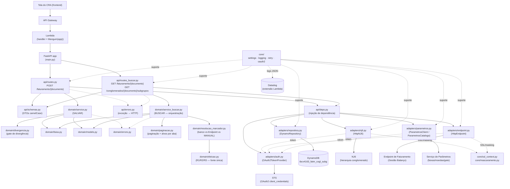
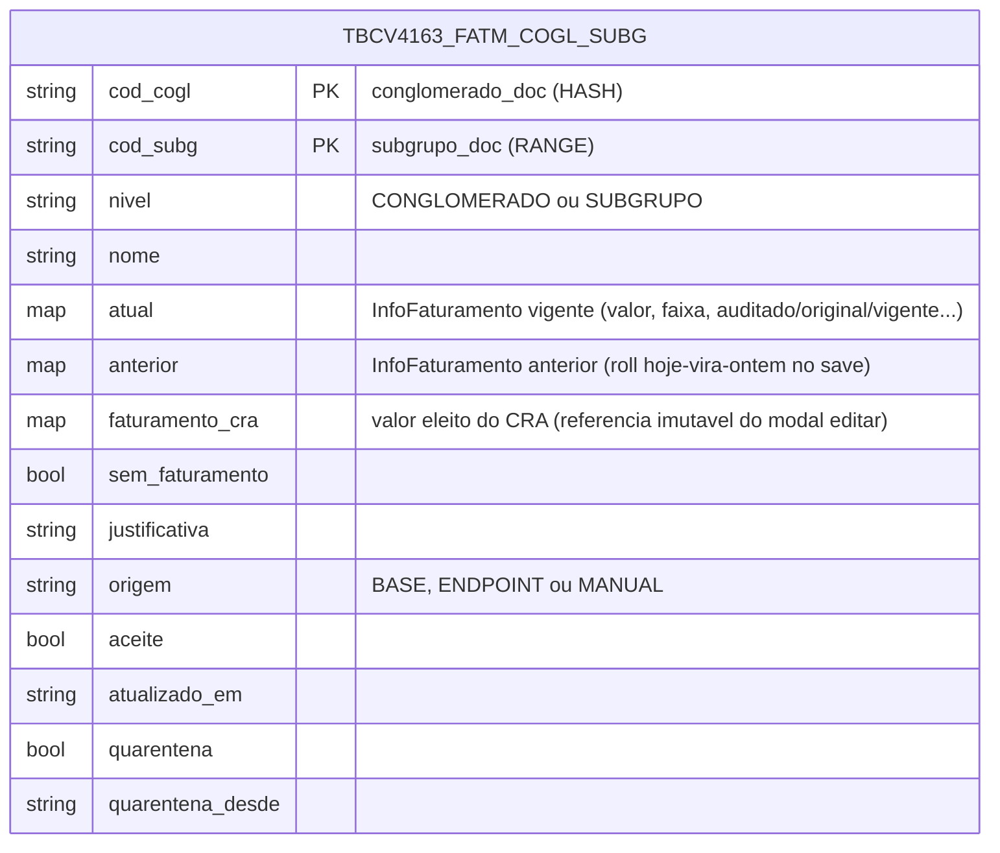

# Arquitetura — Faturamento IRB/CV4

## 1. Visão geral hexagonal

O serviço segue uma arquitetura hexagonal (ports & adapters) em 4 camadas,
todas dentro de `app/src/app/`:

```
api/      → transporte HTTP (FastAPI): rotas, DTOs (Pydantic), DI, mapeamento de erro
domain/   → regras de negócio puras (dataclasses + Protocol), sem dependência de framework/IO
adapters/ → implementações concretas dos Protocols do domínio (DynamoDB, HTTP externo)
core/     → infraestrutura transversal: settings, logging, retry, OAuth2
```

A direção de dependência é sempre de fora para dentro: `api` depende de
`domain`, `domain` **não depende de nada** fora de si mesmo (nem `boto3`,
nem FastAPI, nem nenhuma biblioteca HTTP), e `adapters` depende de `domain`
só para implementar os `Protocol`s que ele define. Isso é o que permite
trocar DynamoDB por outro banco, ou o Endpoint por outro provedor, sem tocar
em uma linha de regra de negócio.

Dentro de `domain/`, o fluxo BUSCAR é dividido em três módulos por
responsabilidade (ver `docs/AVALIACAO.md` §7): `service_buscar.py`
(orquestração do fluxo), `paginacao.py` (paginação/cursor + seleção de
alvos por aba) e `resolucao_marcador.py` (banco vs. Endpoint vs. MANUAL,
incluindo a validação R1/R2/R3 do registro salvo).

## 2. Diagrama de componentes



## 3. Diagrama de classes de domínio

Escopo: apenas `domain/models.py` e os `Protocol`s que `domain/service.py` e
`domain/service_buscar.py` definem para seus adapters. Os adapters concretos
não são repetidos aqui (já estão no diagrama de componentes) — só as setas de
realização, para deixar visível a inversão de dependência.

> Nota: `service.py` e `service_buscar.py` definem, **cada um**, um
> `Protocol` chamado `Repositorio` — mas com métodos diferentes (o do SALVAR
> tem `get_subgrupo`/`save`; o do BUSCAR só tem `get_conglomerado`). São dois
> tipos distintos que por acaso têm o mesmo nome; `DynamoRepository`
> satisfaz os dois por duck typing, já que implementa os três métodos.

```mermaid
classDiagram
    class Nivel {
        <<enum>>
        CONGLOMERADO
        SUBGRUPO
    }
    class Origem {
        <<enum>>
        BASE
        ENDPOINT
        MANUAL
    }
    class InfoFaturamento {
        +Decimal valor
        +str faixa_codigo
        +str faixa_descricao
        +str data_ref_balanco
        +str moeda
        +str unidade
        +str id_spread
        +str sistema_origem
        +str racf
        +bool auditado
        +bool original
        +bool vigente
        +str data_atualizacao
        +vazio: bool
    }
    class MarcadorFaturamento {
        +str conglomerado_doc
        +str subgrupo_doc
        +Nivel nivel
        +str nome
        +InfoFaturamento atual
        +InfoFaturamento anterior
        +Origem origem
        +bool aceite
        +InfoFaturamento faturamento_cra
        +bool sem_faturamento
        +bool quarentena
        +bool faturamento_modificado
        +e_matriz: bool
    }
    class Paginacao {
        +int limit
        +int total
        +int offset
        +str proximo_cursor
        +tem_mais: bool
    }
    class Faturamento {
        +str conglomerado_doc
        +str nome_grupo_economico
        +str segmento
        +list~MarcadorFaturamento~ marcadores
        +Paginacao paginacao
    }
    class Pessoa {
        +str codigo_identificacao_pessoa
        +str documento_raiz
        +str codigo_tipo_pessoa
    }
    class Subgrupo {
        +str nome_subgrupo
        +str cabeca_documento_raiz
        +list~Pessoa~ participantes
    }
    class Conglomerado {
        +str nome_grupo_economico
        +str cabeca_documento_raiz
        +list~Subgrupo~ subgrupos
    }

    MarcadorFaturamento "1" *-- "1" InfoFaturamento : atual
    MarcadorFaturamento "1" *-- "0..1" InfoFaturamento : anterior/faturamento_cra
    MarcadorFaturamento --> Nivel
    MarcadorFaturamento --> Origem
    Faturamento "1" *-- "0..*" MarcadorFaturamento : marcadores
    Faturamento "1" o-- "0..1" Paginacao
    Conglomerado "1" *-- "0..*" Subgrupo : subgrupos
    Subgrupo "1" *-- "0..*" Pessoa : participantes

    class RepositorioSalvar {
        <<Protocol>>
        +get_subgrupo(cong, sub) MarcadorFaturamento
        +save(f: Faturamento) None
    }
    class RepositorioBuscar {
        <<Protocol>>
        +get_conglomerado(cong) list~MarcadorFaturamento~
    }
    class NJ6Protocol {
        <<Protocol>>
        +get_por_documento(documento) Conglomerado
    }
    class EndpointProtocol {
        <<Protocol>>
        +buscar(documento_raiz, asof) ResultadoFaturamento
    }
    class CatalogoProtocol {
        <<Protocol>>
        +obter() dict
    }
    class TokenProvider {
        <<Protocol>>
        +get_token() str
        +auth_headers() dict
    }

    class DynamoRepository {
        +get_subgrupo(cong, sub)
        +get_conglomerado(cong)
        +save(f)
    }
    class HttpNJ6 {
        +get_por_documento(documento)
    }
    class HttpEndpoint {
        +buscar(documento_raiz, asof)
    }
    class ParametrosClient {
        +obter() dict
    }
    class ParametrosCatalogo {
        +obter() dict
    }
    class OAuth2TokenProvider {
        +get_token() str
        +auth_headers() dict
    }

    DynamoRepository ..|> RepositorioSalvar
    DynamoRepository ..|> RepositorioBuscar
    HttpNJ6 ..|> NJ6Protocol
    HttpEndpoint ..|> EndpointProtocol
    ParametrosClient ..|> CatalogoProtocol
    ParametrosCatalogo ..|> CatalogoProtocol
    OAuth2TokenProvider ..|> TokenProvider
```



## 4. Modelo de dados (DynamoDB)

Tabela única `tbcv4163_fatm_cogl_subg` — desenho single-table típico de
DynamoDB: **não há chaves estrangeiras**, "relações" aqui significam padrões
de acesso (query por `cod_cogl` traz todos os subgrupos de um conglomerado).
Um item por par (conglomerado, subgrupo); `save()` é um upsert incremental
que nunca apaga um subgrupo ausente do payload, e faz o "roll" do valor
`atual` de hoje para `anterior` a cada gravação.



## 5. Integrações externas

| Serviço | Propósito | Protocolo/cliente | Autenticação |
|---|---|---|---|
| **DynamoDB** (`tbcv4163_fatm_cogl_subg`) | Persistência de marcadores de faturamento (leitura e escrita) | `boto3` (`adapters/repository.py`) | IAM (role da Lambda) |
| **NJ6** | Resolve conglomerado → subgrupos → integrantes a partir do documento (CPF/CNPJ/CGI) | HTTP via `urllib` (`adapters/nj6.py`) | Bearer JWT (OAuth2 client-credentials) + `x-itau-apikey` + `x-itau-correlationid` |
| **Endpoint de Faturamento / Gestão Balanço** | Fornece as análises cruas de balanço; a eleição R1/R2/R3 é regra própria deste serviço (`domain/eleicao.py`), não do Endpoint | HTTP via `urllib` (`adapters/endpoint.py`) | Idem NJ6 |
| **Serviço de Parâmetros** | Faixas de valor, moedas aceitas e configuração do gate de divergência (SALVAR) / catálogo de rótulos (BUSCAR) | HTTP via `urllib`, cache em memória com TTL (`adapters/parametros.py`) | Idem NJ6 |
| **STS (OAuth2 client-credentials)** | Emite o token Bearer usado pelos 3 adapters acima | `core/oauth2.py::OAuth2Manager`, token cacheado em memória (renovado 60s antes de expirar) | `client_id`/`client_secret` (via env, injetados pelo Terraform a partir do Secrets Manager em produção) |
| **Datadog** | Coleta os logs JSON estruturados do stdout | Extensão/forwarder Lambda (fora deste repo) | — |

## 6. Infraestrutura (inferida — não presente no repositório)

**Nenhum arquivo de IaC existe neste repositório** (sem `template.yaml`,
`serverless.yml`, CDK ou `.tf`). O que existe (`docker-compose.yml`) é
**apenas o stack de mocks para desenvolvimento local**, não infraestrutura
real. A seção abaixo é **inferência** a partir de comentários no código
(`core/settings.py`, `core/oauth2.py`), não fato confirmado do repositório:

- **API Gateway** na frente da Lambda (o handler usa `Mangum`, feito
  especificamente para eventos de proxy do API Gateway/ALB).
- **AWS Lambda** rodando este código, com runtime Python.
- **Terraform** provisionando a infraestrutura e injetando `AUTH_CLIENT_ID`/
  `AUTH_CLIENT_SECRET` como variáveis de ambiente a partir do **Secrets
  Manager** (comentário explícito em `core/settings.py`).
- **Lambda Layer** fornecendo um CA bundle customizado em `/opt/ca_bundle.crt`
  ou `/opt/certs/ca_bundle.crt` (`core/oauth2.py::_get_ssl_context`,
  `core/ssl_context.py::criar_contexto_ssl` — compartilhado por
  `nj6.py`/`endpoint.py`).
- **Extensão/forwarder do Datadog** coletando os logs JSON do stdout.

## 7. Convenções e padrões

- **Inversão de dependência via `Protocol`** (não ABC/herança): domínio
  define a interface, adapters a satisfazem por duck typing — permite trocar
  implementação sem o domínio saber.
- **Erros de domínio → HTTP num único lugar** (`api/errors.py`), usando a
  resolução por MRO de exceção do FastAPI.
- **Logging estruturado com convenção explícita**: eventos de negócio
  (`log_event` sem `level`, default `info`) vs. eventos técnicos (`level=
  "debug"`) vs. erros (`logger.exception(..., extra={"ctx": {...}})`); dados
  pessoais (CPF/CNPJ) sempre mascarados via `core/mascaramento.py` antes de
  logar.
- **Configuração 12-factor centralizada**: tudo via variável de ambiente,
  em `core/settings.py` — inclusive os headers customizados do Itaú
  (`itau_api_key`/`itau_correlation_id`/`itau_flow_id`), que antes eram
  lidos direto de `os.environ` nos adapters.
- **Qualidade de código automatizada**: `ruff` + `black` configurados em
  `app/pyproject.toml` (e `.pre-commit-config.yaml` na raiz) — ver
  `docs/AVALIACAO.md` §5.3/§8 para como rodar.
