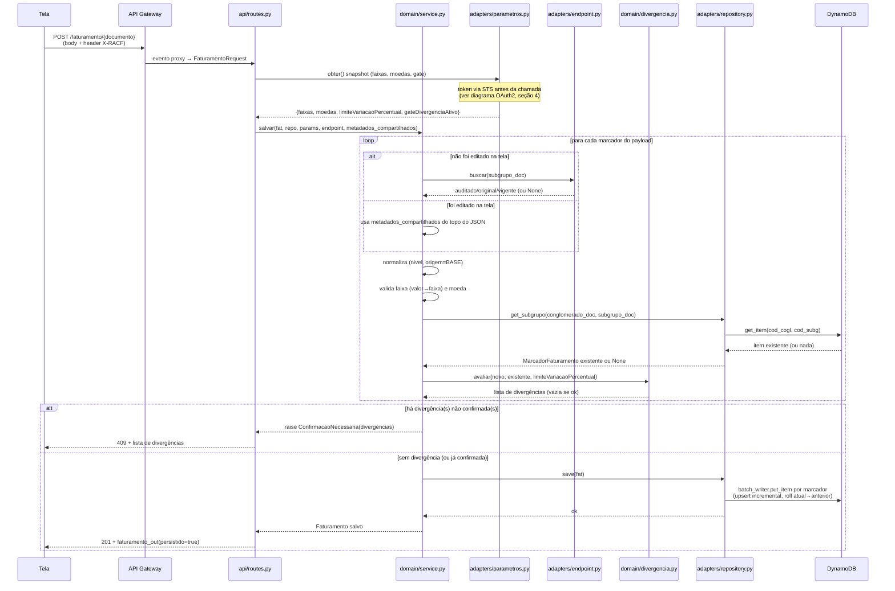
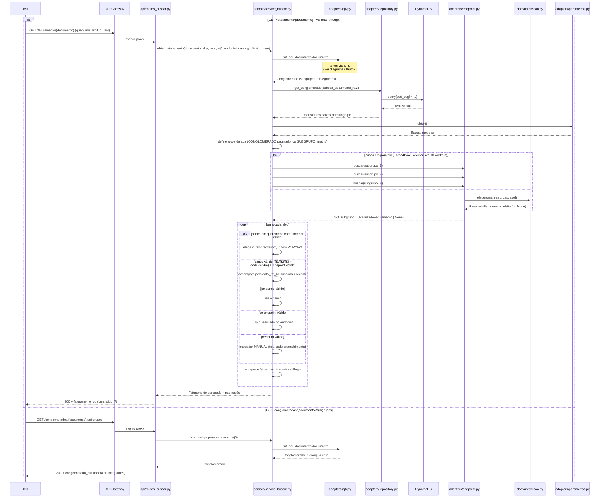
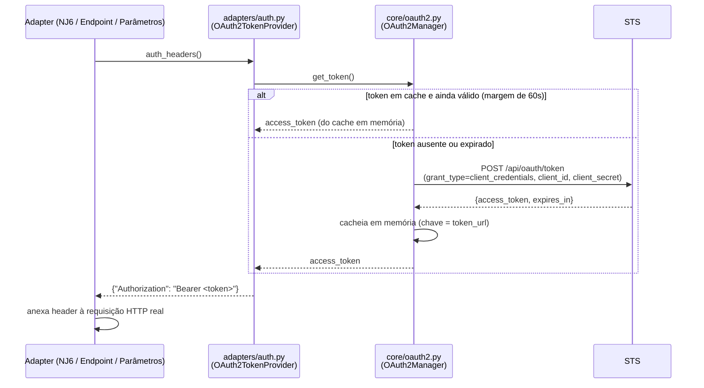
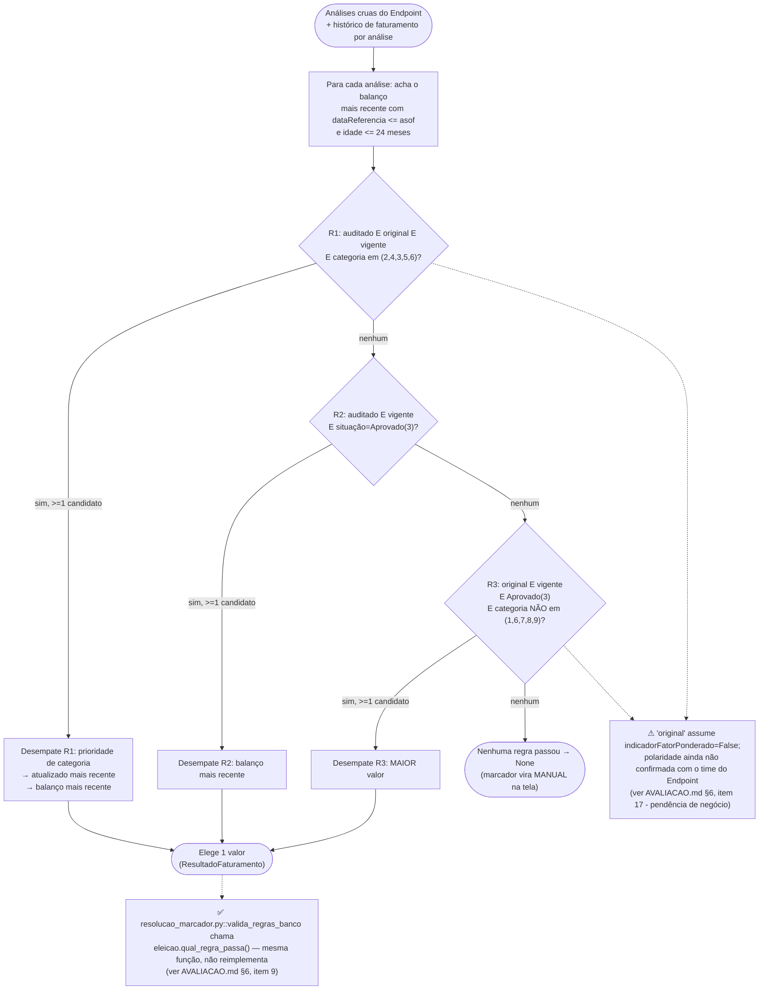

# Fluxos — Faturamento IRB/CV4

> Os bugs que impediam estes fluxos de rodar (ver histórico em
> `docs/AVALIACAO.md` §4) já foram corrigidos e estão cobertos por testes
> (`app/tests/unit/` e `app/features/`). Os diagramas abaixo descrevem o
> comportamento real e atual do código.

## 1. Visão geral dos dois fluxos

Uma única Lambda serve dois caminhos independentes, montados no mesmo app
FastAPI (`/irb-cra-faturamento/v1`):

- **SALVAR** (`POST /faturamento/{documento}`): o analista grava/edita
  valores de faturamento na tela; passa por validação de faixa/moeda e por
  um *gate* de divergência antes de persistir no DynamoDB.
- **BUSCAR** (`GET /faturamento/{documento}`, `GET /conglomerados/{documento}/
  subgrupos`): leitura *read-through* — tenta resolver o melhor valor
  combinando o que já está salvo com o que vem do Endpoint de Faturamento,
  aplicando as regras de negócio R1/R2/R3.

## 2. Fluxo SALVAR

## 3. Fluxo BUSCAR

## 4. Autenticação OAuth2 (STS) — compartilhada pelos 3 adapters HTTP

Genérico: `adapters/nj6.py`, `adapters/endpoint.py` e `adapters/parametros.py`
usam o mesmo `TokenProvider` (injetado via `api/deps.py::get_token_provider`,
singleton por invocação quente da Lambda).

## 5. Cascata de eleição R1 → R2 → R3 (`domain/eleicao.py`)

A primeira regra com pelo menos um candidato elegível vence — não há
combinação entre regras.

## 6. Tratamento de erros (domínio → HTTP)

Mapeamento único, registrado em `api/errors.py::register_exception_handlers`,
resolvido pela MRO da exceção (subclasses de `ErroValidacao` caem no handler
de `ErroValidacao`, preservando `type(e).__name__` na resposta):

| Exceção de domínio | Status HTTP | Quando |
|---|---|---|
| `ConfirmacaoNecessaria` | 409 | Divergência detectada no SALVAR sem confirmação prévia (`confirmado_divergencia=false`) |
| `NaoEncontrado` | 404 | Documento não resolvido no NJ6 |
| `ErroValidacao` (e subclasses, ex. `FaixaObrigatoria`) | 422 | Falha de validação de regra de negócio (faixa, moeda, cursor inválido, etc.) |
| `DominioError` (genérica) | 400 | Erro de domínio não mais específico — logado como aviso, pois "não deveria vazar sem tratamento" |
| `Exception` (não mapeada) | 500 | Qualquer exceção não prevista — logada com stack trace, resposta genérica sem detalhe interno |
