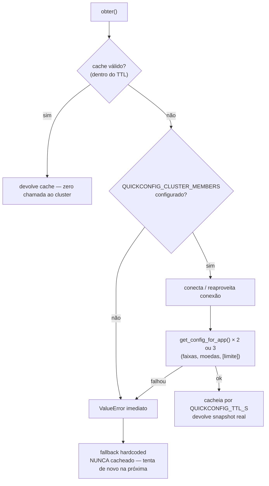

# Serviço de Parâmetros — guia de uso do QuickConfig

> Detalhe técnico regra-a-regra em [`docs/REGRAS.md` §9 (`R-PRM`)](REGRAS.md).
> Este documento é o guia **prático**: o que cada variável faz e em que
> cenário você mexeria nela.

## O que é

`ParametrosClient` (SALVAR) e `ParametrosCatalogo` (BUSCAR), em
`app/src/app/adapters/parametros.py`, buscam faixas de faturamento, moedas
aceitas e o limite de divergência (%) no **QuickConfig** — o serviço de
configuração distribuída interno do Itaú (biblioteca `manager`). Não é uma
API REST: é um cliente que conecta direto num **cluster**.

O gate de divergência está sempre ativo — não existe mais um "liga/desliga"
separado (ver `R-PRM-031`).

## Variáveis de ambiente

| Variável | Controla | Default | Obrigatória? |
|---|---|---|---|
| `QUICKCONFIG_CLUSTER_MEMBERS` | Endereços do cluster QuickConfig, separados por vírgula (`host1:5701,host2:5701`) | `""` (vazio) | Não — vazio = sempre cai no fallback |
| `QUICKCONFIG_APP_NAME` | Nome desta aplicação no QuickConfig (as chaves de config são por app) | `"Faturamento-irb-lambda"` | Não |
| `QUICKCONFIG_TTL_S` | Segundos que o snapshot fica em cache em memória antes de buscar de novo | `300` (5 min) | Não |
| `QUICKCONFIG_KEY_FAIXAS` | Nome da chave, no QuickConfig, que guarda o catálogo de faixas | `"catalogo-faixas"` | Não |
| `QUICKCONFIG_KEY_MOEDAS` | Nome da chave que guarda as moedas aceitas | `"catalogo-moedas"` | Não |
| `QUICKCONFIG_KEY_LIMITE_DIVERGENCIA` | Nome da chave que guarda o limite (%) do gate de divergência | `"limite-Maximo-Divergencia-Porcentagem"` | Não |

Todas têm default seguro — nenhuma **precisa** ser configurada para a Lambda
subir. Sem `QUICKCONFIG_CLUSTER_MEMBERS`, o adapter cai direto no catálogo
hardcoded (6 faixas, BRL/USD, 30% de limite) sem tentar conectar em nada.

## Cenários de uso

### 1. Rodar localmente (padrão, sem tocar em nada)

Não configure `QUICKCONFIG_CLUSTER_MEMBERS`. `_inicializar_servico()` falha
rápido com `ValueError` e o adapter cai no fallback — determinístico, sem
precisar de um cluster de verdade. É o que o `SETUP.md` já assume.

```bash
# .env local: não define QUICKCONFIG_CLUSTER_MEMBERS
uvicorn app.main:app --reload  # SALVAR/BUSCAR usam o catálogo hardcoded
```

### 2. Apontar para um cluster QuickConfig real (DEV/HML/produção)

Configure o cluster de verdade. É o único caso em que essa variável importa.

```bash
QUICKCONFIG_CLUSTER_MEMBERS=quickconfig-dev-1.itau.com.br:5701,quickconfig-dev-2.itau.com.br:5701
QUICKCONFIG_APP_NAME=Faturamento-irb-lambda
```

Isso é o que vai num `testspec-<ambiente>.yml`/Terraform de cada ambiente —
**nunca** hardcoded no código.

### 3. Time de config usa nomes de chave diferentes por ambiente

Se HML usa `catalogo-faixas-hml` em vez de `catalogo-faixas` (por exemplo,
durante uma migração), só a env var muda — sem deploy de código:

```bash
QUICKCONFIG_KEY_FAIXAS=catalogo-faixas-hml
```

### 4. Reduzir o TTL para iterar mais rápido em teste manual/homologação

Se você mudou um valor no QuickConfig e não quer esperar até 5 minutos pra
ver o efeito na Lambda (container quente com cache válido), derruba o TTL:

```bash
QUICKCONFIG_TTL_S=0   # sem cache — cada obter() busca de novo
```

Cuidado: em produção isso significa 1 chamada ao cluster por requisição —
use só para depuração pontual, não deixe assim de forma permanente.

### 5. Testar o comportamento de indisponibilidade de propósito

Aponte `QUICKCONFIG_CLUSTER_MEMBERS` para um endereço que não responde (ou
deixe vazio) e observe: `SALVAR` continua funcionando com o catálogo de
fallback, `gateDivergenciaAtivo=True` e limite 30% — o log
`parametros.indisponivel` (nível `error`) é o sinal de que isso está
acontecendo. Útil para validar que uma queda do QuickConfig não derruba o
fluxo (é exatamente o que `R-PRM-020`/`R-PRM-021` garantem).

### 6. Múltiplas apps compartilhando o mesmo cluster QuickConfig

Se outro time também usa o cluster, `QUICKCONFIG_APP_NAME` isola as chaves —
`get_config_for_app(app_name, chave, default)` só lê configuração
registrada para **esse** `app_name`. Não precisa (nem deve) mudar isso a
menos que o nome real da aplicação no QuickConfig seja diferente do default.

### 7. Escrever um teste que exercita o QuickConfig de verdade (sem o cluster real)

`manager` não é instalável fora da rede do Itaú — os testes usam
`unittest.mock.patch` em cima do stub registrado em `app/tests/conftest.py`
(ver `app/tests/unit/test_parametros.py` para os exemplos já existentes):

```python
@patch("app.adapters.parametros.QuickConfigConfigurationSource")
@patch("app.adapters.parametros.ConfigurationService")
def test_meu_cenario(mock_config_service_class, mock_config_source):
    mock_service = MagicMock()
    mock_service.get_config_for_app.side_effect = ["[]", "[]", "25"]  # faixas, moedas, limite
    mock_config_service_class.return_value = mock_service

    snapshot = ParametrosClient(cluster_members="qualquer:5701").obter()
    assert snapshot["limiteVariacaoPercentual"] == 25
```

### 8. Construir uma instância isolada, sem depender de `settings`

Todos os parâmetros do construtor são opcionais e sobrepõem `settings` —
útil em teste ou script isolado, sem precisar setar variável de ambiente:

```python
cliente = ParametrosClient(
    cluster_members="localhost:5701",
    app_name="Faturamento-teste",
    ttl_s=0,
    key_faixas="minhas-faixas",
    key_limite_divergencia="meu-limite",
)
```

## Fluxo de decisão



## O que NÃO é configurável (e por quê)

- **O catálogo de fallback em si** (as 6 faixas, BRL/USD, 30%) — é código
  (`_FAIXAS_FALLBACK`/`_MOEDAS_FALLBACK` em `parametros.py`), não env var.
  Mudar exige deploy. Ver `docs/REGRAS.md::R-PRM-033`/`R-PRM-034` se quiser
  que isso vire configurável também.
- **O gate de divergência liga/desliga** — foi removido de propósito
  (decisão de negócio confirmada): o gate está sempre ativo.
