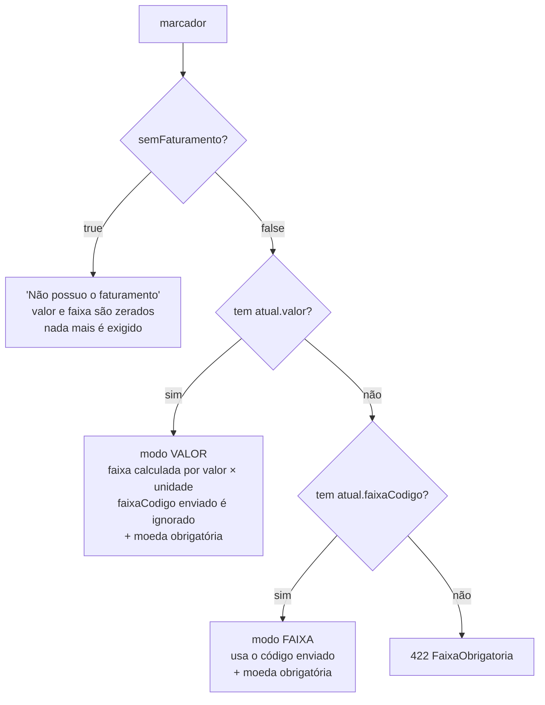

# `POST /faturamento/{documento}` — criar/atualizar faturamento

> **O que é este documento**: o contrato do POST do SALVAR — campos obrigatórios,
> cenários de request, exemplo pronto pra copiar e os erros esperados. É o par em
> texto do script executável `scripts/curls_salvar_post.sh`: cada cenário aqui tem
> um subcomando lá.
>
> Complementar a:
> - `docs/FLUXOS.md` §2 — o passo a passo do fluxo SALVAR ponta a ponta;
> - `docs/REGRAS.md` — o catálogo de todas as regras (esta página é só o recorte do POST);
> - `docs/CASOS_TESTE_MOCK.md` — os 20 documentos de teste (`900001000`…`900020000`);
> - `app/api.yaml` — o OpenAPI gerado.

---

## 1. Contrato

```
POST {BASE_URL}/irb-cra-faturamento/v1/faturamento/{documento}
Content-Type: application/json
X-RACF: A123456
```

| Status | Quando |
|---|---|
| `201` | Gravado. Devolve o mesmo envelope do GET, já com a faixa calculada. |
| `409` | `ConfirmacaoNecessaria` — gate de divergência (§5). Reenviar com `confirmadoDivergencia`. |
| `422` | `ErroValidacao` / `FaixaObrigatoria` (regra de negócio, §6) ou 422 do FastAPI (path/JSON malformado). |
| `400` | `DominioError` não mapeado. |
| `500` | Erro não tratado. |

Onde vive: rota em `app/src/app/api/routes.py::salvar`, parsing em
`app/src/app/api/schemas.py`, **validação em `app/src/app/domain/service.py::salvar`**.

---

## 2. Campos — o que é realmente obrigatório

O Pydantic do request **não valida nada**: todos os campos são `Optional` de propósito
(`api/schemas.py`), porque quem valida — shape *e* negócio — é o domínio, num lugar só.
Então "obrigatório" abaixo é o que o `service.salvar` exige, não o que o schema declara.
Um campo faltando dá **422 do domínio**, com mensagem em português, não o 422 padrão do
FastAPI com `loc`/`msg`.

### Raiz

| Campo | Obrigatório | Observação |
|---|---|---|
| path `documento` | **sim** | Só dígitos (`^\d+$`). CPF, CNPJ, CGI ou outro identificador — sem validação de tamanho nem de dígito verificador. |
| header `X-RACF` | opcional\* | \*Na prática, sempre mande: é o que volta no GET como "atualizado por" (é o RACF mesmo, não um nome). Nome do header configurável via env `RACF_HEADER`. |
| `conglomeradoDoc` | não | Default = o `documento` do path. |
| `marcadores` | **sim** | Lista **não vazia**. Vazia → 422 "Nenhum marcador informado para classificar." |

### Por marcador

Matriz e subgrupos vão no **mesmo array**. Não existe campo `nivel` no request — a matriz
é implícita: é o marcador cujo `subgrupoDoc == conglomeradoDoc`. Cada marcador é
independente: um pode ter valor, outro `semFaturamento`, outro confirmar divergência, tudo
no mesmo POST.

| Campo | Obrigatório | Observação |
|---|---|---|
| `subgrupoDoc` | **sim** | Sempre. Ausente → 422 "subgrupoDoc obrigatório no marcador." |
| `semFaturamento` | não (`false`) | Se **`true`**, o backend zera valor+faixa e **pula** as validações de valor, faixa, unidade e moeda — nada mais é exigido. |
| `atual.moeda` | **sim**, se `semFaturamento=false` | Tem que estar no catálogo de parâmetros. |
| `atual.valor` **ou** `atual.faixaCodigo` | **sim**, se `semFaturamento=false` | Um dos dois. Com `valor`, o backend calcula a faixa e **ignora** o `faixaCodigo` enviado. |
| `atual.unidade` | não (`"milhoes"`) | ⚠️ Ver §4. Só entra no cálculo quando há `valor`. Desconhecida → 422. |
| `confirmadoDivergencia` | não (`false`) | Ver §5. |
| `justificativa` | não | A API não exige (a tela pede). |
| `nome`, `idSpread`, `sistemaOrigem` | não | Passthrough, sem validação. O `idSpread` do **marcador** tem prioridade sobre o de `atual`. |
| `atual.dataRefBalanco` | não | String livre — **não** é validada como data. |
| `atual.auditoria`, `atual.valorAtivo`, `atual.idSpread` | não | Passthrough. |
| `faturamentoCra` | não | Valor eleito do CRA (referência imutável do modal "editar faturamento"). É persistido, mas **não volta na resposta**. |

**Carimbados pelo backend — não mande**: `nivel`, `origem` (vira sempre `BASE` ao gravar),
`racf` (vem do header), `faixaCodigo` quando há `valor`, `atualizadoEm`.

### Os três modos de preencher um marcador



---

## 3. Exemplo — criar um faturamento

POST realista da tela: matriz + dois subgrupos, cada um num estado diferente.
Equivalente a `./scripts/curls_salvar_post.sh completo`.

```bash
curl -sS -X POST \
  "http://localhost:8000/irb-cra-faturamento/v1/faturamento/900001000" \
  -H "Content-Type: application/json" \
  -H "Accept: application/json" \
  -H "X-RACF: A123456" \
  -d '{
    "conglomeradoDoc": "900001000",
    "marcadores": [
      {
        "subgrupoDoc": "900001000",
        "nome": "Alfa Comércio e Distribuição S.A.",
        "idSpread": "2097",
        "sistemaOrigem": "CRA",
        "semFaturamento": false,
        "confirmadoDivergencia": false,
        "justificativa": "Faturamento informado seguindo a visão consolidada do grupo.",
        "atual": {
          "valor": 6500000,
          "dataRefBalanco": "2024-12-31",
          "moeda": "BRL",
          "unidade": "mil",
          "auditoria": "KPMG",
          "valorAtivo": 900000
        }
      },
      {
        "subgrupoDoc": "900001001",
        "nome": "Alfa Norte Ltda",
        "sistemaOrigem": "MANUAL",
        "semFaturamento": false,
        "justificativa": "Valor confirmado com o cliente em contato telefônico.",
        "atual": {
          "valor": 850,
          "dataRefBalanco": "2024-12-31",
          "moeda": "BRL",
          "unidade": "milhões"
        }
      },
      {
        "subgrupoDoc": "900001002",
        "nome": "Alfa Sul Ltda",
        "semFaturamento": true,
        "justificativa": "Empresa recém-constituída, sem balanço publicado ainda."
      }
    ]
  }'
```

O menor body que grava é bem menor que isso — só o obrigatório
(`./scripts/curls_salvar_post.sh minimo`):

```json
{
  "marcadores": [
    {
      "subgrupoDoc": "900001000",
      "atual": { "valor": 5000000, "moeda": "BRL", "unidade": "mil" }
    }
  ]
}
```

**Resposta (201)** — envelope único, o mesmo do GET. `faixaCodigo` vem calculado
(`6500000 × 1.000 = R$ 6,5 Bi`), `racf` vem do header, `origem` vira `BASE`:

```json
{
  "conglomeradoDoc": "900001000",
  "nomeGrupoEconomico": null,
  "segmento": null,
  "origemDados": "BASE",
  "atualizadoEm": "2026-08-17T13:41:02+00:00",
  "marcadores": [
    {
      "nivel": "CONGLOMERADO",
      "subgrupoDoc": "900001000",
      "nome": "Alfa Comércio e Distribuição S.A.",
      "atual": {
        "valor": "6500000",
        "faixaCodigo": "5_bi_10_bi",
        "faixaDescricao": null,
        "dataRefBalanco": "2024-12-31",
        "moeda": "BRL",
        "unidade": "mil",
        "idSpread": "2097",
        "racf": "A123456",
        "auditoria": "KPMG",
        "valorAtivo": "900000"
      },
      "semFaturamento": false,
      "origem": "BASE",
      "justificativa": "Faturamento informado seguindo a visão consolidada do grupo.",
      "atualizadoEm": "2026-08-17T13:41:02+00:00"
    }
  ]
}
```

> `nomeGrupoEconomico`, `segmento` e `faixaDescricao` vêm `null` no POST — são
> enriquecidos só na leitura (NJ6 + catálogo). No GET eles vêm preenchidos.

---

## 4. Faixas e unidades

O de-para é `valor × multiplicador(unidade)` comparado contra limiares em **reais
absolutos**. `5000000` com unidade `"mil"` é **R$ 5 Bi**, não "5 milhões".

**Unidades aceitas** (`domain/faixa.py`) — mesma escala linear, dois vocabulários:

| Origem | Strings aceitas | Multiplicador |
|---|---|---|
| Combo do SALVAR | `unitário` / `unitario` | ×1 |
| Endpoint (enum Java `UnidadeEnum`) | `Real/Efetivo` | ×1 |
| Ambos | `mil` | ×1.000 |
| Ambos | `milhão`/`milhao`/`milhões`/`milhoes` | ×1.000.000 |
| Ambos | `bilhão`/`bilhao`/`bilhões`/`bilhoes` | ×1.000.000.000 |

> ⚠️ **Omitir `unidade` não significa "unitário"** — o default é `"milhoes"`
> (`schemas.py::_in_to_info`). Um `{"valor": 5000}` sem unidade grava R$ 5 Bi, não R$ 5 mil.
> Qualquer outra string → 422 "Unidade desconhecida".

**Códigos de faixa** aceitos em `atual.faixaCodigo` — vêm do QuickConfig; abaixo o
fallback local de `adapters/parametros.py::_FAIXAS_FALLBACK`, intervalo `[min, max)`:

| Código | Intervalo | Código | Intervalo |
|---|---|---|---|
| `ate_360_mil` | 0 – 360 mil | `300_mm_500_mm` | 300 MM – 500 MM |
| `360_mil_4_8_mm` | 360 mil – 4,8 MM | `500_mm_1_bi` | 500 MM – 1 Bi |
| `4_8_mm_20_mm` | 4,8 MM – 20 MM | `1_bi_2_5_bi` | 1 Bi – 2,5 Bi |
| `20_mm_125_mm` | 20 MM – 125 MM | `2_5_bi_5_bi` | 2,5 Bi – 5 Bi |
| `125_mm_300_mm` | 125 MM – 300 MM | `5_bi_10_bi` | 5 Bi – 10 Bi |
| | | `acima_10_bi` | 10 Bi – ∞ |

**Moedas** aceitas (fallback local): `USD` `EUR` `BRL` `AFN` `ARS` `AUD` `CAD` `CHF`
`CLP` `CNY` — mantidas em sincronia com o combo do front (`faturamento.model.ts::MOEDAS`).

---

## 5. Gate de divergência (409)

Roda **antes** de gravar, comparando cada marcador com o que **já está salvo** no banco
para aquele par (conglomerado, subgrupo). Sem registro salvo, nunca dispara.

Dispara em três situações (`domain/divergencia.py`):

| Tipo | Condição |
|---|---|
| `VALOR` | Variação percentual acima do limite (`limite-Maximo-Divergencia-Porcentagem`; fallback 30%). |
| `MOEDA` | Moeda salva ≠ moeda nova. |
| `UNIDADE` | Unidade diferente **pelo multiplicador** — `"milhoes"` vs `"milhões"` não divergem. |

Resposta `409`:

```json
{
  "tipo": "ConfirmacaoNecessaria",
  "erro": "...",
  "divergencias": [
    {
      "tipo": "VALOR",
      "subgrupoDoc": "900002000",
      "de": "1000000",
      "para": "5000000",
      "variacaoPercentual": "400.00"
    }
  ]
}
```

Para gravar mesmo assim, a tela reenvia o **mesmo** marcador com
`"confirmadoDivergencia": true` — que desliga o gate só para aquele marcador.

---

## 6. Cenários de teste

Cada linha é um subcomando de `./scripts/curls_salvar_post.sh <cenário>`.
Rode `todos` para executar a lista inteira em ordem.

### Caminhos felizes (201)

| Cenário | O que exercita |
|---|---|
| `minimo` | O menor body que grava: `subgrupoDoc` + `valor` + `moeda`. → faixa `5_bi_10_bi`. |
| `completo` | Matriz + 2 subgrupos, todos os campos opcionais, três estados diferentes. |
| `por-faixa` | Sem `valor`, só `faixaCodigo` — o modo "só sei a faixa". |
| `sem-faturamento` | `semFaturamento: true` dispensa valor, faixa **e** moeda. |
| `unidade-omitida` | Prova que o default de `unidade` é `"milhoes"`: `5000` vira R$ 5 Bi. |

### Gate de divergência

| Cenário | O que exercita |
|---|---|
| `divergencia` | Grava a linha de base e reenvia 5× maior sem confirmar → **409**, variação 400%. |
| `divergencia-confirmada` | O mesmo reenvio com `confirmadoDivergencia: true` → **201**. |

> Precisam do DynamoDB local no ar — o gate só compara contra o que está **salvo**.
> Usam um documento dedicado (`900002000`) pra não sujar a linha de base dos outros.

### Erros (422)

| Cenário | Mensagem |
|---|---|
| `erro-sem-marcadores` | `Nenhum marcador informado para classificar.` |
| `erro-sem-subgrupo-doc` | `subgrupoDoc obrigatório no marcador.` |
| `erro-sem-valor-nem-faixa` | `Subgrupo …: informe valor específico ou faixa.` (tipo `FaixaObrigatoria`) |
| `erro-sem-moeda` | `Moeda obrigatória para o subgrupo ….` |
| `erro-moeda-invalida` | `Moeda inválida (XPT) para o subgrupo ….` |
| `erro-unidade-desconhecida` | `Unidade desconhecida para o subgrupo …: 'trilhões'.` |
| `erro-valor-fora-das-faixas` | `Valor -1 (unitário) fora das faixas conhecidas.` |
| `erro-documento-invalido` | 422 do FastAPI (pattern `^\d+$` no path), antes de chegar no domínio. |

> **Sobre `erro-valor-fora-das-faixas`**: com o catálogo real a menor faixa começa em 0,
> então só valor **negativo** cai fora de todas. O `.feature` usa valor `1` para esse caso,
> mas isso só falha com as faixas do fixture de teste — no fallback real, `1` cai em
> `ate_360_mil`.

A ordem de validação importa quando falta mais de uma coisa: `subgrupoDoc` → valor/faixa →
unidade → moeda. Um marcador sem `atual` nenhum falha em `FaixaObrigatoria`, não em moeda.

---

## 7. O mesmo POST via BFF

O BFF (`exemplo/`) só repassa: mesmo body, mesma resposta, mesmos status. O que muda para
quem chama:

- **Path**: `/api-irb-cra-faturamento-bff/v1/faturamento/{documento}`.
- **Tamanho do documento**: o BFF tem `min_length=11` no path (`routes.py::DocumentoPath`).
  Os documentos de teste de 9 dígitos (`900001000`) são rejeitados com 422 **antes** do
  forward — use um CNPJ de 14 dígitos.
- **Headers**: o BFF **não** repassa os headers do caller. Ele injeta os seus próprios —
  `x-itau-apikey` (da config, `ITAU_API_KEY`), `x-itau-correlationid` (UUID4 novo a cada
  chamada) e `Authorization` com o token OAuth2 que ele mesmo obtém. Do caller, só o
  `X-RACF` segue adiante.

```bash
./scripts/curls_salvar_post.sh via-bff
```
