# Catálogo COMPLETO de regras — Faturamento IRB/CV4

> **O que é este documento**: o inventário exaustivo de **todas** as regras que
> existem neste código — das regras de negócio grandes (a cascata R1/R2/R3) até
> a menor decisão possível (um `moeda: str = "BRL"` num dataclass, um
> `int(valor or 0)`, um `if` que levanta exceção, uma chave que é removida do
> item antes de gravar). Cada regra tem: **ID**, **enunciado**, **onde vive no
> código**, **por que está ali** e um **diagrama Mermaid**.
>
> Este documento é o *catálogo de regras*. Ele é complementar a:
> - `docs/ARQUITETURA.md` — como as camadas se organizam;
> - `docs/FLUXOS.md` — o passo a passo dos dois fluxos ponta a ponta;
> - `docs/AVALIACAO.md` — histórico da avaliação de código e dos bugs corrigidos.

---

## 0. Como ler este documento

### 0.1 Anatomia de uma regra

Cada regra é apresentada neste formato:

> ### `R-AREA-000` — Enunciado curto da regra
> **Onde**: `arquivo.py::função`
> **Por quê**: a justificativa.
> *(+ diagrama Mermaid)*

### 0.2 Legenda das áreas (prefixo do ID)

| Prefixo | Área | Camada |
|---|---|---|
| `R-CFG` | Configuração / variáveis de ambiente | `core/settings.py` |
| `R-LOG` | Logging estruturado e observabilidade (Datadog) | `core/logging.py` |
| `R-SEC` | Segurança, LGPD, mascaramento, TLS | `core/mascaramento.py`, `core/ssl_context.py` |
| `R-AUT` | Autenticação M2M (OAuth2 / JWT) | `core/oauth2.py`, `adapters/auth.py` |
| `R-HTTP` | Transporte HTTP, pool de conexões, retry | `core/http_client.py`, `core/retry.py` |
| `R-NJ6` | Adapter NJ6 (hierarquia de grupos econômicos) | `adapters/nj6.py` |
| `R-END` | Adapter Endpoint de Faturamento (Gestão Balanço) | `adapters/endpoint.py` |
| `R-PRM` | Adapter do serviço de Parâmetros (catálogo + gate) | `adapters/parametros.py` |
| `R-DYN` | Persistência DynamoDB | `adapters/repository.py` |
| `R-MOD` | Modelo de domínio: campos, defaults, propriedades | `domain/models.py` |
| `R-FXA` | De-para valor ↔ faixa | `domain/faixa.py` |
| `R-DIV` | Gate de divergência | `domain/divergencia.py` |
| `R-ELE` | Eleição do melhor balanço (R1/R2/R3) | `domain/eleicao.py` |
| `R-SLV` | Fluxo SALVAR (orquestração + validações) | `domain/service.py` |
| `R-BSC` | Fluxo BUSCAR (orquestração read-through) | `domain/service_buscar.py` |
| `R-PAG` | Paginação, cursor e seleção de alvos por aba | `domain/paginacao.py` |
| `R-RES` | Resolução de 1 marcador (banco vs Endpoint vs MANUAL) | `domain/resolucao_marcador.py` |
| `R-API` | Boundary HTTP: rotas, DTOs, validação, erro→HTTP | `api/*` |
| `R-DI` | Injeção de dependência e ciclo de vida da Lambda | `api/deps.py`, `main.py` |
| `R-PEND` | Pendências, contradições e riscos conhecidos | (vários) |

### 0.3 Convenção de "por quê"

O código deste projeto é generoso em docstrings, mas não explica tudo. Para ser
honesto sobre a procedência de cada justificativa, uso:

- **(documentado)** — a razão está escrita no próprio código (docstring/comentário)
  ou nos outros documentos do repositório.
- **(inferido)** — a razão não está escrita; é a leitura técnica mais provável a
  partir do comportamento do código. Se você é o dono da regra e a intenção era
  outra, estes são os pontos a corrigir primeiro.

### 0.4 Aviso sobre as contradições

Durante o levantamento apareceram **15 pontos onde o código contradiz a própria
documentação, onde uma regra existe mas não tem efeito, ou onde há uma assimetria
que parece acidental**. Eles não foram silenciados: estão todos na seção
**[21. Pendências, contradições e riscos](#21-pendências-contradições-e-riscos-conhecidos)**,
com o ID `R-PEND-xxx`, classificados por impacto (🔴 alto / 🟠 médio / 🟡 baixo),
com correção sugerida e referenciados a partir da regra correspondente.

Os 4 de impacto alto originais, em uma linha cada (todos corrigidos/resolvidos
depois da resposta do PO — ver `docs/DIVERGENCIAS_PO.md`):

| ID | O quê |
|---|---|
| `R-PEND-009` | ~~Polaridade de `indicadorFatorPonderado` não confirmada~~ **RESOLVIDO** — PO confirmou `True = original`; polaridade corrigida em `eleicao.py::_original` |
| `R-PEND-012` | ~~O SALVAR grava `auditado/original/vigente = True` sem saber qual regra elegeu~~ **MOOT** — esses campos foram **removidos** do modelo: banco nunca mais é revalidado por R1/R2/R3 (banco sempre vence, ver §16/§21) |
| `R-PEND-010` | ~~Multiplicador de `unidade` não aplicado~~ **CORRIGIDO** — ver §21, valor agora é escalado para reais antes do de-para de faixa (SALVAR e BUSCAR) |
| `R-PEND-005` | ~~Fallback de parâmetros contradiz a docstring~~ **CORRIGIDO** — ver §9, docstring e código agora concordam (catálogo hardcoded documentado, sem duplicação) |

> Também resolvido nesta rodada, sem ter sido um dos 4 originais:
> `R-PEND-011` (duas contagens de "meses entre datas" divergentes) — **MOOT**,
> `resolucao_marcador.py` não faz mais nenhuma contagem de idade própria (banco
> sempre vence sem revalidação); só resta a contagem de `eleicao.py`, usada
> exclusivamente na eleição sobre o Endpoint.

---

## 1. Mapa geral: onde cada grupo de regras atua

Uma única Lambda serve dois caminhos. As regras se distribuem assim:

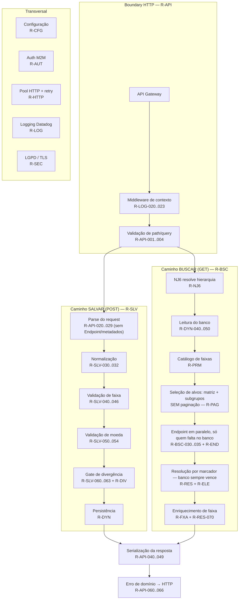

### 1.1 A regra estrutural que explica todas as outras

> ### `R-ARQ-001` — A direção de dependência é sempre de fora para dentro; `domain/` não importa framework, banco nem biblioteca HTTP
> **Onde**: estrutura de pastas `api/` → `domain/` ← `adapters/`, `core/`
> **Por quê**: **(documentado)** em `docs/ARQUITETURA.md` §1. É o que permite
> testar toda a regra de negócio com dublês em memória (`tests/fakes.py`) sem
> subir DynamoDB nem mockar rede, e trocar DynamoDB/Endpoint sem tocar em regra.
> Consequência prática: o domínio declara `Protocol`s (`Repositorio`, `NJ6`,
> `Endpoint`, `Catalogo`) e os adapters os satisfazem por *duck typing* — não há
> herança, não há registro, não há importação do domínio para o adapter.

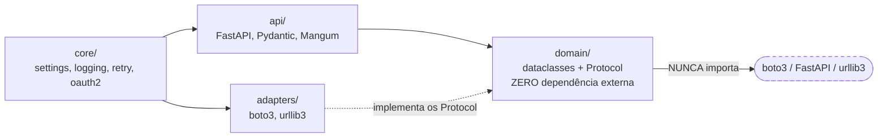

> ### `R-ARQ-002` — SALVAR e BUSCAR são módulos de domínio separados, na mesma Lambda
> **Onde**: `domain/service.py` (SALVAR) e `domain/service_buscar.py` (BUSCAR)
> **Por quê**: **(documentado)** no topo de `service_buscar.py`: para não
> misturar os `Protocol`s de repositório (o SALVAR precisa de
> `get_subgrupo`+`save`; o BUSCAR precisa de `get_conglomerado`) nem as
> dependências (o SALVAR **não** usa NJ6). Uma Lambda só, porém, porque os dois
> caminhos compartilham auth, logging, settings e o modelo de domínio — separar
> em duas funções duplicaria o cold start e o token.

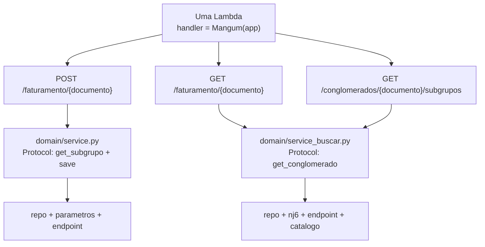

---

## 2. `R-CFG` — Regras de configuração (`core/settings.py`)

### 2.1 Regras estruturais da configuração

> ### `R-CFG-001` — `Settings` é um dataclass **congelado** (`frozen=True`)
> **Onde**: `core/settings.py` → `@dataclass(frozen=True) class Settings`
> **Por quê**: **(inferido)** congelado, nenhum ponto do código consegue mutar
> configuração em runtime (`settings.timeout = 10` levanta
> `FrozenInstanceError`). Isso torna o comportamento da Lambda determinístico
> dentro de uma invocação: se um valor mudou, foi deploy, não código.

> ### `R-CFG-002` — Todas as variáveis de ambiente são lidas **uma única vez, no cold start**
> **Onde**: `core/settings.py` — os `os.environ.get(...)` estão nos *defaults dos
> campos* do dataclass, avaliados quando a **classe** é criada (import do
> módulo), e `settings = Settings()` é um singleton de módulo.
> **Por quê**: **(documentado)** "Lida uma vez no cold start" — 12-factor.
> Consequência importante: **mudar uma variável de ambiente não tem efeito em
> container quente**; exige nova versão/cold start.

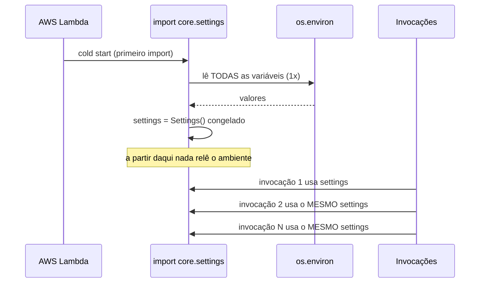

> ### `R-CFG-003` — Toda URL base sofre `.rstrip("/")` na leitura
> **Onde**: `nj6_base_url`, `endpoint_base_url`, `token_url` — todos terminam em
> `.rstrip("/")`.
> **Por quê**: **(inferido)** os adapters montam URL por concatenação
> (`f"{base}/consulta-gruposeconomicos/..."`). Sem o `rstrip`, uma URL terminada em
> `/` produziria barra dupla — que alguns gateways tratam como rota diferente
> (404) e outros normalizam. Normalizar na entrada elimina a classe inteira de
> bug de "barra dupla". Não se aplica ao serviço de parâmetros — QuickConfig não
> é uma URL, é um cluster (`R-PRM-004`).

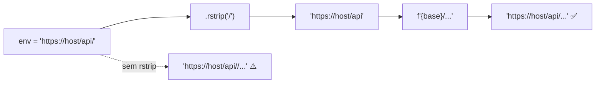

> ### `R-CFG-004` — URLs de integração têm default `""` (string vazia), não um valor de produção
> **Onde**: `nj6_base_url`, `endpoint_base_url`, `token_url` — todos
> `os.environ.get("...", "")`.
> **Por quê**: **(inferido)** *fail-safe por omissão*: se a variável não foi
> configurada, a URL fica vazia e a chamada falha imediatamente (URL inválida) em
> vez de apontar silenciosamente para um ambiente errado. Nunca há um host
> "padrão" que possa vazar tráfego de produção para homologação (ou vice-versa).

> ### `R-CFG-005` — O ambiente local **não** usa um "modo mock" no código para NJ6/Endpoint: só troca a URL de destino
> **Onde**: docstring de `core/settings.py` e de `api/deps.py`.
> **Por quê**: **(documentado)** — decisão registrada em `docs/AVALIACAO.md`
> §5.1. Existia um `USAR_MOCK_INTEGRACOES` documentado que **nunca era lido**; em
> vez de implementar o switch, ele foi removido. O mock local é um stack
> `docker-compose` que responde HTTP: `HttpNJ6` e `HttpEndpoint` são **as mesmas
> classes** em local e produção. Isso elimina a classe de bug "funciona no mock e
> quebra em produção porque o caminho de código é outro".
> **Exceção — parâmetros**: `ParametrosClient`/`ParametrosCatalogo` não têm URL
> pra trocar (QuickConfig é um cluster, não HTTP). Local, sem
> `QUICKCONFIG_CLUSTER_MEMBERS`, o adapter cai direto no fallback hardcoded
> (`R-PRM-031`) — não existe stack de mock equivalente ao QuickConfig; ver
> `R-PRM-004` sobre como isso é testado/rodado localmente.

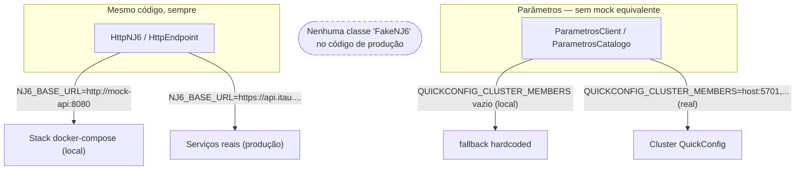

### 2.2 Regras de cada variável e seu default

Cada linha abaixo é uma regra: **o valor default é a regra que vale quando ninguém
configurou nada**.

| ID | Campo | Env var | Default | Por que este default |
|---|---|---|---|---|
| `R-CFG-010` | `tabela_faturamento` | `TABELA_FATURAMENTO` | `"tbcv4163_fatm_cogl_subg"` | **(inferido)** nome real da tabela nova do projeto; default útil evita erro de config no caminho mais comum |
| `R-CFG-011` | `racf_header` | `RACF_HEADER` | `"X-RACF"` | **(documentado)** "RACF de quem informou chega SEMPRE neste header no POST"; configurável porque o gateway pode renomear headers |
| `R-CFG-012` | `nj6_base_url` | `NJ6_BASE_URL` | `""` | ver `R-CFG-004` |
| `R-CFG-013` | `endpoint_base_url` | `ENDPOINT_BASE_URL` | `""` | ver `R-CFG-004` |
| `R-CFG-014` | `integ_timeout_s` | `INTEG_TIMEOUT_S` | `5.0` s | **(inferido)** timeout de NJ6+Endpoint; 5 s cabe dentro do timeout típico de API Gateway (29 s) mesmo com 3 tentativas |
| `R-CFG-015` | `quickconfig_cluster_members` | `QUICKCONFIG_CLUSTER_MEMBERS` | `""` | **(inferido)** vazio por omissão = *fail-safe*: sem cluster real configurado, `_inicializar_servico` falha rápido (`ValueError`) e cai no fallback — nunca tenta conectar num host inventado |
| `R-CFG-016` | `quickconfig_app_name` | `QUICKCONFIG_APP_NAME` | `"Faturamento-irb-lambda"` | **(inferido)** identifica esta app no QuickConfig — as chaves de config (`catalogo-faixas` etc.) são por app, não globais |
| `R-CFG-016b` | `quickconfig_ttl_s` | `QUICKCONFIG_TTL_S` | `300` s (5 min) | **(inferido)** catálogo de faixas/moedas muda raríssimo; 5 min corta quase toda chamada repetida sem congelar uma mudança de parâmetro por muito tempo — mesmo raciocínio de quando era HTTP |
| `R-CFG-017` | `quickconfig_key_faixas` / `quickconfig_key_moedas` / `quickconfig_key_limite_divergencia` | `QUICKCONFIG_KEY_FAIXAS` / `QUICKCONFIG_KEY_MOEDAS` / `QUICKCONFIG_KEY_LIMITE_DIVERGENCIA` | `"catalogo-faixas"` / `"catalogo-moedas"` / `"limite-Maximo-Divergencia-Porcentagem"` | **(documentado pelo dono do negócio)** nomes das chaves reais no QuickConfig — o 3º nome (mixed-case, sem padrão kebab consistente) veio literal de produção, não é escolha nossa |
| `R-CFG-018` | `parametros_retries` | `PARAMETROS_RETRIES` | `3` tentativas | ver `R-HTTP-021` e `R-PEND-004` (o nome engana: governa as integrações **HTTP** — NJ6/Endpoint; QuickConfig não usa `@http_retry`, não tem retry por tentativa, só cache+fallback) |
| `R-CFG-019` | `token_url` | `TOKEN_URL` | `""` | ver `R-CFG-004`; obrigatória de fato (`R-AUT-040`) |
| `R-CFG-020` | `token_ttl_margem_s` | `TOKEN_TTL_MARGEM_S` | `30` s | ⚠️ **campo sem efeito** — ver `R-PEND-001` |
| `R-CFG-021` | `token_timeout_s` | `TOKEN_TIMEOUT_S` | `3.0` s | ⚠️ **campo sem efeito** — ver `R-PEND-001` |
| `R-CFG-022` | `auth_client_id` | `AUTH_CLIENT_ID` → fallback `PARAMETROS_CLIENT_ID` | `""` | ver `R-CFG-030` |
| `R-CFG-023` | `auth_client_secret` | `AUTH_CLIENT_SECRET` → fallback `PARAMETROS_CLIENT_SECRET` | `""` | ver `R-CFG-030` |
| `R-CFG-024` | `itau_api_key` | `ITAU_API_KEY` | `""` | **(inferido)** header obrigatório do gateway do Itaú; vazio → header vai vazio e o gateway rejeita (falha explícita, não silenciosa) |
| `R-CFG-025` | `itau_correlation_id` | `ITAU_CORRELATION_ID` | `""` | **(inferido)** usado só na chamada de token; nas chamadas de negócio é sobrescrito por um UUID novo (`R-NJ6-020`) |
| `R-CFG-026` | `itau_flow_id` | `ITAU_FLOW_ID` | `""` | **(inferido)** idem; só enviado se preenchido (`R-AUT-004`) |

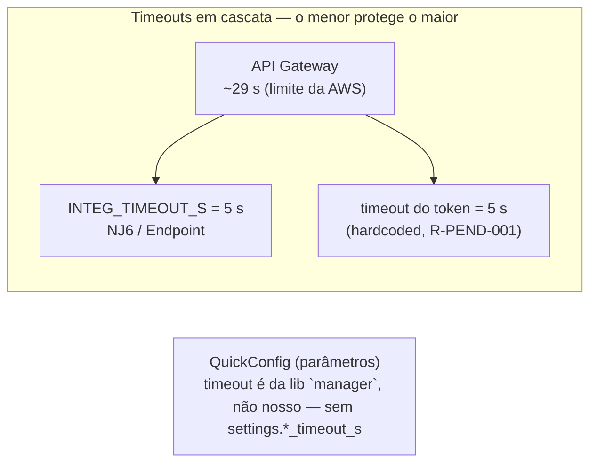

> ### `R-CFG-030` — `AUTH_CLIENT_ID`/`SECRET` aceitam os nomes legados `PARAMETROS_CLIENT_ID`/`SECRET` como fallback
> **Onde**: `core/settings.py` →
> `os.environ.get("AUTH_CLIENT_ID", os.environ.get("PARAMETROS_CLIENT_ID", ""))`
> **Por quê**: **(inferido)** compatibilidade retroativa: as credenciais M2M
> antes eram exclusivas do serviço de parâmetros e depois passaram a servir as
> três integrações. O fallback permite renomear as variáveis no Terraform sem um
> deploy sincronizado ("big bang"). A ordem importa: o nome **novo** ganha.

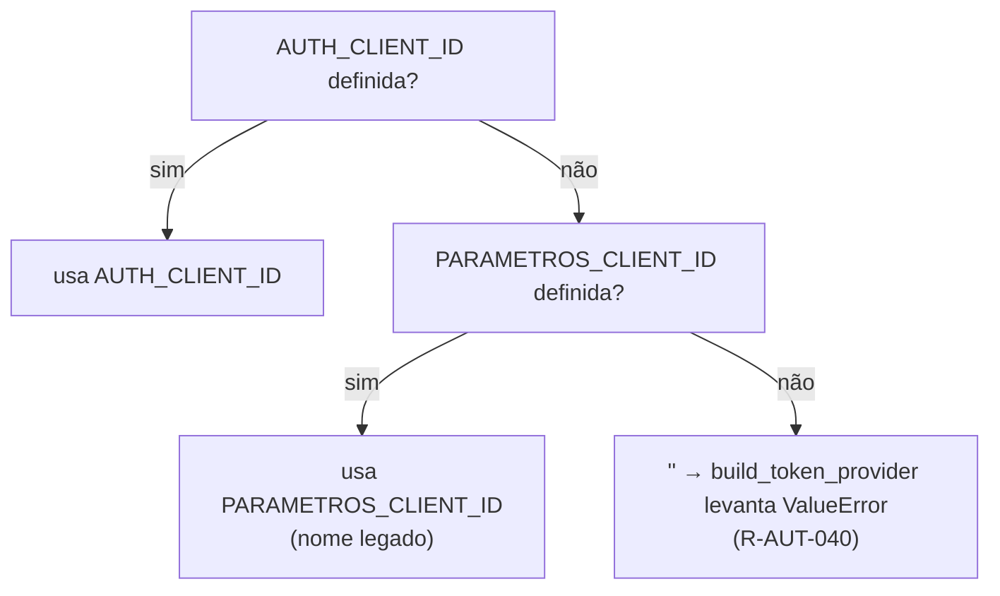

> ### `R-CFG-031` — Credenciais chegam por variável de ambiente, preenchidas pelo Terraform a partir do Secrets Manager
> **Onde**: comentário em `core/settings.py` (bloco "Auth M2M").
> **Por quê**: **(documentado)** o código **não** fala com o Secrets Manager em
> runtime. Isso remove uma chamada de rede (e uma permissão IAM) do caminho
> quente, ao custo de o segredo ficar visível na configuração da Lambda — decisão
> consciente registrada no comentário.

---

## 3. `R-LOG` — Regras de logging estruturado (Datadog)

### 3.1 Regras de formato

> ### `R-LOG-001` — Todo log sai como **uma linha JSON** no stdout
> **Onde**: `core/logging.py` → `_JsonFormatter.format`
> **Por quê**: **(documentado)** "o Datadog parseia logs JSON automaticamente —
> cada chave vira um atributo pesquisável/facetável, sem grok parsing". Não é
> preciso configurar pipeline nenhum na infra: basta a linha sair em JSON que a
> Lambda extension/forwarder coleta e explode em atributos.

> ### `R-LOG-002` — O nível vai no campo `status`, não em `level`
> **Onde**: `_JsonFormatter.format` → `"status": record.levelname.lower()`
> **Por quê**: **(documentado)** `status` é o **atributo reservado do Datadog**
> para severidade. Se fosse `level`, o Datadog mostraria todo log como "info" e a
> faceta de severidade não funcionaria. O `.lower()` existe porque o Datadog
> espera `error`/`warn`/`info`/`debug` em minúsculas.

> ### `R-LOG-003` — Os 6 campos-base de todo log: `timestamp`, `status`, `logger`, `message`, `service`, `env`
> **Onde**: `_JsonFormatter.format`, dict `payload`.
> **Por quê**: **(documentado/inferido)** `timestamp`, `status`, `message` e
> `service` são atributos padrão do Datadog (correlação, severidade, busca
> full-text e agrupamento por serviço); `env` habilita a separação
> dev/homolog/prod na UI; `logger` (nome hierárquico, ex. `faturamento.nj6`)
> permite filtrar por módulo sem depender do texto da mensagem.

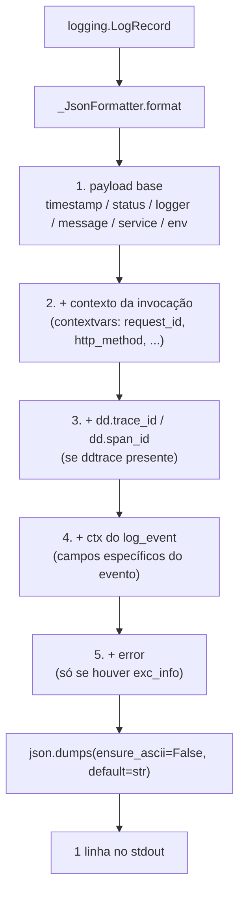

> ### `R-LOG-004` — A ordem de merge é base → contexto → trace ids → `ctx`; **quem vem depois sobrescreve**
> **Onde**: `_JsonFormatter.format` — quatro `payload.update(...)` em sequência.
> **Por quê**: **(inferido)** os campos do evento (`ctx`) são os mais
> específicos, então precisam ter a última palavra: um `log_event(...,
> request_id="x")` sobrepõe o `request_id` global do contexto. O efeito
> colateral a conhecer: um `ctx` com a chave `service` ou `status`
> **sobrescreveria um atributo reservado do Datadog** — nenhum código faz isso
> hoje, mas nada impede.

> ### `R-LOG-005` — `timestamp` é sempre UTC, em ISO-8601
> **Onde**: `datetime.fromtimestamp(record.created, timezone.utc).isoformat()`
> **Por quê**: **(inferido)** Lambda roda em UTC, mas depender do fuso do
> runtime é frágil; fixar `timezone.utc` garante que o log de dois ambientes
> diferentes seja comparável na mesma linha do tempo do Datadog. Usa
> `record.created` (o instante em que o log foi emitido) e não `now()` (o instante
> em que foi formatado).

> ### `R-LOG-006` — `ensure_ascii=False`: acento vai literal, não escapado
> **Onde**: `json.dumps(payload, ensure_ascii=False, default=str)`
> **Por quê**: **(inferido)** o domínio é em português ("Divergência
> detectada"). Sem isso, o Datadog receberia `"Divergência"`, o que quebra a
> busca por texto do jeito que a pessoa digita.

> ### `R-LOG-007` — `default=str`: nenhum objeto não-serializável derruba um log
> **Onde**: mesmo `json.dumps`.
> **Por quê**: **(inferido)** os eventos logam `Decimal` (valor de
> faturamento), `date`, `Enum` e exceções. Sem `default=str`, um
> `TypeError: Object of type Decimal is not JSON serializable` estouraria
> **dentro do formatter** — ou seja, uma falha de log derrubaria a requisição.
> Esta é uma regra de *resiliência do observador*: o logging nunca pode ser a
> causa do incidente.

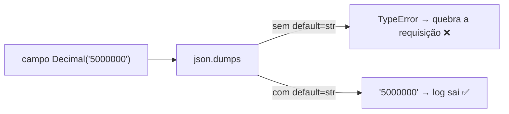

> ### `R-LOG-008` — Traceback vai no campo `error`, e só existe quando há exceção
> **Onde**: `if record.exc_info: payload["error"] = self.formatException(...)`
> **Por quê**: **(inferido)** campo dedicado (em vez de concatenar no
> `message`) permite ao Datadog agrupar por *error tracking* e manter a mensagem
> curta e facetável.

### 3.2 Regras de correlação (contexto da invocação)

> ### `R-LOG-010` — O contexto da invocação vive num `ContextVar`, com default `{}`
> **Onde**: `_context: ContextVar[dict] = ContextVar("log_context", default={})`
> **Por quê**: **(documentado)** "propagado sem passar à mão" — permite que
> qualquer log, em qualquer profundidade de call stack, carregue o `request_id`
> sem que nenhuma função precise receber esse parâmetro. `ContextVar` (e não
> variável global) porque é isolado por contexto de execução assíncrona.

> ### `R-LOG-011` — `bind_context` **descarta campos com valor `None`**
> **Onde**: `bind_context` →
> `{k: v for k, v in fields.items() if v is not None}`
> **Por quê**: **(inferido)** evita poluir todo log da invocação com
> `"racf": null` / `"request_id": null` quando o header não veio ou a Lambda roda
> fora da AWS (teste local). No Datadog, um atributo ausente é mais limpo que um
> atributo nulo — ele simplesmente não aparece na faceta.

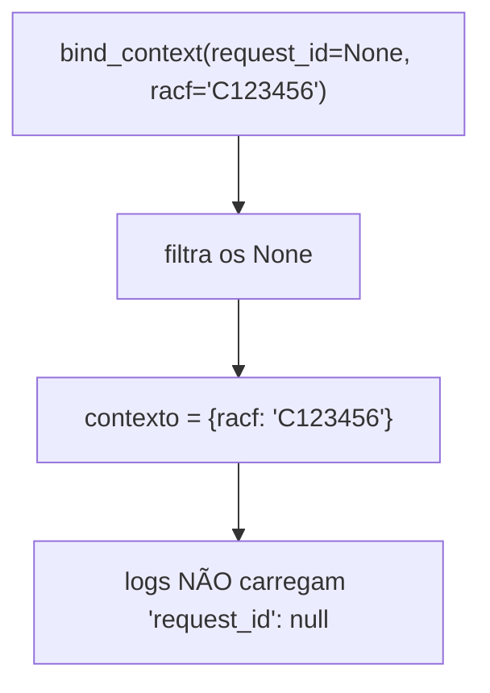

> ### `R-LOG-012` — `bind_context` é **acumulativo** (merge), não substitutivo
> **Onde**: `_context.set({**_context.get(), **novos})`
> **Por quê**: **(inferido)** o middleware vincula `request_id`/método/rota, e
> depois a rota vincula `conglomerado_doc`/`racf` — as duas chamadas precisam
> somar. Substituir faria a segunda chamada apagar o `request_id`.

> ### `R-LOG-013` — `clear_context()` é chamado **no início** de cada requisição, antes de qualquer bind
> **Onde**: `main.py::_contexto_invocacao` — primeira linha do middleware.
> **Por quê**: **(inferido)** esta é uma regra de **isolamento entre
> invocações em container quente**, e é sutil: a Lambda reaproveita o processo, e
> um `ContextVar` pode sobreviver entre invocações. Sem o `clear`, o
> `conglomerado_doc` do cliente A poderia aparecer nos logs da requisição do
> cliente B — um vazamento de dado entre clientes **dentro do log**.

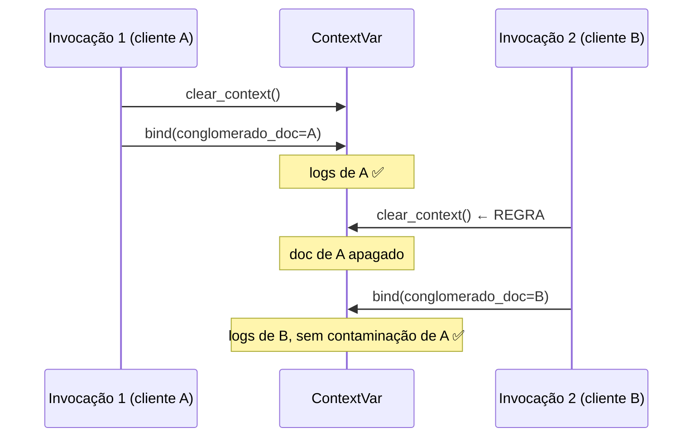

> ### `R-LOG-014` — `request_id` vem do `aws_request_id` do contexto Lambda, via `request.scope["aws.context"]`
> **Onde**: `main.py::_contexto_invocacao` →
> `getattr(ctx, "aws_request_id", None)`
> **Por quê**: **(documentado)** "Correlação no Datadog". É o mesmo id que
> aparece no CloudWatch e nas métricas da Lambda, então permite pular do log da
> aplicação para a invocação da AWS. O acesso é **duplamente defensivo**
> (`.get("aws.context")` + `getattr(..., None)`) porque rodando via `uvicorn`
> local esse escopo não existe — e aí o campo simplesmente não é vinculado
> (`R-LOG-011`).

> ### `R-LOG-015` — Se `ddtrace` estiver disponível, injeta `dd.trace_id`/`dd.span_id`; se não, segue sem
> **Onde**: `core/logging.py::_dd_trace_ids` — `import` dentro de `try`, com
> `except Exception: pass`.
> **Por quê**: **(documentado)** "Opcional". O import é lazy e protegido para
> que a ausência da lib (ou uma falha do tracer) **nunca** quebre o log. Com os
> dois ids, o Datadog liga a linha de log ao span da trace (log↔trace
> correlation); sem eles, o log continua válido, só não é clicável a partir da
> trace.

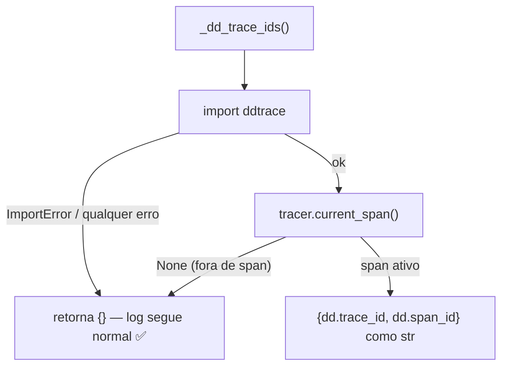

> ### `R-LOG-016` — Os trace ids são convertidos para **string**
> **Onde**: `{"dd.trace_id": str(span.trace_id), ...}`
> **Por quê**: **(inferido)** trace id de 64/128 bits excede o inteiro seguro de
> JSON/JavaScript (2^53); como número, seria arredondado e deixaria de casar com a
> trace real.

### 3.3 Regras de nível e de volume (anti-ruído)

> ### `R-LOG-020` — Convenção obrigatória: evento de **negócio** = `info`; evento **técnico** = `debug`; falha = `logger.exception`
> **Onde**: docstring de `core/logging.py`, aplicada em todo o código.
> **Por quê**: **(documentado)** — a docstring é explícita: *"NÃO logar 'estou
> aqui' — só eventos com contexto"*. A regra existe porque log de Lambda é custo
> (ingestão Datadog + CloudWatch) **e** latência: cada linha é I/O síncrono no
> caminho da resposta. Um evento é de negócio se um analista/produto olharia para
> ele (faturamento persistido, divergência barrada); é técnico se só um dev
> olharia (cache hit, latência de fetch).

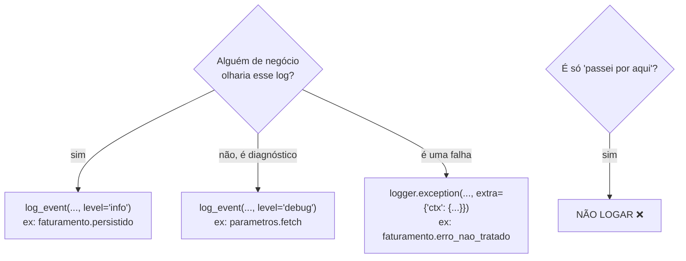

> ### `R-LOG-021` — Todo evento tem **nome hierárquico pontuado** (`dominio.acao.detalhe`) e o nome é repetido dentro do payload como `event`
> **Onde**: `log_event` → `extra={"ctx": {"event": event, **fields}}`
> **Por quê**: **(inferido)** o nome vai no `message` (busca textual) **e** no
> atributo `event` (faceta exata). Sem o atributo, contar
> `faturamento.persistido` no Datadog exigiria busca por substring — frágil e
> caro. Com ele, dá para montar monitor/dashboard por `@event`. O ponto como
> separador cria uma hierarquia natural (`nj6.*`, `oauth2.*`,
> `faturamento.buscar.*`) filtrável por prefixo.

> ### `R-LOG-022` — `log_event` **sai antes de montar o payload** se o nível estiver desabilitado
> **Onde**: `core/logging.py::log_event` →
> `if not logger.isEnabledFor(levelno): return`
> **Por quê**: **(documentado no código)** "evita montar o dict/serializar
> argumentos à toa em toda chamada do hot path". Sem a guarda, um
> `log_event(..., level="debug", documento=mascarar_documento(doc))` com
> `LOG_LEVEL=INFO` ainda executaria o mascaramento, construiria dois dicionários
> e só então o `logging` descartaria a linha. Como há chamadas de debug **por
> subgrupo** (até 100 por requisição), isso é trabalho puro no caminho da
> resposta.

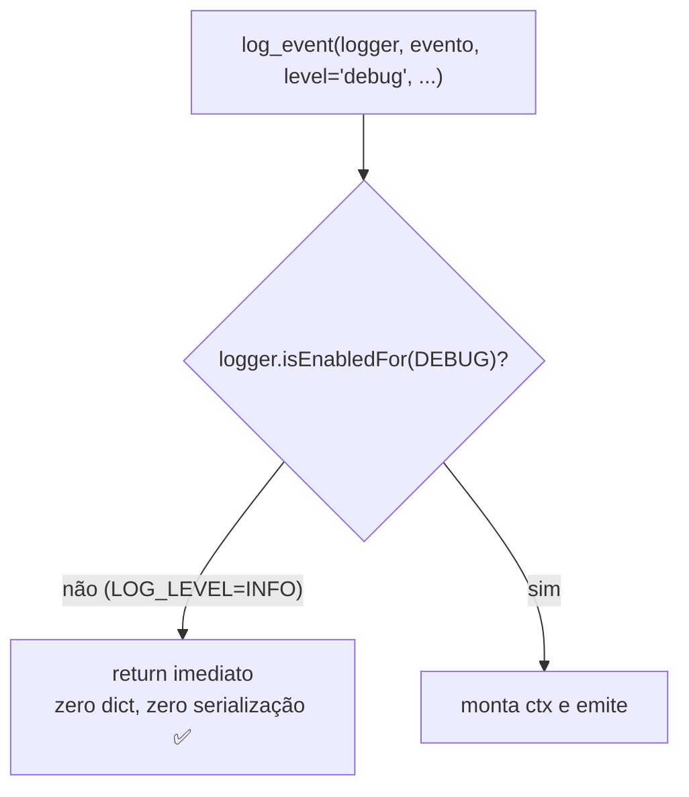

> ### `R-LOG-023` — Nível textual desconhecido cai em `INFO` (nunca levanta)
> **Onde**: `getattr(logging, level.upper(), logging.INFO)`
> **Por quê**: **(inferido)** um typo (`level="warn"` em vez de `"warning"`)
> não pode virar `AttributeError` em produção. Degrada para `INFO` — perde-se a
> severidade correta, mas não se perde o evento nem se derruba o fluxo.

> ### `R-LOG-024` — Uma requisição loga **exatamente 2 eventos de ciclo de vida**: `inicio` e `fim`
> **Onde**: `main.py::_contexto_invocacao`.
> **Por quê**: **(inferido)** dão a latência ponta a ponta e o status code sem
> depender do API Gateway, e são o par mínimo para detectar requisição que
> "desapareceu" (tem `inicio` sem `fim` ⇒ timeout/crash do runtime).

> ### `R-LOG-025` — Latência é medida com `time.time()` e arredondada para 2 casas em milissegundos
> **Onde**: `main.py` → `round((time.time() - start_time) * 1000, 2)`
> **Por quê**: **(inferido)** ms é a unidade que o Datadog espera para
> latência; 2 casas evita cardinalidade inútil no valor. *Nota técnica*: para
> medir duração, `time.perf_counter()` seria mais correto que `time.time()` (não
> sofre ajuste de relógio) — o `parametros.py` usa `perf_counter` para isso; aqui
> ficou `time()`. Diferença irrelevante na prática para janelas de ms/s.

> ### `R-LOG-026` — Exceção no middleware é logada com `exception` e **re-levantada**
> **Onde**: `main.py::_contexto_invocacao` → `except Exception: ... raise`
> **Por quê**: **(inferido)** o middleware é observador, não decisor: quem
> transforma exceção em resposta HTTP são os handlers de `api/errors.py`
> (`R-API-060`). Engolir aqui produziria 502 sem corpo. O `raise` preserva o
> traceback original.

### 3.4 Regras de bootstrap do logging

> ### `R-LOG-030` — `setup_logging()` é chamado **no import do `main.py`**, antes de criar o app FastAPI
> **Onde**: `main.py`, linha `setup_logging()` antes de `app = FastAPI(...)`
> **Por quê**: **(inferido)** qualquer log emitido durante o cold start
> (ex.: `oauth2.manager.inicializado`, `auth.provider.inicializado`) já precisa
> sair em JSON. Se a configuração viesse no primeiro request, os logs de
> inicialização sairiam em texto puro e não apareceriam estruturados no Datadog.

> ### `R-LOG-031` — `setup_logging()` é **idempotente** via uma flag no próprio handler
> **Onde**: `core/logging.py::setup_logging` →
> `if any(getattr(h, "_faturamento_json", False) for h in root.handlers): return`
> **Por quê**: **(documentado)** "idempotente entre invocações da Lambda
> quente". Sem a guarda, cada chamada adicionaria outro `StreamHandler` e **cada
> log sairia duplicado** (e triplicado, etc.) — multiplicando custo de ingestão.
> A flag é um atributo marcado no handler, não um booleano global, porque assim a
> checagem reflete o estado real do `root logger`.

> ### `R-LOG-032` — Todos os handlers pré-existentes do root logger são **removidos**
> **Onde**: `for h in list(root.handlers): root.removeHandler(h)`
> **Por quê**: **(inferido)** o runtime da AWS Lambda instala seu próprio
> handler no root logger. Sem remover, cada linha sairia **duas vezes**: uma em
> JSON (nosso) e uma no formato texto da AWS — dobrando custo e poluindo o parser
> do Datadog com linhas não-JSON. O `list(...)` cria uma cópia porque não se pode
> mutar a lista que está sendo iterada.

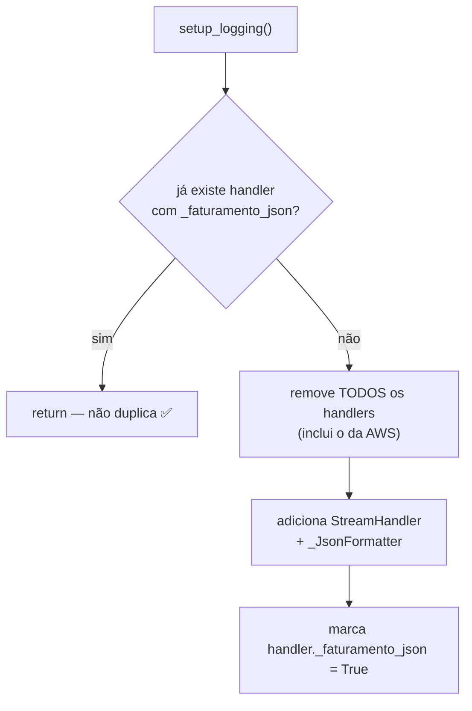

> ### `R-LOG-033` — Defaults de identidade do serviço: `DD_SERVICE="faturamento-save"`, `DD_ENV←STAGE←"dev"`, `LOG_LEVEL="INFO"`
> **Onde**: constantes `_SERVICE`, `_ENV`, `_LEVEL` no topo de `core/logging.py`.
> **Por quê**: **(inferido)**
> - `DD_SERVICE` usa o nome padrão que o Datadog já lê da Lambda, evitando
>   configurar em dois lugares. O valor `"faturamento-save"` é herança de quando
>   a Lambda só salvava — hoje ela também busca (ver `R-PEND-006`).
> - `DD_ENV` cai em `STAGE` antes de `"dev"`: aceita a convenção do Datadog e a
>   do pipeline de deploy, sem exigir as duas.
> - `LOG_LEVEL` default `INFO` (não `DEBUG`): em produção o volume de `debug`
>   deste código é alto por desenho (eventos técnicos por subgrupo) — o default
>   seguro é o silencioso. `.upper()` torna `log_level=debug` aceitável.

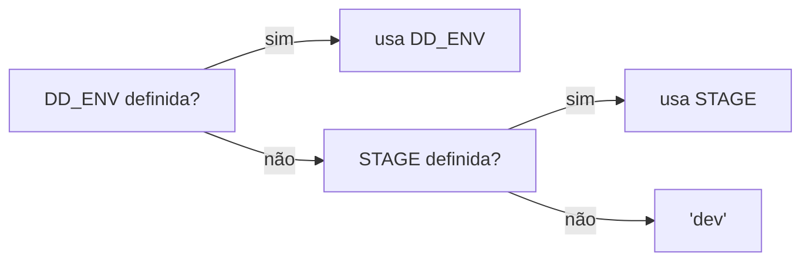

---

## 4. `R-SEC` — Regras de segurança, LGPD e TLS

### 4.1 Mascaramento de documento (`core/mascaramento.py`)

> ### `R-SEC-001` — Documento (CPF/CNPJ/CGI) em log de adapter vai **mascarado**, só com os 4 últimos dígitos
> **Onde**: `core/mascaramento.py::mascarar_documento`, aplicado em
> `adapters/nj6.py` e `adapters/endpoint.py`.
> **Por quê**: **(documentado)** "`documento` é dado pessoal — nunca deve ir
> para o Datadog em texto puro… 4 dígitos são o suficiente para correlacionar uma
> ocorrência de log com um ticket/chamado sem expor o documento inteiro". O
> Datadog é SaaS de terceiro: mandar CPF para lá é tratamento de dado pessoal
> fora do controle do banco (LGPD).
> ⚠️ **Esta regra está aplicada só parcialmente** — ver `R-PEND-002`.

> ### `R-SEC-002` — `_DIGITOS_VISIVEIS = 4` é constante nomeada, não literal espalhado
> **Onde**: `core/mascaramento.py`, topo.
> **Por quê**: **(inferido)** se a política de privacidade mudar (ex.: 3
> dígitos), muda em um lugar só — e o nome documenta a intenção no ponto de uso.

> ### `R-SEC-003` — Documento vazio/`None` vira `""`, não `"None"` nem erro
> **Onde**: `if not documento: return ""`
> **Por quê**: **(inferido)** a função é chamada dentro de `log_event`; se
> levantasse `TypeError` num documento ausente, uma falha de log derrubaria o
> fluxo (mesmo princípio de `R-LOG-007`). Retornar `""` deixa o campo presente e
> obviamente vazio.

> ### `R-SEC-004` — Documento com **4 caracteres ou menos** é mascarado **por inteiro**
> **Onde**: `if len(documento) <= _DIGITOS_VISIVEIS: return "*" * len(documento)`
> **Por quê**: **(documentado, corrigido nesta rodada)** era
> `ocultos = "*" * max(len(documento) - _DIGITOS_VISIVEIS, 0)` — sem o `max`,
> um documento curto produziria multiplicação por número negativo (`""` em
> Python, por acidente). Isso deixava o documento **inteiro** exposto no log,
> sem asterisco nenhum, para qualquer entrada de até 4 caracteres. Era só
> teórico enquanto `R-API-001` exigia 9–14 dígitos; deixou de ser teórico
> quando essa faixa foi removida (`DOCUMENTO_PATTERN` agora aceita qualquer
> sequência de dígitos). **Correção aplicada**: documentos com até 4
> caracteres são mascarados por inteiro (`"***"` em vez de `"123"`) — nunca
> mais aparecem em texto puro no Datadog, ao custo de perder a correlação com
> ticket/chamado nesse caso extremo (documentos reais têm bem mais que 4
> dígitos).

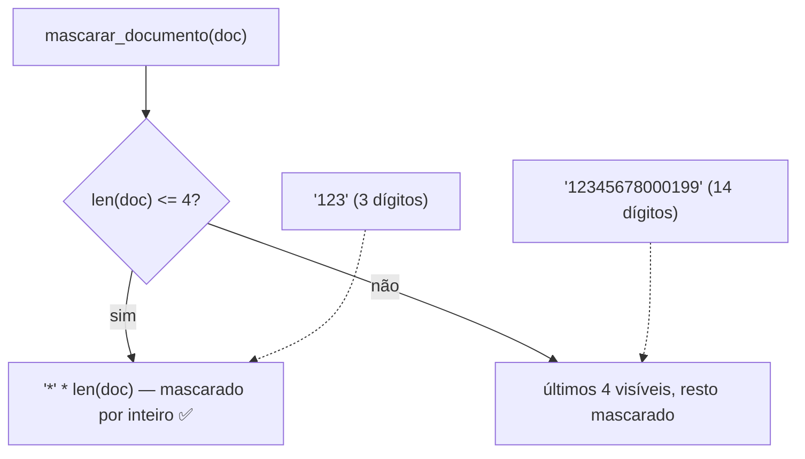

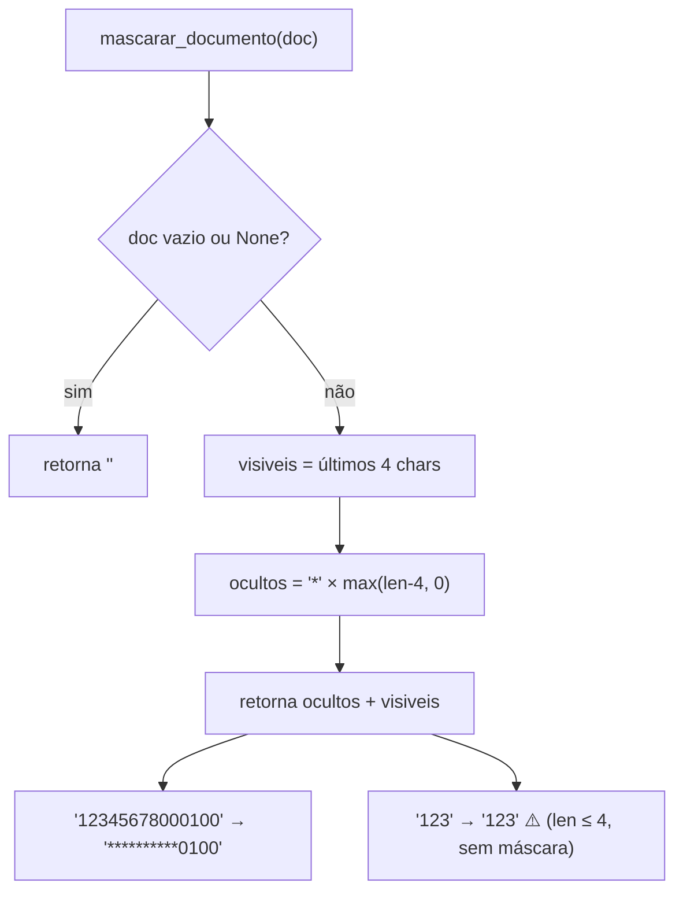

> ### `R-SEC-005` — A mensagem de erro devolvida ao **cliente** mantém o documento em texto puro, de propósito
> **Onde**: `adapters/nj6.py` →
> `NaoEncontrado(f"Nenhum conglomerado encontrado para o documento {documento}.")`
> **Por quê**: **(documentado em `docs/AVALIACAO.md` §5.2)** "não é um log para
> terceiro, é a resposta HTTP para quem já submeteu aquele documento". Mascarar
> aqui só pioraria a usabilidade (o cliente não saberia qual dos documentos
> enviados falhou) sem ganho de privacidade — ele já conhece o dado.

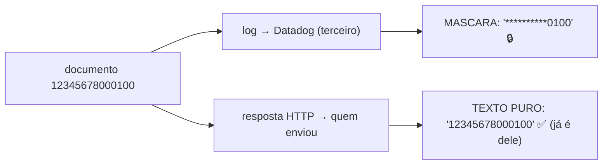

### 4.2 Contexto TLS das integrações (`core/ssl_context.py`)

> ### `R-SEC-010` — Existem **dois** mecanismos de CA bundle, propositalmente diferentes
> **Onde**: `core/ssl_context.py::criar_contexto_ssl` (integrações) **vs.**
> `core/oauth2.py::_get_ssl_context` (STS/token).
> **Por quê**: **(documentado)** na docstring de `ssl_context.py`: o das
> integrações lê `SSL_CERT_FILE`/`SSL_CERT_DIR` do ambiente; o do OAuth2 resolve
> por **caminhos fixos de Lambda Layer** (`/opt/ca_bundle.crt`). São cadeias de
> confiança potencialmente distintas (STS interno vs. APIs de negócio), e cada
> uma é configurada por um mecanismo de infraestrutura diferente.

```mermaid
flowchart TD
    subgraph INTEG["Integrações — core/ssl_context.py"]
        A["SSL_CERT_FILE / SSL_CERT_DIR (env)"] --> B["contexto ou None"]
    end
    subgraph STS["Token/STS — core/oauth2.py"]
        C["/opt/ca_bundle.crt<br/>/opt/certs/ca_bundle.crt (layer)"] --> D["contexto (nunca None)"]
    end
    B --> P1["pool 'integrations'"]
    D --> P2["pool 'oauth2'"]
```

> ### `R-SEC-011` — Sem `SSL_CERT_FILE` **e** sem `SSL_CERT_DIR`, retorna `None` (usa a confiança padrão do sistema)
> **Onde**: `criar_contexto_ssl` → `if not cert_file and not cert_dir: return None`
> **Por quê**: **(documentado)** "Retorna `None` (sem contexto customizado)".
> `None` repassado ao `urllib3.PoolManager` significa "use o comportamento
> padrão", que **valida** certificados contra o truststore do sistema — não
> significa "não valide". Não há nenhum caminho neste código que desligue
> verificação TLS.

> ### `R-SEC-012` — O `.strip()` nas variáveis de certificado
> **Onde**: `os.environ.get("SSL_CERT_FILE", "").strip()`
> **Por quê**: **(inferido)** variável de ambiente vinda de YAML/Terraform
> frequentemente carrega espaço ou `\n` acidental; sem o `strip`, o
> `os.path.isfile(" /opt/x.crt")` falharia e o certificado seria silenciosamente
> ignorado.

> ### `R-SEC-013` — O arquivo só é carregado se existir de fato (`isfile`/`isdir`), e os dois podem coexistir
> **Onde**: `if cert_file and os.path.isfile(cert_file)` /
> `if cert_dir and os.path.isdir(cert_dir)` — dois `if` independentes.
> **Por quê**: **(inferido)** `load_verify_locations` levanta exceção em
> caminho inexistente; checar antes transforma "config errada" em "ignora e segue
> com o truststore do sistema" em vez de derrubar a Lambda. Os dois `if` são
> independentes porque OpenSSL aceita `cafile` **e** `capath` no mesmo contexto.

> ### `R-SEC-014` — Falha ao montar o contexto TLS → `warning` + `None` (degrada, não quebra)
> **Onde**: `except Exception: log_event(..., level="warning", ...); return None`
> **Por quê**: **(inferido)** um CA bundle corrompido não deve impedir a Lambda
> de subir: ela tenta com o truststore do sistema. Se a cadeia realmente for
> necessária, a falha aparece depois como erro de TLS na chamada — com log de
> `warning` já registrado apontando a causa raiz.

```mermaid
flowchart TD
    A["criar_contexto_ssl()"] --> B{"SSL_CERT_FILE ou SSL_CERT_DIR?"}
    B -->|"nenhuma"| C["None → truststore do sistema ✅"]
    B -->|"alguma"| D["create_default_context()"]
    D --> E{"cert_file é arquivo?"}
    E -->|"sim"| F["load_verify_locations(cafile)"]
    E -->|"não"| G["ignora"]
    F --> H{"cert_dir é diretório?"}
    G --> H
    H -->|"sim"| I["load_verify_locations(capath)"]
    H -->|"não"| J["ignora"]
    I --> K["retorna contexto"]
    J --> K
    D -.->|"qualquer exceção"| L["warning + None (degrada)"]
```

> ### `R-SEC-015` — O CA bundle do STS tenta 2 caminhos, na ordem: layer nova, depois layer legada
> **Onde**: `core/oauth2.py::_get_ssl_context` → lista `cert_paths`.
> **Por quê**: **(documentado no comentário)** `/opt/ca_bundle.crt` é a layer
> nova (`layer-crito-pki-dev/prod`) e `/opt/certs/ca_bundle.crt` a legada. A
> ordem permite migrar de layer sem deploy sincronizado: quem já tem a nova usa a
> nova; quem não tem, continua funcionando com a antiga.

> ### `R-SEC-016` — Se um caminho existe mas falha ao carregar, tenta o **próximo** (não aborta)
> **Onde**: `_get_ssl_context` — o `try/except` está **dentro** do `for`, e o
> `except` só loga `warning` sem `return`.
> **Por quê**: **(inferido)** um arquivo presente mas corrompido/truncado (falha
> de build da layer) não deve mascarar a existência de um bundle válido no outro
> caminho.

> ### `R-SEC-017` — O fallback final do STS é `ssl.create_default_context()` — **nunca `None`**
> **Onde**: última linha de `_get_ssl_context`.
> **Por quê**: **(inferido)** diferença deliberada em relação a `R-SEC-011`:
> aqui a função promete um contexto sempre, então o chamador não precisa tratar
> `None`. O efeito é o mesmo (validação contra truststore do sistema).

> ### `R-SEC-018` — Segredo **nunca** é logado: só presença (booleano) e comprimento
> **Onde**: `adapters/auth.py::build_token_provider` →
> `has_client_secret=bool(...)`, `client_secret_length=len(...)`;
> `core/oauth2.py::__post_init__` → `client_id_length`, `has_apikey`.
> **Por quê**: **(inferido)** é o diagnóstico máximo possível sem vazar
> credencial. O comprimento é surpreendentemente útil: distingue "secret ausente"
> (0) de "secret truncado pelo Terraform" (ex.: 12 quando deveria ter 40) — a
> falha de configuração mais comum — sem nunca expor o valor.

```mermaid
flowchart LR
    S["client_secret = 'abc...xyz'"] --> L["log de diagnóstico"]
    L --> A["has_client_secret: true"]
    L --> B["client_secret_length: 40"]
    L --> C(["valor NUNCA logado 🔒"])
    style C stroke-dasharray: 5 5
```

---

## 5. `R-AUT` — Regras de autenticação M2M (OAuth2 client_credentials)

### 5.1 Regras do fluxo de token

> ### `R-AUT-001` — Toda chamada externa leva `Authorization: Bearer <JWT>` obtido por `client_credentials`
> **Onde**: `core/oauth2.py::OAuth2Manager`, consumido por
> `adapters/auth.py::OAuth2TokenProvider.auth_headers()`.
> **Por quê**: **(documentado)** é o padrão M2M do STS interno do Itaú: a
> Lambda não age em nome de um usuário, age como si mesma. Não há refresh token
> no fluxo `client_credentials` — quando expira, pede outro.

```mermaid
sequenceDiagram
    participant L as Lambda
    participant M as OAuth2Manager
    participant C as Cache global (_token_cache)
    participant STS as STS Itaú
    participant API as NJ6 / Endpoint / Parâmetros

    L->>M: auth_headers()
    M->>C: token válido para esta token_url?
    alt cache válido
        C-->>M: access_token (cache_hit)
    else expirado ou ausente
        M->>STS: POST grant_type=client_credentials
        STS-->>M: {access_token, expires_in}
        M->>C: grava (expira_em = agora + expires_in)
    end
    M-->>L: {"Authorization": "Bearer <jwt>"}
    L->>API: GET ... com o header
```

> ### `R-AUT-002` — O corpo do POST é **form-urlencoded**, não JSON
> **Onde**: `_obter_token` → `urllib.parse.urlencode({...}).encode()` +
> `Content-Type: application/x-www-form-urlencoded`
> **Por quê**: **(inferido)** é o que a RFC 6749 (OAuth2) exige para o token
> endpoint. Enviar JSON resultaria em `400 invalid_request` na maioria dos STS.

> ### `R-AUT-003` — As credenciais vão no **corpo** (`client_id`/`client_secret`), não em `Basic auth`
> **Onde**: dict passado ao `urlencode`.
> **Por quê**: **(inferido)** a RFC permite as duas formas
> (`client_secret_post` e `client_secret_basic`); o STS do Itaú usa a primeira
> conforme o fluxo documentado no topo do módulo. Consequência de segurança: o
> segredo trafega no corpo — por isso TLS é obrigatório (`R-SEC-015`).

> ### `R-AUT-004` — Headers `x-itau-*` só são enviados **se preenchidos**
> **Onde**: `_obter_token` → três `if self.itau_xxx: headers[...] = ...`
> **Por quê**: **(inferido)** enviar `x-itau-apikey: ""` é pior que não enviar:
> muitos gateways validam "header presente" e rejeitam vazio com uma mensagem
> genérica. Omitir produz um erro mais claro (header ausente).

```mermaid
flowchart TD
    A["montar headers do token"] --> B["Content-Type: form-urlencoded (SEMPRE)"]
    A --> C{"itau_apikey preenchida?"}
    C -->|"sim"| D["+ x-itau-apikey"]
    C -->|"não"| E["omite (não manda vazio)"]
    A --> F{"itau_correlationid preenchida?"}
    F -->|"sim"| G["+ x-itau-correlationid"]
    F -->|"não"| H["omite"]
    A --> I{"itau_flowid preenchida?"}
    I -->|"sim"| J["+ x-itau-flowid"]
    I -->|"não"| K["omite"]
```

### 5.2 Regras de cache de token

> ### `R-AUT-010` — O cache de token é **global de módulo**, indexado pela `token_url`
> **Onde**: `core/oauth2.py` → `_token_cache: dict[str, dict] = {}`
> **Por quê**: **(documentado)** "Em Lambda, o cache sobrevive entre invocações
> enquanto o container estiver quente". Ser **global de módulo** (e não atributo
> de instância) significa que mesmo se alguém construir um novo `OAuth2Manager`
> por invocação, o token continua sendo reaproveitado. Indexar por `token_url`
> evita que dois STS distintos (ex.: migração de endpoint) compartilhem token por
> engano.

```mermaid
flowchart TD
    subgraph CONTAINER["Container Lambda quente"]
        C["_token_cache<br/>{token_url: {access_token, expira_em, margem}}"]
    end
    I1["Invocação 1"] -->|"grava"| C
    I2["Invocação 2"] -->|"cache_hit — zero rede ✅"| C
    I3["Invocação N"] -->|"cache_hit"| C
    CS["Cold start (novo container)"] -->|"cache vazio → 1 POST ao STS"| C
```

> ### `R-AUT-011` — O token é renovado **60 s antes** de expirar (margem de segurança)
> **Onde**: `margem_renovacao_s: int = 60` e
> `if agora < (expira_em - margem_renovacao)`
> **Por quê**: **(documentado)** "reutilizado até 60 segundos antes de
> expirar". A margem cobre: clock skew entre a Lambda e o STS, e o tempo de voo da
> chamada seguinte (um token que expira em 2 s seria aceito no cache e recusado
> pela API de destino). Sem margem, haveria 401 intermitente perto do vencimento —
> a classe de bug mais difícil de reproduzir.
> ⚠️ Existe `TOKEN_TTL_MARGEM_S=30` em `settings` que **não** chega aqui — ver `R-PEND-001`.

```mermaid
gantt
    title Janela de validade do token (expires_in = 3600 s)
    dateFormat X
    axisFormat %s
    section Token
    Usável via cache        :0, 3540
    Margem de 60 s (renova) :3540, 3600
```

> ### `R-AUT-012` — A margem usada é a **gravada na entrada do cache**, com fallback para a da instância
> **Onde**: `cache_entry.get("margem_renovacao_s", self.margem_renovacao_s)`
> **Por quê**: **(inferido)** como o cache é global (`R-AUT-010`), uma entrada
> pode ter sido escrita por um manager configurado com outra margem. Respeitar a
> margem de quem gravou mantém a decisão coerente com o `expira_em` daquela
> entrada. O `.get` com default também torna o código tolerante a uma entrada de
> cache antiga sem a chave.

> ### `R-AUT-013` — `expira_em` é calculado a partir do instante **anterior** à chamada HTTP
> **Onde**: `agora = time.time()` no início de `get_token()`, e depois
> `"expira_em": agora + expires_in` — com a chamada de rede acontecendo **entre**
> os dois pontos.
> **Por quê**: **(inferido)** é conservador de propósito: o tempo gasto no POST
> ao STS (que pode ser 1–2 s) é descontado da validade. Se usasse `time.time()`
> depois da resposta, o token seria considerado válido por mais tempo do que o STS
> realmente concedeu.

```mermaid
flowchart LR
    A["t0 = time.time()"] --> B["POST ao STS (leva Δ)"]
    B --> C["expira_em = t0 + expires_in"]
    C --> D["validade real ≈ expires_in − Δ<br/>(conservador ✅)"]
```

> ### `R-AUT-014` — `expires_in` ausente na resposta assume **3600 s**
> **Onde**: `expires_in = int(data.get("expires_in", 3600))`
> **Por quê**: **(inferido)** o campo é opcional na RFC. 1 h é o padrão de
> fato do OAuth2. Assumir um valor **alto** é a escolha arriscada aqui (poderia
> cachear um token já expirado), mas é mitigada pela margem de 60 s e pelo fato de
> que um 401 na chamada seguinte é observável. A alternativa (assumir baixo, ex.
> 60 s) causaria renovação excessiva.

> ### `R-AUT-015` — `access_token` ausente/vazio → `ValueError` explícito
> **Onde**: `if not token: raise ValueError("access_token não encontrado na resposta do STS")`
> **Por quê**: **(inferido)** *fail fast com mensagem acionável*. Sem essa
> checagem, o `None` seria cacheado e propagado como
> `Authorization: Bearer None`, produzindo 401 nas três integrações — um sintoma a
> três saltos da causa. Note que `not token` também pega string vazia.

> ### `R-AUT-016` — `clear_cache()` existe apenas para testes e remove só a entrada da própria `token_url`
> **Onde**: `OAuth2Manager.clear_cache`
> **Por quê**: **(documentado)** "útil para testes". Remover só a própria
> entrada (em vez de `_token_cache.clear()`) evita que um teste invalide o token de
> outra configuração em execução paralela.

### 5.3 Regras de erro na obtenção do token

> ### `R-AUT-020` — Erro de rede no token → log `error` + re-`raise` (sem retry)
> **Onde**: `_obter_token` → `except urllib3.exceptions.HTTPError`
> **Por quê**: **(inferido)** `_obter_token` **não** é decorado com
> `@http_retry` — ver `R-PEND-003`. O erro sobe para o adapter chamador; como a
> falha acontece *dentro* do método já decorado do adapter (ex.
> `HttpNJ6.get_por_documento`), na prática a tentativa inteira é repetida, o que
> inclui obter o token novamente.

> ### `R-AUT-021` — Status ≥ 400 do STS → loga o **corpo do erro** e levanta `RuntimeError`
> **Onde**: `if resp.status >= 400:` → log com `erro_body` +
> `raise RuntimeError(f"STS retornou HTTP {resp.status} em {self.token_url}")`
> **Por quê**: **(inferido)** o corpo da resposta do STS é onde vive a causa
> real (`invalid_client`, `unauthorized_client`, `invalid_scope`). Sem logá-lo, um
> 400 do STS é indistinguível de outro. O corpo é decodificado com
> `errors="replace"` para nunca falhar em byte inválido.
> **Nota**: é `RuntimeError` e **não** `ErroServidorIntegracao`, então um 5xx do
> STS não é classificado como transitório (`R-HTTP-023`) — coerente com o fato de
> não haver retry aqui.

```mermaid
flowchart TD
    A["POST ao STS"] --> B{"exceção de rede?"}
    B -->|"sim"| C["log oauth2.erro.rede (error) + raise"]
    B -->|"não"| D{"status >= 400?"}
    D -->|"sim"| E["log oauth2.erro.http com corpo + RuntimeError"]
    D -->|"não"| F["parse JSON"]
    F -->|"JSONDecodeError"| G["log oauth2.erro.json + raise"]
    F --> H{"access_token presente?"}
    H -->|"não"| I["ValueError explícito"]
    H -->|"sim"| J["cacheia + retorna (token, expires_in)"]
```

> ### `R-AUT-022` — Erros são tratados em cascata específica → genérica, cada um com seu evento
> **Onde**: `_obter_token` → `except json.JSONDecodeError` e depois
> `except Exception`, com eventos `oauth2.erro.json` e
> `oauth2.erro.desconhecido`.
> **Por quê**: **(inferido)** eventos distintos permitem alarmar diferente:
> `erro.http` é problema de credencial/permissão (acionável pelo time de infra);
> `erro.json` é contrato quebrado do STS; `erro.desconhecido` é bug nosso. Todos
> re-levantam — nenhum silencia.

### 5.4 Regras de construção do provider (`adapters/auth.py`)

> ### `R-AUT-030` — O domínio conhece só um `Protocol TokenProvider` com 2 métodos
> **Onde**: `adapters/auth.py` →
> `class TokenProvider(Protocol): get_token(); auth_headers()`
> **Por quê**: **(documentado)** "Trocar aqui não toca no domínio". Os adapters
> dependem da interface mínima; substituir OAuth2 por mTLS ou por um token fixo é
> uma classe nova que satisfaça esses dois métodos.

> ### `R-AUT-031` — `OAuth2TokenProvider` é um **adaptador fino** sobre `OAuth2Manager`
> **Onde**: `class OAuth2TokenProvider` — dois métodos que só delegam.
> **Por quê**: **(inferido)** separa "como se fala com o STS"
> (`core/oauth2.py`, infraestrutura) de "o que os adapters esperam"
> (`adapters/auth.py`, porta). Sem a camada, `core/oauth2.py` teria que conhecer o
> `Protocol` do adapter, invertendo a dependência.

> ### `R-AUT-040` — As 3 credenciais são **obrigatórias**: faltando qualquer uma, `ValueError` com mensagem acionável
> **Onde**: `build_token_provider` → três `if not ...: raise ValueError(...)`, na
> ordem `token_url` → `client_id` → `client_secret`.
> **Por quê**: **(documentado nas próprias mensagens)** cada mensagem diz o que
> falta **e** o que fazer ("Configure a variável de ambiente TOKEN_URL"). A ordem
> segue a do fluxo (sem URL, nem faz sentido checar credencial). Isso transforma
> um erro de deploy em uma mensagem única e legível no primeiro request, em vez de
> um 401 obscuro nas três integrações.

```mermaid
flowchart TD
    A["build_token_provider()"] --> L["log de diagnóstico<br/>(só booleanos + comprimentos)"]
    L --> B{"token_url?"}
    B -->|"vazia"| B1["ValueError: TOKEN_URL não configurada"]
    B -->|"ok"| C{"client_id?"}
    C -->|"vazio"| C1["ValueError: AUTH_CLIENT_ID não configurado"]
    C -->|"ok"| D{"client_secret?"}
    D -->|"vazio"| D1["ValueError: AUTH_CLIENT_SECRET não configurado"]
    D -->|"ok"| E["OAuth2Manager(...) + OAuth2TokenProvider"]
```

> ### `R-AUT-041` — O log de diagnóstico é emitido **antes** das validações
> **Onde**: `build_token_provider` — `log_event("auth.provider.diagnostico")`
> precede os três `if`.
> **Por quê**: **(inferido)** se a validação falhar, o log de diagnóstico já
> saiu — e é justamente ele que diz **qual** das três está ausente e se alguma
> veio truncada. Logar depois perderia a informação exatamente no caso em que ela
> é necessária.

> ### `R-AUT-042` — Os headers `x-itau-*` são passados **explicitamente** ao `OAuth2Manager`
> **Onde**: `build_token_provider` → `itau_apikey=settings.itau_api_key`, etc.
> **Por quê**: **(documentado em `docs/AVALIACAO.md` §6)** o `OAuth2Manager`
> tem `default_factory` que lê `os.environ` direto; passar explicitamente faz
> `settings` ser a única fonte de configuração (o `default_factory` fica só como
> rede de segurança para uso isolado da classe). Evita a situação em que
> `settings.itau_api_key` e o que o manager realmente usou divergem.

> ### `R-AUT-043` — `OAuth2Manager.__post_init__` **revalida** as 3 credenciais
> **Onde**: `core/oauth2.py::__post_init__` → três `if not ... raise ValueError`
> **Por quê**: **(inferido)** validação redundante com `R-AUT-040`, e
> intencionalmente: a classe é utilizável fora de `build_token_provider` (testes,
> scripts), então ela mesma garante seu invariante — não confia no chamador.

---

## 6. `R-HTTP` — Regras de transporte HTTP (pool de conexões e retry)

### 6.1 Pool de conexões (`core/http_client.py`)

> ### `R-HTTP-001` — Todas as chamadas HTTP passam por um `urllib3.PoolManager` **reaproveitado entre invocações**
> **Onde**: `core/http_client.py::get_pool`, usado por `oauth2.py`, `nj6.py`,
> `endpoint.py`, `parametros.py`.
> **Por quê**: **(documentado no módulo)** `urllib.request.urlopen` abre
> conexão TCP+TLS **nova a cada chamada**. Uma requisição típica faz 2–4 chamadas
> HTTPS (token + NJ6/Endpoint/Parâmetros), pagando handshake completo em cada uma.
> Com o pool em nível de módulo, as conexões keep-alive sobrevivem entre
> invocações do container quente — mesmo princípio do cache de token
> (`R-AUT-010`). É a otimização de latência mais significativa do caminho quente.

```mermaid
sequenceDiagram
    participant L as Lambda (container quente)
    participant P as PoolManager (módulo)
    participant H as Host remoto

    Note over L,H: SEM pool (urlopen) — antes
    L->>H: TCP handshake + TLS handshake + GET
    L->>H: TCP handshake + TLS handshake + GET
    L->>H: TCP handshake + TLS handshake + GET

    Note over L,H: COM pool — agora
    L->>P: request()
    P->>H: TCP + TLS (1ª vez)
    P-->>L: resposta
    L->>P: request()
    P->>H: reusa conexão viva (keep-alive) ✅
    P-->>L: resposta
    Note over P: conexão sobrevive à invocação
```

> ### `R-HTTP-002` — Existem pools **nomeados** (`"oauth2"` e `"integrations"`), não um só
> **Onde**: `get_pool(nome, ssl_context)`; chamadas com `"oauth2"` em
> `core/oauth2.py` e `"integrations"` nos três adapters.
> **Por quê**: **(documentado no módulo)** o STS e as integrações resolvem a CA
> bundle por mecanismos diferentes (`R-SEC-010`), e o contexto SSL é propriedade
> do pool. Um pool único forçaria uma cadeia de confiança comum às duas famílias
> de host.

> ### `R-HTTP-003` — O contexto SSL é aplicado **só na criação** do pool; chamadas seguintes o ignoram
> **Onde**: `get_pool` → `if pool is None: pool = urllib3.PoolManager(ssl_context=...)`
> **Por quê**: **(documentado no módulo)** "as variáveis de ambiente que definem
> a CA bundle não mudam durante a vida do processo" (`R-CFG-002`). Recriar o
> contexto por chamada anularia o ganho do pool (e faria I/O de disco lendo o
> certificado a cada requisição).
> **Consequência a conhecer**: `criar_contexto_ssl()` ainda é *chamado* a cada
> request nos adapters (fazendo o `isfile`/`isdir`), mas seu resultado é
> descartado depois da primeira vez.

```mermaid
flowchart TD
    A["get_pool('integrations', ctx)"] --> B{"_pools já tem 'integrations'?"}
    B -->|"não (1ª vez)"| C["cria PoolManager COM ctx<br/>maxsize=10, retries=False"]
    C --> D["guarda em _pools"]
    B -->|"sim"| E["retorna o existente<br/>(ctx do argumento é ignorado)"]
    D --> F["retorna pool"]
    E --> F
```

> ### `R-HTTP-004` — `maxsize=10` conexões por host no pool
> **Onde**: `urllib3.PoolManager(..., maxsize=10, ...)`
> **Por quê**: **(inferido)** casa com `_MAX_WORKERS = 10` do fetch paralelo
> (`R-BSC-031`, `R-SLV-025`): com 10 threads batendo no mesmo host, um `maxsize`
> menor faria threads descartarem conexões (o urllib3 fecha o excedente em vez de
> bloquear), reintroduzindo handshakes justamente sob carga.

```mermaid
flowchart LR
    T["ThreadPoolExecutor<br/>_MAX_WORKERS = 10"] --> P["PoolManager<br/>maxsize = 10"]
    P --> N["cada thread pega uma conexão viva ✅"]
    X["maxsize < 10"] -.->|"causaria"| Y["conexões descartadas → handshake extra ⚠️"]
```

> ### `R-HTTP-005` — O retry **nativo do urllib3 está desligado** (`retries=False`)
> **Onde**: `urllib3.PoolManager(..., retries=False)`
> **Por quê**: **(documentado no módulo)** "retry de aplicação já é feito pelo
> tenacity". Se ambos estivessem ativos, os retries se **multiplicariam**: 3
> tentativas do tenacity × 3 do urllib3 = 9 chamadas reais, com o backoff do
> tenacity contando errado e o timeout total explodindo (potencialmente além dos
> 29 s do API Gateway). Também impediria que os logs de `integracao.retry`
> refletissem o número real de tentativas.

```mermaid
flowchart TD
    A["1 chamada lógica"] --> B{"retries do urllib3"}
    B -->|"False (nosso caso)"| C["tenacity: até 3 tentativas → 3 chamadas reais ✅"]
    B -->|"default (3)"| D["3 × 3 = 9 chamadas reais ⚠️<br/>timeout total imprevisível"]
```

### 6.2 Política de retry (`core/retry.py`)

> ### `R-HTTP-020` — Retry acontece **só** em falha transitória: rede/timeout ou HTTP 5xx
> **Onde**: `_TRANSIENTES = (urllib3.exceptions.HTTPError, ErroServidorIntegracao, TimeoutError, ConnectionError)`
> **Por quê**: **(documentado)** "Retry só em falhas transitórias
> (rede/timeout/5xx)". `urllib3.exceptions.HTTPError` é a **base de todas** as
> exceções do urllib3 (timeout, conexão recusada, falha de DNS, erro de TLS), o
> que cobre a família inteira sem enumerar. `TimeoutError`/`ConnectionError` são
> as builtins, cobrindo camadas mais baixas.

> ### `R-HTTP-021` — São **3 tentativas no total** (não 3 retries), governadas por `PARAMETROS_RETRIES`
> **Onde**: `stop=stop_after_attempt(settings.parametros_retries)` com default 3
> (`R-CFG-018`).
> **Por quê**: **(inferido)** `stop_after_attempt(3)` = 1 original + 2
> repetições. Com backoff máximo de 2 s, o pior caso é ~4 s de espera + 3 × 5 s de
> timeout ≈ 19 s — ainda dentro do limite do API Gateway (~29 s), o que explica a
> escolha de 3 e não 5.
> ⚠️ O nome da variável é enganoso: governa **todas** as integrações — ver `R-PEND-004`.

> ### `R-HTTP-022` — Backoff **exponencial com jitter**, de 0,1 s até no máximo 2 s
> **Onde**: `wait=wait_exponential_jitter(initial=0.1, max=2.0)`
> **Por quê**: **(inferido)**
> - *exponencial*: se o serviço está sobrecarregado, insistir no mesmo ritmo
>   piora o problema;
> - *jitter* (aleatoriedade): sem ele, N Lambdas que falharam no mesmo instante
>   voltariam a bater **no mesmo instante** (thundering herd), transformando um
>   soluço em incidente;
> - *`initial=0.1`*: falha transitória de rede costuma resolver em dezenas de ms —
>   esperar 1 s de saída penalizaria o caso comum;
> - *`max=2.0`*: teto que mantém o total dentro do orçamento de tempo do gateway.

```mermaid
flowchart LR
    T1["tentativa 1"] -->|"falha transitória"| W1["espera ~0,1 s + jitter"]
    W1 --> T2["tentativa 2"]
    T2 -->|"falha transitória"| W2["espera ~0,2–2 s + jitter"]
    W2 --> T3["tentativa 3"]
    T3 -->|"falha"| F["reraise da exceção ORIGINAL"]
    T2 -->|"sucesso"| S["retorna ✅"]
    T3 -->|"sucesso"| S
```

> ### `R-HTTP-023` — HTTP **4xx não é retentado** — e é por isso que existe `ErroServidorIntegracao`
> **Onde**: `class ErroServidorIntegracao(Exception)` em `core/retry.py`; os
> adapters levantam essa classe para 5xx e `RuntimeError` para 4xx.
> **Por quê**: **(documentado na docstring da classe)** "erro do cliente não se
> resolve tentando de novo, só adiciona latência à resposta de erro". Um 400/401/403
> vai retornar 400/401/403 nas três tentativas — o único efeito seria triplicar o
> tempo até o usuário ver o erro. Como o status HTTP não é uma exceção no urllib3
> (ele retorna um objeto de resposta), foi preciso **criar** uma exceção
> específica para sinalizar "5xx = transitório" ao tenacity.

```mermaid
flowchart TD
    A["resposta HTTP do adapter"] --> B{"status"}
    B -->|"404"| C["tratamento próprio<br/>NJ6: NaoEncontrado / Endpoint: []"]
    B -->|"400–499"| D["RuntimeError<br/>NÃO está em _TRANSIENTES → falha rápido ✅"]
    B -->|">= 500"| E["ErroServidorIntegracao<br/>ESTÁ em _TRANSIENTES → retenta ✅"]
    B -->|"2xx"| F["parse do corpo"]
```

> ### `R-HTTP-024` — `reraise=True`: a exceção que sobe é a **original**, não `RetryError`
> **Onde**: `retry(reraise=True, ...)`
> **Por quê**: **(inferido)** é o que permite ao resto do código continuar
> tratando exceções por tipo. Sem `reraise`, o `NaoEncontrado`… (na verdade este
> não é retentado) e principalmente o `ErroServidorIntegracao` chegariam
> embrulhados em `tenacity.RetryError`, e o `except Exception` de
> `HttpEndpoint.buscar` (`R-END-010`) veria um tipo inútil no log
> (`tipo_erro="RetryError"` em vez da causa real).

> ### `R-HTTP-025` — Cada espera entre tentativas é logada em `WARNING` pelo próprio tenacity
> **Onde**: `before_sleep=before_sleep_log(_logger, logging.WARNING)` com
> `_logger = get_logger("integracao.retry")`
> **Por quê**: **(documentado)** "Cada tentativa loga um evento técnico
> (`integracao.retry`) — visível no Datadog". `WARNING` (e não `INFO`) porque
> retry é sinal de degradação: um monitor em cima do volume desse logger detecta
> instabilidade de integração **antes** de ela virar erro 500.
> **Nota**: este log sai no formato de mensagem do tenacity (texto), sem o campo
> `event` estruturado das nossas chamadas de `log_event`.

> ### `R-HTTP-026` — A política é aplicada por **decorator no método**, e é construída no **import**
> **Onde**: `def http_retry(func): return retry(...)(func)`, usado como
> `@http_retry` em `HttpNJ6.get_por_documento` e `HttpEndpoint._buscar_spreads`.
> **Por quê**: **(inferido)** decorator concentra a política num lugar — nenhum
> adapter escreve laço de retry. Como `stop_after_attempt(settings.parametros_retries)`
> é avaliado quando o módulo é importado, **mudar `PARAMETROS_RETRIES` exige cold
> start** (coerente com `R-CFG-002`). `ParametrosClient`/`ParametrosCatalogo`
> (QuickConfig) **não** usam `@http_retry` — não são chamadas HTTP; `obter()` só
> tenta uma vez e cai no fallback em qualquer falha (`R-PRM-020`), sem retry por
> tentativa.

> ### `R-HTTP-027` — O retry envolve o método **inteiro**, incluindo a obtenção do token
> **Onde**: `@http_retry` está no método que também chama
> `self._token.auth_headers()`.
> **Por quê**: **(inferido)** efeito colateral positivo: se a falha foi um
> token expirado no limite da margem, a nova tentativa refaz a montagem dos
> headers — e se o cache já venceu, busca um token novo. O custo é que o
> `correlation_id` é regenerado por tentativa (`R-NJ6-021`).

```mermaid
flowchart TD
    subgraph RETRY["escopo do @http_retry (repetido inteiro)"]
        A["uuid4() → correlation_id NOVO"] --> B["auth_headers() → pode renovar token"]
        B --> C["monta URL"]
        C --> D["pool.request(...)"]
        D --> E["classifica status"]
    end
    E -->|"transitório"| A
    E -->|"ok / 4xx"| F["sai do escopo"]
```

---

## 7. `R-NJ6` — Regras do adapter NJ6 (hierarquia de grupos econômicos)

### 7.1 Regras de contrato e construção

> ### `R-NJ6-001` — O NJ6 é a **autoridade** sobre quem é o conglomerado e quais são os subgrupos
> **Onde**: `HttpNJ6.get_por_documento`, consumido por
> `service_buscar.obter_faturamento` e `listar_subgrupos`.
> **Por quê**: **(documentado)** "resolve conglomerado → subgrupos →
> integrantes por documento (CPF/CNPJ/CGI)". Nosso banco guarda **valores**, nunca
> a estrutura do grupo — se guardasse, ficaria desatualizado quando o grupo
> econômico fosse reorganizado. Consequência: um GET sem NJ6 disponível não tem
> como responder (diferente do Endpoint, que tem fallback).

> ### `R-NJ6-002` — `base_url` sofre `rstrip("/")` **de novo** no construtor
> **Onde**: `HttpNJ6.__init__` → `self.base_url = base_url.rstrip("/")`
> **Por quê**: **(inferido)** defesa em profundidade: `settings` já normaliza
> (`R-CFG-003`), mas a classe também é instanciável direto (testes, scripts) com
> uma URL crua. A classe garante seu próprio invariante.

> ### `R-NJ6-003` — `timeout` default `5.0` s no construtor, mas na prática vem de `settings`
> **Onde**: `def __init__(self, base_url, timeout: float = 5.0, ...)`; em
> `api/deps.py::get_nj6` é passado `settings.integ_timeout_s`.
> **Por quê**: **(inferido)** o default existe para uso isolado da classe; o
> valor que vale em produção é o de `settings` (`R-CFG-014`). Coincidem em 5 s por
> desenho, para que teste e produção se comportem igual.

> ### `R-NJ6-004` — `token=None` faz a classe **construir** seu próprio provider
> **Onde**: `self._token = token or build_token_provider()`
> **Por quê**: **(inferido)** duplo propósito: em produção o token é injetado e
> **compartilhado** entre os três adapters (`R-DI-003`); em teste/uso isolado, a
> classe se autossustenta. O `or` também significa que um provider "falsy" seria
> substituído — irrelevante na prática, já que objetos são sempre truthy.

### 7.2 Regras da chamada HTTP

> ### `R-NJ6-010` — Rota fixa: `GET {base}/consulta-gruposeconomicos/v1/grupos-economicos?codigo_identificacao_pessoa={documento}`
> **Onde**: `get_por_documento`, montagem da `url`.
> **Por quê**: **(documentado na docstring)** é o contrato do serviço NJ6 do
> Itaú. O parâmetro se chama `codigo_identificacao_pessoa` (não `documento`)
> porque o NJ6 aceita qualquer identificador de pessoa — é o que permite que o
> documento de **um integrante qualquer** resolva o grupo inteiro.

> ### `R-NJ6-011` — O documento é **URL-encoded** (`urllib.parse.quote`)
> **Onde**: `...?codigo_identificacao_pessoa={urllib.parse.quote(documento)}`
> **Por quê**: **(inferido)** o valor entra numa querystring montada por
> f-string. Como o `documento` já passou pelo `DOCUMENTO_PATTERN` (só dígitos,
> `R-API-001`), o encode é redundante na prática — mas é a defesa correta contra
> *query/URL injection* caso a validação da rota mude ou a classe seja chamada de
> outro ponto.

> ### `R-NJ6-012` — 4 headers obrigatórios: `Authorization`, `x-itau-apikey`, `x-itau-correlationid`, `Content-Type`
> **Onde**: `get_por_documento` — `headers = self._token.auth_headers()` e três
> atribuições.
> **Por quê**: **(documentado na docstring)** é o contrato do gateway do Itaú.
> Note que aqui os `x-itau-*` são atribuídos **sempre** (mesmo vazios), ao
> contrário do fluxo de token (`R-AUT-004`) — inconsistência menor, sem efeito
> prático porque a apikey é obrigatória na chamada de negócio.
> `Content-Type: application/json` num GET sem corpo é tecnicamente
> desnecessário, mas alguns gateways do banco o exigem.

> ### `R-NJ6-013` — `headers` parte do dict **retornado pelo token provider** e é mutado
> **Onde**: `headers = self._token.auth_headers()` seguido de
> `headers["x-itau-apikey"] = ...`
> **Por quê**: **(inferido)** funciona porque `get_auth_header()` cria um dict
> novo a cada chamada (`return {"Authorization": ...}`). Se algum dia o provider
> passar a devolver um dict cacheado/compartilhado, essa mutação o contaminaria —
> é um acoplamento implícito que vale conhecer.

> ### `R-NJ6-020` — Cada chamada gera um `correlation_id` **UUID4 novo**
> **Onde**: `correlation_id = str(uuid.uuid4())`
> **Por quê**: **(inferido)** correlaciona *esta* chamada específica entre o
> nosso log e o log do provedor NJ6 — é o identificador que se leva para uma
> conversa com o time do outro lado. Sobrepõe o `ITAU_CORRELATION_ID` estático de
> `settings` (`R-CFG-025`), que não serviria: um valor fixo por ambiente não
> distingue chamadas.

> ### `R-NJ6-021` — O `correlation_id` é regenerado **a cada tentativa** do retry
> **Onde**: `uuid.uuid4()` está **dentro** do método decorado com `@http_retry`.
> **Por quê**: **(inferido)** cada tentativa é uma chamada HTTP física distinta
> no log do provedor; um id compartilhado tornaria ambíguo qual das 3 tentativas
> gerou qual log. O custo é que não há um id único agrupando "a operação lógica" —
> esse papel é do `request_id` do contexto (`R-LOG-014`).

```mermaid
flowchart TD
    A["get_por_documento (com @http_retry)"] --> B["tentativa 1: correlation_id = uuid-A"]
    B -->|"5xx / rede"| C["tentativa 2: correlation_id = uuid-B"]
    C -->|"5xx / rede"| D["tentativa 3: correlation_id = uuid-C"]
    E["request_id da invocação (constante)"] -.->|"agrupa todas no Datadog"| B
    E -.-> C
    E -.-> D
```

> ### `R-NJ6-022` — A **URL completa nunca é logada**; loga-se o documento mascarado
> **Onde**: comentário explícito "sem a URL completa (contém o documento na
> querystring)" + `documento=mascarar_documento(documento)`
> **Por quê**: **(documentado)** correção de LGPD registrada em
> `docs/AVALIACAO.md` §5.2: antes se logava a URL **e** o documento em texto puro.
> A URL é o vazamento menos óbvio dos dois — daí o comentário no código, para que
> ninguém a "reintroduza para facilitar o debug".

### 7.3 Regras de tratamento de status HTTP

> ### `R-NJ6-030` — HTTP **404 → `NaoEncontrado`** (que o boundary converte em 404 para o cliente)
> **Onde**: `if resp.status == 404: ... raise NaoEncontrado(...)`
> **Por quê**: **(inferido)** documento inexistente é um resultado **legítimo**
> de negócio, não uma falha técnica: o cliente digitou um CNPJ que não é de um
> grupo econômico conhecido. Traduzir para exceção de domínio deixa o adapter
> falar a língua do domínio, e o handler de `api/errors.py` (`R-API-062`) faz o
> resto. Logado em `info` (não `error`) exatamente porque não é incidente.

> ### `R-NJ6-031` — HTTP ≥ 500 → `ErroServidorIntegracao` (retentado); 4xx restantes → `RuntimeError` (falha rápido)
> **Onde**: `if resp.status >= 400:` → log `error` → `if resp.status >= 500`
> **Por quê**: ver `R-HTTP-023`. A ordem dos `if` importa: o 404 é interceptado
> **antes** do bloco genérico de `>= 400`, então nunca chega a virar `RuntimeError`.

> ### `R-NJ6-032` — O corpo do erro HTTP é logado **truncado em 500 caracteres**
> **Onde**: `erro=resp.data.decode("utf-8", errors="replace")[:500]`
> **Por quê**: **(inferido)** três razões somadas: (a) custo de ingestão no
> Datadog — uma página de erro HTML de gateway pode ter dezenas de KB; (b) um
> corpo de erro grande pode conter dado sensível não previsto; (c) 500 caracteres
> bastam para ver o código e a mensagem de erro do provedor. O
> `errors="replace"` garante que um byte inválido não levante `UnicodeDecodeError`
> **dentro do tratamento de erro** — a pior hora para uma exceção nova.

```mermaid
flowchart TD
    A["resposta do NJ6"] --> B{"exceção de rede/timeout?"}
    B -->|"sim"| C["log nj6.erro_rede (warning)<br/>+ raise → RETENTA"]
    B -->|"não"| D{"status == 404?"}
    D -->|"sim"| E["log nj6.nao_encontrado (info)<br/>+ NaoEncontrado → HTTP 404"]
    D -->|"não"| F{"status >= 400?"}
    F -->|"sim"| G["log nj6.erro_http (error)<br/>corpo truncado em 500 chars"]
    G --> H{"status >= 500?"}
    H -->|"sim"| I["ErroServidorIntegracao → RETENTA"]
    H -->|"não"| J["RuntimeError → falha rápido"]
    F -->|"não (2xx)"| K["json.loads"]
    K -->|"JSONDecodeError"| L["log nj6.erro_json + raise"]
    K --> M["_map_conglomerado(data)"]
```

> ### `R-NJ6-033` — Falha de parse JSON e falha genérica têm **eventos distintos**, ambos re-levantam
> **Onde**: `except json.JSONDecodeError` (evento `nj6.erro_json`) e
> `except Exception` (evento `nj6.erro`).
> **Por quê**: **(inferido)** `erro_json` significa contrato quebrado do
> provedor (acionável com o time do NJ6); `nj6.erro` engloba falha de mapeamento
> (bug nosso, ex. campo obrigatório ausente). Nenhum dos dois silencia: o GET
> falha com 500, porque sem hierarquia não há resposta possível (`R-NJ6-001`).

### 7.4 Regras de mapeamento resposta → domínio (`_map_conglomerado`)

> ### `R-NJ6-040` — Se a resposta vem envelopada em `{"data": [...]}`, usa-se o **primeiro** elemento
> **Onde**: `if "data" in raw and isinstance(raw["data"], list) and raw["data"]: raw = raw["data"][0]`
> **Por quê**: **(documentado)** "A resposta real do NJ6 vem envolvida em
> `{"data": [...]}`, enquanto as fixtures vêm direto com a estrutura. Esse método
> normaliza ambas". As **três** condições do `if` são todas necessárias:
> `"data" in raw` (existe a chave), `isinstance(..., list)` (é lista — se fosse
> dict, `[0]` daria `KeyError`), e `raw["data"]` (não está vazia — `[0]` em lista
> vazia daria `IndexError`). Pegar `[0]` assume que uma consulta por documento
> retorna **um** grupo econômico.

```mermaid
flowchart TD
    A["raw da resposta"] --> B{"tem chave 'data'?"}
    B -->|"não"| F["usa raw direto (formato fixture)"]
    B -->|"sim"| C{"data é list?"}
    C -->|"não"| F
    C -->|"sim"| D{"data não está vazia?"}
    D -->|"não"| F
    D -->|"sim"| E["raw = data[0] (formato real do NJ6)"]
    E --> G["mapeia campos"]
    F --> G
```

> ### `R-NJ6-041` — Campos **obrigatórios** usam acesso direto (`raw["x"]`) e **quebram** se ausentes
> **Onde**: `raw["nome_grupo_economico"]`, `raw["cabeca_grupo"]["documento_raiz"]`,
> `s["nome_subgrupo"]`, `s["cabeca_subgrupo"]["documento_raiz"]`,
> `p["pessoa"]["codigo_identificacao_pessoa"]`, `p["pessoa"]["documento_raiz"]`
> **Por quê**: **(inferido)** decisão deliberada de *fail loud*: sem a cabeça do
> grupo não existe chave de agregação (`R-BSC-002`) e sem `documento_raiz` do
> subgrupo não há o que resolver. Um `.get()` aqui produziria um `Conglomerado`
> com `None` nas chaves, que falharia depois — mais longe da causa.

> ### `R-NJ6-042` — Campos **opcionais** usam `.get()` com default explícito
> **Onde**: `segmento=raw.get("segmento")` (→ `None`),
> `codigo_grupo_cliente_atacado=s.get("codigo_grupo_cliente_atacado")` (→ `None`),
> `raw.get("subgrupos", [])`, `s.get("participantes", [])`
> **Por quê**: **(inferido)** `segmento` é passthrough de exibição (cabeçalho da
> tela) — sua ausência não impede nada. Já as listas caem em `[]` e não `None`
> porque são iteradas imediatamente: `for ... in None` quebraria; `for ... in []`
> simplesmente não itera, produzindo um conglomerado sem subgrupos (que o fluxo
> BUSCAR trata como zero alvos).

> ### `R-NJ6-043` — `codigo_tipo_pessoa` default `"J"` (pessoa jurídica)
> **Onde**: `p["pessoa"].get("codigo_tipo_pessoa", "J")`
> **Por quê**: **(inferido)** o domínio é faturamento de conglomerados
> econômicos — a esmagadora maioria dos integrantes é PJ. O default assume o caso
> comum, e o campo é puro passthrough para a tela (não entra em nenhuma decisão).

> ### `R-NJ6-044` — `indicador_estrangeiro` default `0` (nacional)
> **Onde**: `p["pessoa"].get("indicador_estrangeiro", 0)`
> **Por quê**: **(inferido)** mesmo raciocínio: `0` = nacional é o caso comum.
> É `int` (não `bool`) porque espelha o tipo do contrato do NJ6 — e o modelo
> `Pessoa` declara `indicador_estrangeiro: int = 0` para casar (`R-MOD-081`).

> ### `R-NJ6-045` — Erro em **um** subgrupo é logado com o índice e **aborta o mapeamento inteiro**
> **Onde**: `try/except` dentro do `for i, s in enumerate(...)` → loga
> `nj6.map_conglomerado.erro_subgrupo` com `idx=i` e faz `raise`.
> **Por quê**: **(inferido)** a escolha é *tudo ou nada*: um conglomerado com 8
> subgrupos dos quais 1 falhou no mapeamento seria devolvido com 7 — e a tela
> mostraria uma carteira **incompleta sem avisar**, o que é pior que um erro. O
> `idx` no log é o que permite achar qual elemento do JSON está malformado sem
> logar o payload todo (que teria documentos).

```mermaid
flowchart TD
    A["for i, s in enumerate(subgrupos)"] --> B["mapeia participantes + Subgrupo"]
    B -->|"KeyError/TypeError"| C["log erro_subgrupo com idx=i"]
    C --> D["raise → aborta TUDO"]
    D --> E["log erro_fatal + raise → HTTP 500"]
    B -->|"ok"| F["append no resultado"]
    F --> A
    E -.->|"por quê?"| G(["carteira parcial silenciosa<br/>é pior que erro explícito"])
```

> ### `R-NJ6-046` — Há um `try/except` externo que loga `erro_fatal` com o **tipo do `raw`** e re-levanta
> **Onde**: `except Exception` externo de `_map_conglomerado` → ctx com
> `raw_type=type(raw).__name__`
> **Por quê**: **(inferido)** `raw_type` diagnostica a falha mais comum sem
> vazar dado: se o NJ6 devolver uma **lista** no topo (em vez de dict), o
> `"data" in raw` já quebra com `TypeError`, e saber que veio `list` em vez de
> `dict` resolve o caso na hora — sem logar o conteúdo.

> ### `R-NJ6-047` — O log de sucesso do mapeamento é `debug` e agregado (nome do grupo + quantidade)
> **Onde**: `log_event(..., "nj6.map_conglomerado.sucesso", level="debug",
> nome_grupo=..., qtd_subgrupos=...)`
> **Por quê**: **(inferido)** é o **único** log que sobrou do mapeamento (os
> logs por subgrupo foram removidos por serem "estou aqui", `R-LOG-020`). Um
> agregado dá a informação útil — quantos subgrupos vieram — em uma linha só, em
> vez de N.

---

## 8. `R-END` — Regras do adapter Endpoint de Faturamento (Gestão Balanço)

### 8.1 A regra que define o adapter: ele é um **fallback**

> ### `R-END-001` — O Endpoint é **opcional** no fluxo: falha dele **nunca** derruba a leitura
> **Onde**: `HttpEndpoint.buscar` → `except Exception: log; return None`
> **Por quê**: **(documentado)** "É fallback: em falha, devolve None (o marcador
> fica MANUAL, não derruba a leitura)". Esta é a diferença arquitetural central
> em relação ao NJ6 (`R-NJ6-001`): sem hierarquia não há resposta; sem spread, há
> resposta — o analista simplesmente preenche à mão. Em produto: a tela abre
> mesmo com o Gestão Balanço fora do ar.

```mermaid
flowchart LR
    subgraph NJ6["NJ6 — obrigatório"]
        A["falha"] --> B["HTTP 500 / 404<br/>tela não abre"]
    end
    subgraph END["Endpoint — fallback"]
        C["falha"] --> D["buscar() → None"]
        D --> E["marcador vira MANUAL<br/>tela abre e pede input ✅"]
    end
```

> ### `R-END-002` — O `except Exception` de `buscar()` é **deliberadamente amplo**
> **Onde**: `except Exception as e:` com comentário
> `# fallback: não derruba a leitura`
> **Por quê**: **(documentado no comentário)** captura tudo: erro de rede
> esgotado pelo retry, 5xx, JSON inválido, `RuntimeError` de 4xx e até erro de
> programação na eleição. O **custo consciente** desse desenho é que um bug nosso
> em `eleicao.py` apareceria como "sem balanço" em vez de erro — foi exatamente
> assim que o bug de precedência de operador de `docs/AVALIACAO.md` §4.5 ficou
> invisível. A mitigação é o log em nível `error` com `tipo_erro`: o evento
> `endpoint.indisponivel` existe justamente para ser alarmável.

> ### `R-END-003` — O evento de falha é `error` (não `warning`), mesmo o fluxo seguindo
> **Onde**: `log_event(_logger, "endpoint.indisponivel", level="error", ...)`
> **Por quê**: **(inferido)** o fluxo degradou de forma invisível para o
> usuário — é justamente o caso que precisa de alarme. Se fosse `warning`, um
> Endpoint 100% fora do ar produziria telas silenciosamente vazias sem disparar
> monitor.

> ### `R-END-004` — O log de falha **não** inclui o documento
> **Onde**: `log_event(..., "endpoint.indisponivel", erro=..., tipo_erro=...)`
> **Por quê**: **(inferido)** minimização de dado (LGPD): o evento é sobre a
> saúde da integração, não sobre um cliente. A contrapartida é que não se sabe
> *qual* subgrupo falhou por este log — mas isso está nos logs internos de
> `_buscar_spreads` (com documento mascarado) e no
> `faturamento.buscar.endpoint_erro_paralelo` (`R-BSC-034`).

### 8.2 Regras de eleição e data de referência

> ### `R-END-010` — O adapter **carrega** os dados; a eleição R1/R2/R3 é regra **nossa**, em `domain/eleicao.py`
> **Onde**: `buscar()` → `spreads = self._buscar_spreads(...)` e depois
> `return eleger(spreads, ref)`
> **Por quê**: **(documentado)** "A eleição do melhor balanço (R1/R2/R3) é regra
> NOSSA e mora em `domain/eleicao.py` — aqui o adapter só carrega os dados e chama
> `eleger`". Mantém a regra de negócio testável sem rede e impede que ela se
> espalhe pelo adapter.

> ### `R-END-011` — `asof` ausente ⇒ usa `date.today()`
> **Onde**: `ref = date.fromisoformat(asof) if asof else date.today()`
> **Por quê**: **(inferido)** o parâmetro existe para permitir consulta
> retroativa/determinística (inclusive em teste), mas o caso real é "melhor
> balanço **hoje**". `date.fromisoformat` valida o formato: um `asof` malformado
> levanta `ValueError` — que cai no `except` de `R-END-002` e vira `None`
> (silenciosamente). Hoje nenhum chamador passa `asof`, então o caminho é teórico.

> ### `R-END-012` — `ResultadoFaturamento` = `None` significa "não há balanço elegível"
> **Onde**: retorno de `eleger` repassado por `buscar`.
> **Por quê**: **(documentado)** "Retorna `None` quando não há balanço elegível
> (→ input MANUAL na tela)". `None` unifica dois casos diferentes para o
> chamador — "não veio nada do Endpoint" e "veio, mas nada passou nas regras" —
> porque a consequência para a tela é a mesma.

### 8.3 Regras de extração da lista de spreads (`_extrair_spreads`)

> ### `R-END-020` — A resposta é aceita em **3 formatos**: lista crua, `{"data": [...]}` ou `{"spreads": [...]}`
> **Onde**: `_extrair_spreads` →
> `data if isinstance(data, list) else (data.get("data") or data.get("spreads") or [])`
> **Por quê**: **(documentado)** o contrato real do provedor é `{"data": [...],
> "page", "size", "totalElements", "totalPages"}` (confirmado numa fixture de
> resposta real), mas fixtures antigas e versões do mock devolvem outras
> formas — `_extrair_spreads` só extrai a **lista de spreads** de qualquer uma
> delas; quem lê `page`/`totalPages` para paginar é `HttpEndpoint._buscar_todas_paginas`
> (`R-END-033`), não esta função. Esta função é a **correção do bug crítico** de
> `docs/AVALIACAO.md` §4.5 (precedência de operador que descartava
> silenciosamente todos os spreads) e foi extraída para **função pura**
> exatamente para ser testável sem mockar rede — hoje coberta por 4 testes em
> `tests/unit/test_regressao_bugs_criticos.py`.

```mermaid
flowchart TD
    A["data (corpo já parseado)"] --> B{"é list?"}
    B -->|"sim"| C["usa data direto"]
    B -->|"não (dict)"| D{"data.get('data') truthy?"}
    D -->|"sim"| E["usa data['data']"]
    D -->|"não"| F{"data.get('spreads') truthy?"}
    F -->|"sim"| G["usa data['spreads']"]
    F -->|"não"| H["[] (nada reconhecível)"]
    C --> I{"resultado é list?"}
    E --> I
    G --> I
    H --> I
    I -->|"sim"| J["retorna a lista"]
    I -->|"não"| K["[data] — embrulha objeto único"]
```

> ### `R-END-021` — A cadeia de `or` trata lista **vazia** como "tenta a próxima chave"
> **Onde**: `data.get("data") or data.get("spreads") or []`
> **Por quê**: **(inferido)** efeito de `or` com valores falsy: `{"data": []}`
> não retorna `[]` imediatamente — cai para `spreads` e depois para `[]`. O
> resultado final é o mesmo (lista vazia), então é inofensivo aqui; mas é a razão
> pela qual a função não distingue "chave ausente" de "chave com lista vazia".

> ### `R-END-022` — Se o extraído **não** for lista, embrulha em lista de 1 elemento
> **Onde**: `return spreads if isinstance(spreads, list) else [data]`
> **Por quê**: **(inferido)** tolera a resposta que devolve **uma** análise como
> objeto (`{"codigo": 1, ...}`) em vez de lista. Note o detalhe: embrulha
> **`data`** (o objeto original), não `spreads` — coerente, porque nesse caminho
> `spreads` seria o valor não-lista extraído de uma chave, e o que interessa
> analisar é o objeto todo.

### 8.4 Regras HTTP do Endpoint (e a diferença crucial no 404)

> ### `R-END-030` — Rota: `GET {base}/gestaobalanco/v1/spreads-faturamento?documento={documento}&valido=true&page={n}&size=100`
> **Onde**: `_buscar_spreads`, montagem da `url`.
> **Por quê**: **(documentado, corrigido nesta rodada)** confirmado contra o
> código real do serviço Gestão Balanço (`FaturamentoRepositoryImpl`):
> - `documento` filtra por `grupo_empresa.cod_docm_grup_baln_coro` **com
>   `LIKE`** — é o campo do CNPJ de verdade;
> - `subgrupo`/`conglomerado` (que o adapter usava **antes**) filtram por
>   `cod_idef_subg_grup_ecoo`/`cod_idef_pess_cbaa_grup` — códigos **internos**
>   (tipo UUID, o mesmo `codigo_identificacao_pessoa` que o NJ6 devolve), **não**
>   o CNPJ. Mandar o CNPJ no parâmetro `subgrupo` (como o código fazia) nunca
>   bateria com nada num ambiente real — só "funcionava" contra o mock local,
>   que nunca filtrou de verdade;
> - `valido=true` é mandado **sempre**: as três regras (R1/R2/R3) exigem
>   `vigente=True` (`R-ELE-011`), então filtrar isso no servidor só reduz
>   volume de dados, sem mudar o resultado da eleição;
> - **não** manda `situacao` (R1 não exige Aprovado) nem `dataInicial` (filtra
>   pela data de **atualização** do spread, não pela data do **balanço** que a
>   janela de 24 meses usa — semânticas diferentes, não confirmado como
>   equivalente).
> A consulta continua **por documento único** — o fluxo BUSCAR faz N chamadas
> (uma por alvo sem banco resolvido), o que motivou a paralelização
> (`R-BSC-030`).

> ### `R-END-033` — A resposta é **paginada**; `_buscar_todas_paginas` busca todas antes de eleger
> **Onde**: `HttpEndpoint._buscar_todas_paginas` → laço incrementando `page` até
> `page >= totalPages` (lido do corpo da resposta, quando é um dict).
> **Por quê**: **(documentado, corrigido nesta rodada)** o contrato real devolve
> `page`/`size`/`totalElements`/`totalPages`; antes o adapter fazia **uma única**
> chamada e usava só a 1ª página, o que descartaria silenciosamente candidatos
> em páginas seguintes. Isso importa especialmente pra R1: pode haver **mais de
> um** spread simultaneamente elegível para R1 com categorias **diferentes**, e
> o desempate de R1 prioriza a categoria antes da data — um candidato de
> categoria prioritária numa página 2+ precisa **necessariamente** ser visto,
> senão a eleição escolhe errado. `total_paginas = corpo.get("totalPages", 1) if
> isinstance(corpo, dict) else 1` trata respostas sem paginação (lista crua,
> `{"spreads": [...]}`) como página única — compatível com fixtures/mocks mais
> simples.

```mermaid
flowchart TD
    A["_buscar_todas_paginas"] --> B["pagina = 1"]
    B --> C["_buscar_spreads(doc, pagina)"]
    C --> D["todos += _extrair_spreads(corpo)"]
    D --> E{"corpo é dict? pega totalPages (default 1)"}
    E --> F{"pagina >= totalPages?"}
    F -->|"não"| G["pagina += 1"] --> C
    F -->|"sim"| H["retorna todos — eleger() roda sobre a carteira inteira ✅"]
```

> ### `R-END-031` — HTTP **404 → `[]`** (lista vazia), **não** exceção
> **Onde**: `if resp.status == 404: log(info); return []`
> **Por quê**: **(inferido)** esta é a **diferença fundamental** em relação ao
> NJ6 (`R-NJ6-030`): "este subgrupo não tem balanço cadastrado" é o estado normal
> de um cliente novo, não um erro. Devolver `[]` faz `eleger([])` retornar `None`
> e o marcador virar MANUAL — exatamente o comportamento desejado, sem passar pelo
> `except` de `buscar()`.

```mermaid
flowchart LR
    subgraph N["NJ6 — 404"]
        A["404"] --> B["NaoEncontrado (exceção)"]
        B --> C["HTTP 404 ao cliente"]
    end
    subgraph E["Endpoint — 404"]
        D["404"] --> F["[] (lista vazia)"]
        F --> G["eleger([]) → None"]
        G --> H["marcador MANUAL ✅"]
    end
```

> ### `R-END-032` — 5xx → `ErroServidorIntegracao` (retenta); outros 4xx → `RuntimeError` (falha rápido)
> **Onde**: bloco `if resp.status >= 400` em `_buscar_spreads`.
> **Por quê**: idêntico a `R-NJ6-031`/`R-HTTP-023`. Ambos acabam capturados pelo
> `except` de `buscar()` (`R-END-002`) e viram `None` — a diferença é **quanto
> tempo** se gasta antes: 5xx custa 3 tentativas, 4xx falha na primeira.

> ### `R-END-033` — Só `_buscar_spreads` tem `@http_retry`; `buscar()` **não**
> **Onde**: decorator em `_buscar_spreads`; `buscar` sem decorator.
> **Por quê**: **(inferido)** separação de responsabilidades: o método privado
> cuida do transporte (e do que é transitório); o público cuida da política de
> negócio (fallback). Se `buscar()` também tivesse retry, o fallback seria
> repetido inutilmente, multiplicando o tempo antes de devolver `None`.

```mermaid
flowchart TD
    A["buscar() — política de negócio"] --> B["_buscar_spreads() — transporte<br/>@http_retry: até 3 tentativas"]
    B --> C["eleger(spreads, ref) — regra de domínio"]
    A -.->|"QUALQUER exceção"| D["log endpoint.indisponivel (error)<br/>+ return None"]
    C --> E["ResultadoFaturamento ou None"]
```

---

## 9. `R-PRM` — Regras do serviço de Parâmetros (catálogo, gate e cache)

### 9.0 Mudança de arquitetura

A reconstrução original assumia um serviço de parâmetros **REST** (`GET
{base}/parametros`), espelhado num mock HTTP local. O dono do negócio corrigiu
isso ao mostrar um projeto de exemplo (BFF interno): o serviço real é o
**QuickConfig** — biblioteca interna do Itaú (`manager`, `ConfigurationService`/
`QuickConfigConfigurationSource`) que conecta direto num **cluster**
(`cluster_members`), não uma URL HTTP. `adapters/parametros.py` foi reescrito de
ponta a ponta pra usar QuickConfig; as regras desta seção descrevem a versão
atual. Duas mudanças de negócio vieram junto, e valem pra todo o resto desta
seção:
  - O **gate de divergência agora está sempre ativo** — não existe mais um
    `gateDivergenciaAtivo` liga/desliga (nem no caminho feliz, nem no fallback).
    Existe um limite real configurado (`limite-Maximo-Divergencia-Porcentagem`),
    então o gate sempre roda contra ele.
  - Esse limite (%) passou a ser buscado **junto** com faixas/moedas, pelo mesmo
    canal (antes só existia hardcoded no fallback, `R-PRM-032`).

### 9.1 Regras estruturais

> ### `R-PRM-001` — Dois clientes, uma infraestrutura: `ParametrosClient` (SALVAR) e `ParametrosCatalogo` (BUSCAR)
> **Onde**: `_ClienteQuickConfig` (base) com duas subclasses.
> **Por quê**: **(documentado)** os dois consumidores precisam de recortes
> diferentes do mesmo conjunto de chaves: o SALVAR precisa do snapshot
> **autoritativo** (limite %, faixas, moedas) porque decide barrar ou gravar; o
> BUSCAR só precisa do **catálogo** (faixas → rótulo). Separar em duas classes
> deixa cada fluxo com um fallback próprio (`R-PRM-030`) e evita que o BUSCAR
> dependa de uma chave (limite de divergência) que não usa.

> ### `R-PRM-002` — O padrão é **Template Method**: a base faz cache+conexão QuickConfig; a subclasse define quais chaves buscar e o fallback
> **Onde**: `_buscar` e `_fallback` levantam `NotImplementedError` na base.
> **Por quê**: **(documentado)** "Template: conecta no QuickConfig (cache TTL) e
> devolve o snapshot que a subclasse monta". Evita duplicar a lógica (delicada)
> de cache/TTL/fallback-não-cacheado/conexão-reaproveitada nas duas classes.

```mermaid
classDiagram
    class _ClienteQuickConfig {
        -_cluster_members
        -_app_name
        -_ttl
        -_cache
        -_exp
        -_config_service
        +obter() dict
        -_inicializar_servico() ConfigurationService
        -_buscar(service) NotImplementedError
        -_fallback() NotImplementedError
        -_parse_json(data, default)$ Any
    }
    class ParametrosClient {
        -_key_faixas
        -_key_moedas
        -_key_limite_divergencia
        -_buscar() faixas+moedas+limite (gate sempre True)
        -_fallback() gate True + catálogo hardcoded
    }
    class ParametrosCatalogo {
        -_key_faixas
        -_key_moedas
        -_buscar() faixas+moedas
        -_fallback() catálogo hardcoded
    }
    _ClienteQuickConfig <|-- ParametrosClient
    _ClienteQuickConfig <|-- ParametrosCatalogo
```

> ### `R-PRM-003` — `ttl_s` usa `is not None` (e não `or`), para permitir TTL **zero**
> **Onde**: `self._ttl = ttl_s if ttl_s is not None else settings.quickconfig_ttl_s`
> **Por quê**: **(inferido)** com `ttl_s or settings...`, passar `0` (desligar o
> cache, útil em teste) cairia no default de 300 s, porque `0` é falsy. O
> `is not None` respeita o zero explícito. Contraste deliberado com
> `cluster_members or settings...` na linha anterior, onde string vazia **deve**
> cair no default.

```mermaid
flowchart TD
    A["ttl_s recebido"] --> B{"is not None?"}
    B -->|"0"| C["_ttl = 0 → cache desligado ✅"]
    B -->|"None"| D["_ttl = settings (300 s)"]
    E["se fosse 'ttl_s or settings'"] -.-> F["0 cairia em 300 s ⚠️"]
```

> ### `R-PRM-004` — `manager` (QuickConfig) não é instalável fora da rede do Itaú — dois stubs distintos resolvem isso
> **Onde**: `app/tests/conftest.py::_stub_manager_module` (testes) e
> `dev-stubs/manager/` (rodar `uvicorn` local).
> **Por quê**: **(documentado)** `adapters/parametros.py` faz
> `from manager import ConfigurationService, QuickConfigConfigurationSource` no
> topo do arquivo — sem isso instalado/stubado, **qualquer** import de
> `app.adapters.parametros` (direto ou via `app.api.deps`/`app.main`) quebra em
> qualquer máquina fora da rede interna. Dois stubs, dois propósitos diferentes:
>   - `app/tests/conftest.py` registra um stub em `sys.modules["manager"]` só
>     pra permitir o import na coleta do pytest — os testes de verdade usam
>     `@patch("app.adapters.parametros.ConfigurationService")` etc. por cima, o
>     stub em si nunca é exercitado.
>   - `dev-stubs/manager/` é um pacote de verdade no `PYTHONPATH` (ver
>     `SETUP.md`), pra o `uvicorn` local conseguir subir. Como
>     `QUICKCONFIG_CLUSTER_MEMBERS` também não está configurado localmente
>     (`R-CFG-015`), o efeito combinado é: local sempre cai no fallback
>     hardcoded (`R-PRM-031`/`R-PRM-033`) — determinístico, sem precisar simular
>     um cluster QuickConfig de verdade.
> Em produção (Lambda real), nenhum dos dois stubs é usado — o `manager` real
> vem do artifactory interno do Itaú.

```mermaid
flowchart TD
    A["import app.adapters.parametros"] --> B{"onde?"}
    B -->|"pytest"| C["stub em conftest.py<br/>(sys.modules) — só permite o import,<br/>@patch cobre o comportamento"]
    B -->|"uvicorn local"| D["dev-stubs/manager/ no PYTHONPATH<br/>+ QUICKCONFIG_CLUSTER_MEMBERS vazio<br/>→ sempre cai no fallback"]
    B -->|"Lambda real"| E["manager real (artifactory Itaú)<br/>+ QUICKCONFIG_CLUSTER_MEMBERS real<br/>→ conecta no cluster de verdade"]
```

### 9.2 Regras de cache TTL

> ### `R-PRM-010` — Cache válido exige **duas** condições: existir e não ter expirado
> **Onde**: `if self._cache is not None and agora < self._exp`
> **Por quê**: **(inferido)** `self._cache is not None` (e não `if self._cache`)
> é intencional: um snapshot legítimo mas "vazio" (`{}`, ou faixas `[]`) é falsy e
> seria refetchado a cada chamada com um `if` truthy — transformando um catálogo
> vazio em tempestade de chamadas ao cluster.

> ### `R-PRM-011` — O cache é **por instância**, e as instâncias são singletons de container
> **Onde**: `self._cache` + `@lru_cache` em `api/deps.py` (`R-DI-002`).
> **Por quê**: **(documentado)** "cache em memória por TTL (Lambda quente)". O
> cache não é global de módulo (ao contrário do token, `R-AUT-010`) porque cada
> subclasse expõe um recorte diferente das mesmas chaves. Como `deps.py` garante
> uma instância por container, o efeito prático é o mesmo. `_config_service`
> (a conexão em si) também é reaproveitada entre chamadas da mesma instância —
> `_inicializar_servico` só conecta na 1ª vez (`R-PRM-005`, implícita no código).

> ### `R-PRM-012` — `_exp` é calculado com o instante **anterior** ao fetch
> **Onde**: `agora = time.time()` no topo de `obter()`;
> `self._exp = agora + self._ttl` depois do fetch.
> **Por quê**: **(inferido)** mesmo princípio conservador de `R-AUT-013`: o
> tempo gasto na chamada é descontado do TTL, então o dado nunca é servido por
> mais de `ttl` segundos contados desde antes de ser buscado.

> ### `R-PRM-013` — A latência do fetch é medida com `perf_counter` e logada com 1 casa decimal
> **Onde**: `inicio = time.perf_counter()` …
> `latency_ms=round((time.perf_counter() - inicio) * 1000, 1)`
> **Por quê**: **(inferido)** `perf_counter` é monotônico — imune a ajuste de
> relógio (NTP), o correto para medir duração. Uma casa decimal em ms é precisão
> suficiente e evita cardinalidade inútil no Datadog.

> ### `R-PRM-014` — O evento `parametros.fetch` sai nos **dois** caminhos, com `cache_hit` true/false
> **Onde**: `log_event(..., "parametros.fetch", level="debug", cache_hit=True)`
> no hit e `cache_hit=False` + latência + contagens no miss.
> **Por quê**: **(documentado)** "log técnico (`parametros.fetch`) com
> cache_hit/latência". Usar o **mesmo nome de evento** com um atributo booleano
> permite calcular *hit ratio* no Datadog com uma única faceta — se fossem dois
> eventos diferentes, seria preciso somar duas séries.

```mermaid
flowchart TD
    A["obter()"] --> B{"_cache is not None<br/>E agora < _exp?"}
    B -->|"sim"| C["log parametros.fetch cache_hit=true<br/>retorna cache — ZERO chamada ao cluster ✅"]
    B -->|"não"| D["perf_counter() início"]
    D --> E["_inicializar_servico() (reaproveitada)<br/>+ _buscar(service)"]
    E -->|"exceção"| F["log parametros.indisponivel (error)<br/>retorna _fallback() SEM cachear"]
    E -->|"ok"| G["_cache = snapshot<br/>_exp = agora + ttl"]
    G --> H["log parametros.fetch cache_hit=false<br/>+ latency_ms + qtd faixas/moedas"]
```

### 9.3 Regras de indisponibilidade e fallback

> ### `R-PRM-020` — `obter()` **nunca levanta exceção**: qualquer falha vira fallback
> **Onde**: `except Exception as e: log(error); return self._fallback()`
> **Por quê**: **(documentado)** "Nunca lança — cai no fallback da subclasse".
> Centralizar a política aqui significa que nem o `service.py` nem o
> `service_buscar.py` precisam de `try/except` em volta de `parametros.obter()` —
> o contrato do porto `Catalogo` é "sempre devolve um dict". Cobre tanto
> `cluster_members` vazio (`ValueError` explícito) quanto falha real de conexão/
> leitura no cluster.

> ### `R-PRM-021` — O fallback **nunca é cacheado**
> **Onde**: o `return self._fallback()` acontece **antes** das linhas que
> atribuem `self._cache`/`self._exp`.
> **Por quê**: **(documentado)** "o fallback NUNCA é cacheado (tenta de novo na
> próxima invocação)". Se fosse cacheado, uma indisponibilidade de 1 segundo
> congelaria o modo degradado por 5 minutos inteiros. A consequência aceita é a
> oposta: com o cluster fora do ar por muito tempo, **toda** invocação tenta de
> novo — trocando latência (ou custo de conexão) por atualidade.

```mermaid
sequenceDiagram
    participant S as service
    participant C as ParametrosClient
    participant Q as QuickConfig (cluster)

    S->>C: obter()
    C->>Q: get_config_for_app(...)
    Q--xC: indisponível
    C->>C: log parametros.indisponivel
    C-->>S: _fallback() — NÃO cacheia
    Note over C: _cache continua None

    S->>C: obter() (próxima invocação)
    C->>Q: get_config_for_app(...) (tenta de NOVO ✅)
    Q-->>C: {faixas, moedas, limite}
    C->>C: agora sim cacheia por 300 s
    C-->>S: snapshot real
```

> ### `R-PRM-030` — Cada cliente define o **seu** fallback — mesmo catálogo hardcoded, escopo diferente
> **Onde**: `ParametrosClient._fallback` vs. `ParametrosCatalogo._fallback`.
> **Por quê**: **(documentado)** no topo do módulo. Os dois usam o **mesmo**
> catálogo hardcoded de faixas/moedas (`_FAIXAS_FALLBACK`/`_MOEDAS_FALLBACK`,
> módulo-level, não duplicado) — a diferença é só que `ParametrosClient`
> **também** devolve `gateDivergenciaAtivo`/`limiteVariacaoPercentual`, que
> `ParametrosCatalogo` não precisa (`R-PRM-043`). Diferente da versão HTTP
> anterior, não há mais assimetria de *fail-open* vs *fail-closed* entre os
> dois — ver `R-PRM-031`.

> ### `R-PRM-031` — No fallback, `gateDivergenciaAtivo = True` — igual ao caminho feliz, sem exceção
> **Onde**: `ParametrosClient._fallback` → `"gateDivergenciaAtivo": True`.
> **Por quê**: **(decisão de negócio, confirmada)** o gate de divergência não
> tem mais liga/desliga — existe um limite real configurado, então ele roda
> sempre, **inclusive quando o QuickConfig está indisponível** (usando o limite
> hardcoded de `R-PRM-032`). Isso é uma mudança deliberada de risco em relação à
> versão anterior (que desligava o gate no fallback, *fail-open*): agora, uma
> indisponibilidade do QuickConfig **não** abre uma janela sem proteção contra
> divergência — o preço é usar um limite (30%) que pode não ser o real do
> momento em produção.

> ### `R-PRM-032` — No fallback, `limiteVariacaoPercentual = 30`
> **Onde**: `ParametrosClient._fallback`.
> **Por quê**: **(inferido)** com o gate sempre ativo (`R-PRM-031`), este valor
> agora é **realmente usado** para barrar/liberar divergências enquanto o
> QuickConfig estiver fora do ar — diferente da versão anterior, onde era inerte
> (gate desligado no fallback). 30% é o mesmo valor usado como referência desde
> a reconstrução original; não veio de uma fonte de negócio explícita pra este
> caso específico de fallback.

> ### `R-PRM-033` — O catálogo de fallback tem **6 faixas fixas**, contíguas, a última sem teto
> **Onde**: `_FAIXAS_FALLBACK` (módulo-level, `adapters/parametros.py`),
> reaproveitado por `ParametrosClient._fallback` e `ParametrosCatalogo._fallback`.
> **Por quê**: **(inferido)** reproduzem as faixas de faturamento do negócio
> (R$ 360 mil → acima de R$ 2 BI). São **contíguas** (o `max` de uma é o `min` da
> seguinte) para funcionar com o intervalo semiaberto `[min, max)` de
> `R-FXA-003`, sem buraco nem sobreposição; e a 6ª tem `max: None` para não haver
> valor "fora de todas as faixas" no topo.

```mermaid
flowchart LR
    F1["FAIXA_1<br/>360k → 4,8 MM"] --> F2["FAIXA_2<br/>4,8 → 20 MM"]
    F2 --> F3["FAIXA_3<br/>20 → 100 MM"]
    F3 --> F4["FAIXA_4<br/>100 → 500 MM"]
    F4 --> F5["FAIXA_5<br/>500 MM → 2 BI"]
    F5 --> F6["FAIXA_6<br/>acima de 2 BI (max = None)"]
    Z(["valor < 360k → nenhuma faixa → erro no SALVAR"])
```

> ### `R-PRM-034` — Moedas de fallback: `["BRL", "USD"]`
> **Onde**: `_MOEDAS_FALLBACK` (módulo-level), usado por ambos os `_fallback`.
> **Por quê**: **(inferido)** as duas moedas do caso real de faturamento de
> conglomerado. Lista **não vazia** é essencial: `_validar_moeda` rejeita tudo com
> catálogo vazio (`R-SLV-052`), então um fallback com `[]` bloquearia todo SALVAR.

### 9.4 Regras de mapeamento e busca das chaves

> ### `R-PRM-040` — `limiteVariacaoPercentual` vem da chave `limite-Maximo-Divergencia-Porcentagem`, coagido para `int`
> **Onde**: `int(self._parse_json(service.get_config_for_app(self._app_name, self._key_limite_divergencia, "0"), 0))`
> **Por quê**: **(documentado pelo dono do negócio)** nome de chave real do
> QuickConfig — mixed-case, sem padrão kebab consistente com `catalogo-faixas`/
> `catalogo-moedas`; não é escolha nossa, é o nome configurado em produção.
> `_parse_json` trata tanto `"30"` (string simples) quanto `"30"` (JSON válido de
> um número) da mesma forma; `int(...)` normaliza pra inteiro. Default `"0"` é o
> mais **restritivo** possível: sem a chave, "qualquer variação é divergência" —
> falha pro lado seguro.

```mermaid
flowchart LR
    A["limite-Maximo-Divergencia-Porcentagem<br/>ausente no QuickConfig"] --> B["default '0' → int 0"]
    B --> C["variacao > 0 → divergência"]
    C --> D["409 pedindo confirmação<br/>(seguro: pede aval humano) ✅"]
```

> ### `R-PRM-041` — `gateDivergenciaAtivo` não vem mais de dado externo — é uma constante `True`
> **Onde**: `ParametrosClient._buscar` → `"gateDivergenciaAtivo": True` (literal,
> não lido de nenhuma chave do QuickConfig).
> **Por quê**: **(decisão de negócio, confirmada)** a versão anterior lia isso
> de um campo HTTP com `bool(...)` (e tinha um risco conhecido:
> `bool("false")` é `True`). Esse risco **deixou de existir** — não há mais
> nenhuma chave "liga/desliga" pra interpretar; o gate é incondicional.

> ### `R-PRM-042` — `faixas` e `moedas` usam `_parse_json(..., [])` (nunca `None`)
> **Onde**: `self._parse_json(service.get_config_for_app(...), [])` pras duas
> chaves, nas duas subclasses.
> **Por quê**: **(inferido)** os consumidores iteram direto (`for f in faixas`) e
> medem tamanho (`len`). `_parse_json` faz `json.loads` se vier string, devolve o
> dado direto se não for string, e cai no `default` (`[]`) em `JSONDecodeError`/
> `TypeError` — nunca deixa `None` vazar pros consumidores.

> ### `R-PRM-043` — `ParametrosCatalogo` busca **apenas** `faixas` e `moedas`
> **Onde**: `ParametrosCatalogo._buscar` → só as 2 chaves, sem
> `key_limite_divergencia` (a classe nem tem esse atributo).
> **Por quê**: **(inferido)** *princípio do menor privilégio aplicado a dado*: o
> fluxo BUSCAR não deve nem ter acesso ao limite de divergência, para que seja
> impossível um refactor futuro fazer o GET tomar decisão de gate. O snapshot
> menor também é mais barato de cachear.

> ### `R-PRM-050` — `_inicializar_servico` conecta uma vez e reaproveita a conexão
> **Onde**: `if self._config_service is not None: return self._config_service`
> no topo de `_inicializar_servico`.
> **Por quê**: **(documentado)** evita reconectar no cluster QuickConfig a cada
> `obter()` — só a 1ª chamada (ou a 1ª depois de uma falha, já que a exceção não
> é cacheada) paga o custo de `QuickConfigConfigurationSource(...)` +
> `ConfigurationService(...)`.

> ### `R-PRM-051` — Sem `cluster_members`, falha **antes** de tentar conectar (`ValueError` explícito)
> **Onde**: `if not self._cluster_members: raise ValueError("QUICKCONFIG_CLUSTER_MEMBERS não está configurado!")`
> **Por quê**: **(inferido)** falha rápida e com mensagem clara, em vez de deixar
> `QuickConfigConfigurationSource` tentar conectar numa lista vazia e falhar com
> um erro mais genérico/confuso lá dentro. É o mecanismo que faz o ambiente local
> (sem `QUICKCONFIG_CLUSTER_MEMBERS`) cair no fallback de forma determinística
> (`R-PRM-004`).

> ### `R-PRM-052` — `cluster_members` é uma string separada por vírgula; múltiplos membros viram lista
> **Onde**: `cluster_members=self._cluster_members.split(",")` ao construir
> `QuickConfigConfigurationSource`.
> **Por quê**: **(documentado)** `QUICKCONFIG_CLUSTER_MEMBERS` chega como
> `"host1:5701,host2:5701"` (formato de env var); a lib espera uma lista. Um só
> membro (`"host1:5701"`) vira `["host1:5701"]` — lista de 1, não a string
> inteira tratada como membro único por engano (regressão coberta por teste,
> mesma classe de bug encontrada no BFF de exemplo).

---

## 10. `R-DYN` — Regras de persistência (DynamoDB)

### 10.1 Regras de layout da tabela

> ### `R-DYN-001` — Chave composta: `cod_cogl` (HASH) + `cod_subg` (RANGE) — **um item por (conglomerado, subgrupo)**
> **Onde**: `adapters/repository.py`, docstring do módulo e `_build_item`.
> **Por quê**: **(documentado)** é o layout da tabela nova
> `tbcv4163_fatm_cogl_subg`. A chave de partição ser o conglomerado é o que
> permite ler **toda** a carteira com um único `query` (`R-DYN-049`) em vez de N
> `get_item` — a operação mais frequente do fluxo BUSCAR.

```mermaid
flowchart TD
    subgraph T["tbcv4163_fatm_cogl_subg"]
        direction LR
        I1["cod_cogl=123 | cod_subg=123<br/>(matriz)"]
        I2["cod_cogl=123 | cod_subg=456"]
        I3["cod_cogl=123 | cod_subg=789"]
    end
    Q["query(cod_cogl = 123)"] --> I1
    Q --> I2
    Q --> I3
    G["get_item(cod_cogl=123, cod_subg=456)"] --> I2
```

> ### `R-DYN-002` — **Sem** snapshots `SPREAD#` e **sem** GSI
> **Onde**: docstring: "Sem SPREAD# snapshots (a nova tabela não suporta
> multi-item por subgrupo). Sem GSI."
> **Por quê**: **(documentado)** restrição da tabela provisionada, não escolha de
> design. Consequência: o histórico por spread não é versionado — o que sobrou é
> o par `atual`/`anterior` dentro do mesmo item (`R-DYN-030`).

> ### `R-DYN-003` — As chaves são **duplicadas** em atributos de negócio (`conglomerado_doc`/`subgrupo_doc`)
> **Onde**: `_build_item` grava `cod_cogl` **e** `conglomerado_doc`, `cod_subg`
> **e** `subgrupo_doc`.
> **Por quê**: **(inferido)** `_item_to_marcador` lê `it["conglomerado_doc"]` e
> `it["subgrupo_doc"]` (acesso direto, obrigatório) — os nomes de negócio são o
> contrato de leitura, e os `cod_*` são o contrato da tabela. A duplicação
> desacopla os dois: renomear a chave física não quebraria o mapeamento. Custo:
> ~2 atributos redundantes por item.

### 10.2 Regras de escrita

> ### `R-DYN-010` — `save()` é **upsert incremental**: grava só os marcadores do payload e **nunca apaga** subgrupo ausente
> **Onde**: docstring do módulo + `save()` iterando `f.marcadores`.
> **Por quê**: **(documentado)** "NUNCA apaga um subgrupo por ele estar ausente
> do payload — o analista preenche a carteira aos poucos". É a regra que faz a
> tela funcionar: o usuário salva 2 de 8 subgrupos e volta amanhã para os outros 6
> sem perder nada. Um `PUT` semântico (substituir a carteira toda) destruiria
> trabalho.

```mermaid
flowchart TD
    subgraph BEFORE["Banco antes"]
        A1["subg 111: 5 MM"]
        A2["subg 222: 3 MM"]
        A3["subg 333: 1 MM"]
    end
    P["POST com marcadores: [111, 222]"] --> S["save()"]
    subgraph AFTER["Banco depois"]
        B1["subg 111: ATUALIZADO"]
        B2["subg 222: ATUALIZADO"]
        B3["subg 333: INTACTO ✅ (não veio, não apaga)"]
    end
    S --> AFTER
```

> ### `R-DYN-011` — Antes de gravar, `save()` **lê** todos os `atual` já salvos do conglomerado
> **Onde**: `save()` → `atual_por_subg = {it["cod_subg"]: it.get("atual") for it in self._query_conglomerado(...)}`
> **Por quê**: **(documentado)** é o insumo do roll "hoje vira ontem"
> (`R-DYN-030`). Um `query` único (em vez de um `get_item` por marcador) mantém o
> custo em 1 leitura por POST, independentemente do número de marcadores.
> Consequência: um POST sempre custa **1 query + N puts**.

> ### `R-DYN-012` — A escrita usa `batch_writer()`
> **Onde**: `with self.table.batch_writer() as bw: ... bw.put_item(...)`
> **Por quê**: **(inferido)** o `batch_writer` do boto3 agrupa em `BatchWriteItem`
> (até 25 itens por request), faz *flush* automático no fim do `with` e **retenta
> os itens não processados** por conta própria. Salvar 8 subgrupos custa 1 request
> em vez de 8 — latência e throttling reduzidos.
> **Nota**: `BatchWriteItem` **não é transacional** — se o processo morresse no
> meio, parte dos marcadores estaria gravada. Para este domínio (upsert
> incremental idempotente) o retry do cliente resolve.

```mermaid
sequenceDiagram
    participant S as save()
    participant Q as query
    participant BW as batch_writer
    participant D as DynamoDB

    S->>Q: query(cod_cogl) → itens atuais
    Q-->>S: {subg: atual}  (insumo do roll)
    S->>BW: put_item × N (no with)
    BW->>D: BatchWriteItem (até 25 por lote)
    D-->>BW: UnprocessedItems?
    BW->>D: retenta os não processados
    Note over BW: flush automático ao sair do with
```

> ### `R-DYN-013` — `atualizado_em` do **agregado** é carimbado em todos os itens
> **Onde**: `_build_item` → `"atualizado_em": f.atualizado_em` (do
> `Faturamento`, não do marcador).
> **Por quê**: **(inferido)** todos os marcadores de um mesmo POST recebem o
> **mesmo** timestamp (gerado uma vez em `service.salvar`, `R-SLV-070`). Isso
> permite reconstruir "o que foi salvo nesta operação" agrupando por timestamp — e
> evita que 8 marcadores tenham 8 timestamps com milissegundos diferentes,
> sugerindo edições separadas.

### 10.3 Regras do roll "hoje vira ontem"

> ### `R-DYN-030` — Se o marcador novo **não** traz `anterior`, o `atual` que estava salvo **vira** o `anterior`
> **Onde**: `_build_item` →
> `anterior = _info_to_map(m.anterior)`; `if anterior is None: anterior = atual_por_subg.get(m.subgrupo_doc)`
> **Por quê**: **(documentado)** "fazendo o roll 'hoje vira ontem' em cada um".
> É o versionamento mínimo possível sem multi-item (`R-DYN-002`): guarda-se **uma**
> geração anterior. Serve à quarentena (`R-RES-010`), que precisa de um valor
> anterior confiável para eleger quando o atual fica suspeito. Como o request do
> SALVAR nunca envia `anterior` (não existe no `MarcadorIn`), na prática **o roll
> sempre acontece**.

```mermaid
flowchart TD
    subgraph ANTES["Item antes do save"]
        A["atual = 5 MM (jan)"]
        B["anterior = 3 MM (dez)"]
    end
    P["POST: atual = 7 MM, sem 'anterior'"] --> R["_build_item"]
    R --> C{"m.anterior é None?"}
    C -->|"sim (sempre, no POST)"| D["anterior ← atual salvo (5 MM)"]
    subgraph DEPOIS["Item depois do save"]
        E["atual = 7 MM (fev)"]
        F["anterior = 5 MM (jan) ← rolou"]
        G["3 MM de dez: PERDIDO (só 1 geração)"]
    end
    D --> DEPOIS
```

> ### `R-DYN-031` — O `atual` salvo é lido **cru** (o map do Dynamo), sem passar pelo domínio
> **Onde**: `atual_por_subg` guarda `it.get("atual")` (dict), atribuído direto a
> `anterior` no item novo.
> **Por quê**: **(inferido)** evita o *round-trip* `dict → InfoFaturamento →
> dict`, que aplicaria os defaults de `_info_from_map` (`moeda="BRL"`,
> `unidade="milhoes"`) e **inventaria** valores que não estavam no item original.
> Copiar o map preserva o histórico exatamente como foi gravado.

> ### `R-DYN-032` — Subgrupo salvo pela primeira vez fica com `anterior` ausente
> **Onde**: `atual_por_subg.get(m.subgrupo_doc)` → `None` → `_clean` remove a
> chave.
> **Por quê**: **(inferido)** não há passado a preservar. `_item_to_marcador`
> trata `None` (`anterior=... if anterior else None`, `R-DYN-042`), e a quarentena
> não elege nada (`R-RES-011`).

### 10.4 Regras de conversão domínio ↔ item

> ### `R-DYN-040` — `_clean()` remove **toda** chave com valor `None` antes de gravar
> **Onde**: `_clean(item)` → `{k: v for k, v in item.items() if v is not None}`,
> aplicado em `_build_item` e `_info_to_map`.
> **Por quê**: **(documentado no código)** "DynamoDB não aceita atributos nulos
> em put". Tecnicamente o Dynamo tem o tipo `NULL`, mas gravá-lo desperdiça espaço
> e obriga a distinguir "atributo ausente" de "atributo nulo" na leitura. Com o
> `_clean`, existe **uma** representação de ausência: a chave não existe. Todos os
> `.get()` com default de `_item_to_marcador`/`_info_from_map` dependem disso.

```mermaid
flowchart LR
    A["dict com Nones<br/>{valor: 5, faixa_codigo: None, racf: None}"] --> B["_clean()"]
    B --> C["{valor: 5}"]
    C --> D["item gravado só com o que existe"]
    D --> E["leitura usa .get(k, default) ✅"]
```

> ### `R-DYN-041` — `faixa_descricao` **não** é persistido
> **Onde**: `_info_to_map` lista os campos gravados — `faixa_descricao` não está
> entre eles (embora exista em `InfoFaturamento`).
> **Por quê**: **(inferido)** é dado **derivado**: o rótulo vem do catálogo de
> parâmetros no momento da leitura (`R-RES-070`). Persistir criaria uma cópia que
> ficaria desatualizada se o texto da faixa mudasse no serviço de parâmetros —
> clássico *stale denormalization*. A fonte da verdade é o catálogo.

> ### `R-DYN-042` — Na leitura, `anterior` e `faturamento_cra` só são convertidos **se existirem**
> **Onde**: `_item_to_marcador` →
> `anterior=_info_from_map(anterior) if anterior else None`
> **Por quê**: **(inferido)** distingue "não existe" (`None`) de "existe vazio"
> (um `InfoFaturamento` com todos os campos `None`). A diferença é **semântica e
> importante**: `aplicar_quarentena` (`R-RES-011`) checa
> `m.anterior is not None and not m.anterior.vazio` — se `_info_from_map` fosse
> chamado sempre, `anterior` nunca seria `None` e a checagem viraria só a de
> `vazio`.

> ### `R-DYN-043` — `atual` é convertido **sempre** (nunca fica `None`)
> **Onde**: `atual=_info_from_map(it.get("atual"))` — sem condicional; e
> `_info_from_map` faz `m = m or {}`.
> **Por quê**: **(inferido)** casa com o invariante do modelo: `MarcadorFaturamento.atual`
> é `field(default_factory=InfoFaturamento)`, nunca `Optional` (`R-MOD-040`). Um
> item sem `atual` produz um `InfoFaturamento` vazio, e o resto do código pode
> escrever `m.atual.valor` sem checar `None`.

> ### `R-DYN-044` — `valor` volta como `Decimal(str(valor))`
> **Onde**: `_info_from_map` →
> `valor=Decimal(str(valor)) if valor is not None else None`
> **Por quê**: **(inferido)** duplamente defensivo. O boto3 já devolve `Decimal`
> para números, mas o `str()` intermediário garante `Decimal` exato mesmo se vier
> `float` (de um item gravado por outro produtor): `Decimal(0.1)` é
> `0.1000000000000000055…`, enquanto `Decimal(str(0.1))` é exatamente `0.1`. Em
> valores monetários isso é a diferença entre bater e não bater com o extrato.

```mermaid
flowchart TD
    A["valor vindo do item"] --> B{"is None?"}
    B -->|"sim"| C["None"]
    B -->|"não"| D["Decimal(str(valor))"]
    D --> E["float 0.1 → '0.1' → Decimal('0.1') exato ✅"]
    F["Decimal(0.1) direto"] -.-> G["0.100000000000000005551 ⚠️"]
```

> ### `R-DYN-045` — Defaults na leitura: `moeda="BRL"`, `unidade="milhoes"`
> **Onde**: `_info_from_map` → `m.get("moeda", "BRL")`, `m.get("unidade", "milhoes")`
> **Por quê**: **(inferido)** repetem os defaults do modelo (`R-MOD-014`,
> `R-MOD-015`) para que um item legado — gravado antes desses campos existirem —
> seja lido com a mesma semântica implícita de então (valores em milhões de reais).

> ### `R-DYN-046` — Defaults de enum na leitura: `nivel="SUBGRUPO"`, `origem="MANUAL"`
> **Onde**: `Nivel(it.get("nivel", "SUBGRUPO"))`, `Origem(it.get("origem", "MANUAL"))`
> **Por quê**: **(inferido)** `SUBGRUPO` porque é o caso comum (só um item por
> conglomerado é matriz). `MANUAL` é o mais **conservador** dos três: um item sem
> `origem` não deve se passar por `BASE` (validado) nem `ENDPOINT` (auditado) — na
> dúvida, é dado manual.
> **Cuidado**: um valor **inválido** gravado no item (ex.: `"XPTO"`) levanta
> `ValueError` no construtor do enum e derruba a leitura — não há fallback.

> ### `R-DYN-047` — Booleanos na leitura passam por `bool(...)` com default `False`
> **Onde**: `bool(it.get("sem_faturamento", False))`, `bool(it.get("aceite", False))`,
> `bool(it.get("quarentena", False))`
> **Por quê**: **(inferido)** o `bool()` normaliza o que o Dynamo possa devolver
> (`Decimal(1)`, `"true"`). Default `False` é o valor "neutro" dos três: sem
> faturamento não é o padrão, aceite não é presumido e — o mais importante —
> **quarentena não é presumida**, senão todo item legado entraria no caminho
> especial de `R-RES-010`.

> ### `R-DYN-048` — `get_subgrupo` devolve `None` quando o item não existe
> **Onde**: `it = resp.get("Item"); return self._item_to_marcador(it) if it else None`
> **Por quê**: **(inferido)** é o sinal que o gate de divergência usa para
> decidir "primeiro salvamento não diverge" (`R-SLV-062`). `get_item` sem match não
> retorna a chave `Item`, daí o `.get`.

> ### `R-DYN-049` — `_query_conglomerado` usa `Key("cod_cogl").eq(...)` e `.get("Items", [])`
> **Onde**: método privado, compartilhado por `get_conglomerado` e `save`.
> **Por quê**: **(inferido)** `Key(...).eq(...)` é a expressão de condição do
> boto3 `resource` (evita montar `KeyConditionExpression` como string com
> `ExpressionAttributeValues` — mais legível e sem risco de injeção). O
> `.get("Items", [])` cobre a resposta sem itens.
> ⚠️ **Limitação conhecida**: `query` traz no máximo 1 MB por página e o código
> **não pagina** (`LastEvaluatedKey` é ignorado) — ver `R-PEND-007`.

> ### `R-DYN-050` — Os logs do repositório são `debug` e agregados
> **Onde**: `dynamo.query` (com `itens=len`) e `dynamo.save` (com
> `upserted=len`), ambos `level="debug"`.
> **Por quê**: **(inferido)** eventos técnicos por `R-LOG-020`: contam o volume
> (útil para achar conglomerado gigante) sem uma linha por item.
> ⚠️ Ambos logam `conglomerado_doc` **em texto puro** — ver `R-PEND-002`.

---

## 11. `R-MOD` — Regras do modelo de domínio (`domain/models.py`)

> ### `R-MOD-001` — Modelos são `@dataclass` **puras**, sem framework, banco ou validação
> **Onde**: todo o `domain/models.py`.
> **Por quê**: **(documentado)** "dataclasses puras, sem framework/banco". Não
> são modelos Pydantic de propósito: validação é responsabilidade do
> `service`/`service_buscar` (`R-API-020`), num lugar só. Isso mantém `domain/`
> sem dependência (`R-ARQ-001`) e faz cada teste montar um objeto de domínio em
> uma linha, sem passar por validação.

> ### `R-MOD-002` — A identidade de um marcador é o par `(conglomerado_doc, subgrupo_doc)`
> **Onde**: docstring do módulo; refletido na chave da tabela (`R-DYN-001`) e nos
> dicionários `salvos_por_sub`/`atual_por_subg`.
> **Por quê**: **(documentado)** "Identidade = (conglomerado_doc,
> subgrupo_doc)". Não existe id sintético — a chave natural do negócio é a chave
> do sistema, o que elimina a necessidade de resolver id ao fazer upsert.

### 11.1 Enums

> ### `R-MOD-010` — `Nivel` e `Origem` herdam de `str, Enum`
> **Onde**: `class Nivel(str, Enum)`, `class Origem(str, Enum)`
> **Por quê**: **(inferido)** herdar de `str` faz o membro **ser** uma string:
> comparável com `"BASE"`, serializável por `json.dumps` e gravável no Dynamo sem
> conversão. Mesmo assim o código usa `.value` explicitamente ao serializar
> (`R-API-045`, `R-DYN-046`), o que é mais claro para quem lê.

> ### `R-MOD-011` — `Origem` tem exatamente 3 valores, e cada um carrega uma semântica de confiança
> **Onde**: `BASE` / `ENDPOINT` / `MANUAL`
> **Por quê**: **(documentado nos comentários)** `BASE` = já estava salvo na
> nossa base (passou pelas nossas validações); `ENDPOINT` = veio do Gestão Balanço
> (auditado na origem, mas não confirmado por nós); `MANUAL` = não existe ainda, o
> analista precisa preencher. O front usa isso para o *badge* da linha
> (`R-API-046`), e o `_log_resolucao` (`R-BSC-040`) conta os três para dar o mix de
> origem da resposta.

```mermaid
stateDiagram-v2
    [*] --> MANUAL: nada existe
    MANUAL --> ENDPOINT: Gestão Balanço tem balanço elegível
    MANUAL --> BASE: analista salva
    ENDPOINT --> BASE: analista salva (aceita ou edita)
    BASE --> BASE: analista re-salva
    note right of BASE
        _normalizar força origem=BASE
        em todo save (R-SLV-032)
    end note
```

> ### `R-MOD-012` — `Nivel.CONGLOMERADO` identifica **a matriz**, não o agregado
> **Onde**: comentário: "a matriz (cabeça do grupo == cabeça do subgrupo)"
> **Por quê**: **(documentado)** o nome engana à primeira vista: um marcador de
> nível `CONGLOMERADO` é a **linha** do subgrupo que é a matriz do grupo. É
> derivado, nunca informado pelo cliente (`R-SLV-031`).

### 11.2 `InfoFaturamento` — o valor e sua procedência

> ### `R-MOD-013` — **Todos** os campos de `InfoFaturamento` têm default; nenhum é obrigatório
> **Onde**: `@dataclass class InfoFaturamento` — 10 campos, todos com `= ...`
> **Por quê**: **(inferido)** permite `InfoFaturamento()` vazio como default do
> marcador (`R-MOD-040`) e simplifica os testes. A validação de "o que é
> obrigatório de verdade" é do service, dependendo do caso (`sem_faturamento`
> muda as regras).

| ID | Campo | Default | Por quê |
|---|---|---|---|
| `R-MOD-014` | `moeda: str` | `"BRL"` | **(inferido)** único campo **não-opcional** com default de conteúdo: banco brasileiro, moeda local é o caso dominante. Tipo `str` (não `Optional[str]`) declara que valor sempre tem moeda — embora `api/schemas.py` consiga injetar `None` (ver `R-PEND-008`) |
| `R-MOD-015` | `unidade: str` | `"milhoes"` | **(inferido)** os valores de faturamento de conglomerado são informados em milhões; sem default, cada camada teria que assumir uma escala — e escala implícita divergente é erro de 6 ordens de grandeza |
| `R-MOD-016` | `valor` | `None` | **(inferido)** ausência é legítima: pode-se informar só a faixa (`R-SLV-045`) ou marcar "não possuo" (`R-SLV-042`) |
| `R-MOD-017` | `faixa_codigo` | `None` | **(inferido)** preenchido pelo de-para quando há valor (`R-SLV-044`), ou informado direto |
| `R-MOD-018` | `faixa_descricao` | `None` | **(documentado)** "rótulo humano; enriquecido na leitura" — derivado, não persistido (`R-DYN-041`) |
| `R-MOD-019` | `data_ref_balanco` | `None` | **(inferido)** data do balanço que originou o valor — usada para exibição e no desempate **dentro** da eleição sobre o Endpoint (`R-ELE-023`); não compara mais banco × Endpoint, ver `R-RES-013`/`R-RES-014` |
| `R-MOD-020` | `id_spread` | `None` | **(documentado)** "procedência OPCIONAL" |
| `R-MOD-021` | `sistema_origem` | `None` | **(documentado)** CRA / Serasa / FactSet / agro… |
| `R-MOD-022` | `racf` | `None` | **(documentado)** "quem informou (responsabilização) — vem no header `X-RACF` do POST" |
| `R-MOD-023` | `nome_responsavel` | `None` | **(documentado)** nome de pessoa do responsável, recebido no **body** do POST de salvar (`nomeResponsavel`) — diferente do `racf`, que vem do header. Adicionado após a resposta do PO à D11 (`docs/DIVERGENCIAS_PO.md`) |

> ~~`R-MOD-024`/`R-MOD-025`/`R-MOD-026`~~ — **removidos**: `auditado`,
> `original`, `vigente` e `data_atualizacao` existiam para permitir revalidar
> R1/R2/R3 sobre um registro já salvo no banco. O PO confirmou que isso nunca
> acontece — **banco sempre vence**, sem revalidação (`R-RES-013`, D3 em
> `docs/DIVERGENCIAS_PO.md`) — e não temos como saber essa procedência de um
> valor digitado manualmente mesmo se quiséssemos. Os campos foram removidos do
> modelo, do `adapters/repository.py` e do payload de saída. `R-PEND-012`
> (metadados sempre `True`) e parte de `R-PEND-011` ficaram **moot**.

> ### `R-MOD-027` — A procedência (`id_spread`, `sistema_origem`, `racf`) vive **dentro** de `InfoFaturamento`, não no marcador
> **Onde**: comentário em `MarcadorFaturamento`: "Procedência … vive dentro de
> `atual`/`anterior` (InfoFaturamento) para versionar junto com o valor no roll
> 'hoje vira ontem'".
> **Por quê**: **(documentado)** decisão de modelagem com efeito real: quando o
> roll acontece (`R-DYN-030`), o `anterior` preserva **qual spread, qual sistema e
> quem informou** aquele valor antigo. Se a procedência estivesse no marcador,
> haveria uma só — a de hoje — e o histórico perderia a autoria.

```mermaid
flowchart TD
    subgraph M["MarcadorFaturamento"]
        subgraph A["atual: InfoFaturamento"]
            A1["valor 7 MM"]
            A2["racf C111 · id_spread S9 · sistema CRA"]
        end
        subgraph B["anterior: InfoFaturamento"]
            B1["valor 5 MM"]
            B2["racf C222 · id_spread S4 · sistema Serasa"]
        end
    end
    N(["cada geração guarda SUA autoria ✅"])
```

> ### `R-MOD-028` — `InfoFaturamento.vazio` = "sem valor **e** sem faixa"
> **Onde**: `@property vazio: return self.valor is None and not self.faixa_codigo`
> **Por quê**: **(inferido)** define o que conta como "informação de
> faturamento presente". Usa `not self.faixa_codigo` (e não `is None`) para tratar
> string vazia como ausência. Consumido por `R-RES-013` (banco só vence se
> não estiver vazio) e `R-RES-011` (quarentena só elege `anterior` não-vazio).

### 11.3 `MarcadorFaturamento` — a linha da tela

> ### `R-MOD-040` — `atual` usa `field(default_factory=InfoFaturamento)` — **nunca** é `None`
> **Onde**: `atual: InfoFaturamento = field(default_factory=InfoFaturamento)`
> **Por quê**: **(inferido)** duas regras num só lugar.
> (a) `default_factory` (não `= InfoFaturamento()`) porque um default mutável
> compartilhado seria o mesmo objeto em **todos** os marcadores — um dos bugs
> clássicos de Python: editar `m1.atual.valor` mudaria `m2.atual.valor`.
> (b) Não ser `Optional` elimina checagem de `None` em todo o código: `service.py`
> escreve `m.atual.valor = None` e `resolucao_marcador.py` lê `salvo.atual.vazio`
> sem guarda.

```mermaid
flowchart TD
    A["field(default_factory=InfoFaturamento)"] --> B["m1.atual e m2.atual são objetos DISTINTOS ✅"]
    C["= InfoFaturamento() (errado)"] -.-> D["m1.atual IS m2.atual<br/>editar um muda o outro ⚠️"]
    B --> E["código escreve m.atual.x sem checar None"]
```

> ### `R-MOD-041` — `e_matriz` é derivado: `subgrupo_doc == conglomerado_doc`
> **Onde**: `@property e_matriz`
> **Por quê**: **(documentado)** "Matriz = subgrupo cujo doc == doc do
> conglomerado". Regra de negócio expressa como propriedade em vez de campo
> persistido: assim é impossível existir um marcador com `nivel` incoerente com os
> documentos. Usado por `_normalizar` (`R-SLV-031`).

| ID | Campo de `MarcadorFaturamento` | Default | Por quê |
|---|---|---|---|
| `R-MOD-042` | `conglomerado_doc`, `subgrupo_doc` | **sem default** (obrigatórios) | **(inferido)** são a identidade (`R-MOD-002`); sem eles o objeto não faz sentido — dataclass sem default força o argumento |
| `R-MOD-043` | `nivel` | `Nivel.SUBGRUPO` | **(inferido)** caso comum; sobrescrito por `_normalizar` no SALVAR e pelo alvo no BUSCAR |
| `R-MOD-044` | `nome` | `None` | **(inferido)** vem do NJ6 (nome do subgrupo) ou do payload; puro passthrough de exibição |
| `R-MOD-045` | `anterior` | `None` | **(inferido)** `Optional` de propósito, para distinguir "sem passado" de "passado vazio" (`R-DYN-042`) |
| `R-MOD-046` | `origem` | `Origem.MANUAL` | **(inferido)** o mais conservador (`R-DYN-046`): na dúvida, o dado não é confiável nem auditado |
| `R-MOD-047` | `aceite` | `False` | **(inferido)** aceite é ato explícito do analista; nunca presumido |
| `R-MOD-048` | `faturamento_cra` | `None` | **(documentado)** "Valor ELEITO do CRA — referência imutável mostrada no modal 'editar faturamento' mesmo depois do analista sobrescrever o `atual`" |
| `R-MOD-049` | `sem_faturamento` | `False` | **(documentado)** "analista escolheu 'Não possuo o faturamento'"; default `False` = o caminho normal |
| `R-MOD-050` | `justificativa` | `None` | **(documentado)** "Justifique/Explique o racional do faturamento" — texto livre, nunca validado pelo código |
| `R-MOD-051` | `nome_spread`, `arquivo`, `status`, `categoria` | `None` | **(documentado)** passthrough do CRA para a grade inferior das telas 2/3: "o serviço de Faturamento não os produz, apenas repassa" |
| `R-MOD-052` | `confirmado_divergencia` | `False` | **(documentado)** "entrada do salvar: reenvio confirmando divergência"; default `False` = primeiro envio nunca confirma nada |
| `R-MOD-053` | `quarentena` | `False` | **(inferido)** estado excepcional; default é "não está" |
| `R-MOD-054` | `quarentena_desde` | `None` | **(inferido)** só faz sentido com `quarentena=True` |
| `R-MOD-055` | `atualizado_em` | `None` | **(inferido)** preenchido na gravação (`R-DYN-013`) |
| `R-MOD-056` | `em_quarentena` | `False` | **(documentado)** "transiente: marcado na leitura quando elegeu o anterior" — nunca persistido (`R-RES-012`) |

> ~~`R-MOD-057` (`faturamento_modificado`)~~ — **removido**. Existia só para o
> SALVAR decidir se buscava metadados (`auditado`/`original`/`vigente`) no
> Endpoint quando o marcador não tinha sido editado. Com a remoção desses
> metadados (`R-MOD-024`) e do próprio parâmetro `endpoint` de `service.salvar`
> (`R-SLV-021` obsoleto), o campo não tem mais consumidor.

> ### `R-MOD-058` — Há **dois** campos de quarentena com nomes parecidos e papéis opostos
> **Onde**: `quarentena` (persistido) vs. `em_quarentena` (transiente).
> **Por quê**: **(documentado no comentário)** `quarentena` é o **estado**
> gravado no banco (alguém colocou este marcador em quarentena); `em_quarentena` é
> a **consequência calculada na leitura** (esta resposta está usando o valor
> anterior por causa da quarentena). Confundir os dois é fácil — `aplicar_quarentena`
> lê o primeiro e escreve o segundo (`R-RES-012`).

### 11.4 `Faturamento` e os modelos do NJ6

> ~~`R-MOD-060`–`R-MOD-063` (`Paginacao`)~~ — **classe removida inteira**. O PO
> confirmou que não haverá paginação nem abas (D4/D13 em
> `docs/DIVERGENCIAS_PO.md`): a resposta do BUSCAR sempre lista a matriz + todos
> os subgrupos numa lista só. `Paginacao.limit/.total/.offset/.proximo_cursor/
> .tem_mais` não existem mais no modelo.

| ID | Campo | Default | Por quê |
|---|---|---|---|
| `R-MOD-064` | `Faturamento.conglomerado_doc` | **obrigatório** | **(inferido)** é a raiz do agregado |
| `R-MOD-065` | `Faturamento.nome_grupo_economico` | `None` | **(inferido)** só o BUSCAR preenche (vem do NJ6); no POST a resposta traz `null` |
| `R-MOD-066` | `Faturamento.segmento` | `None` | **(documentado)** "passthrough do NJ6 (cabeçalho 'Segmento: Indústria')" |
| `R-MOD-067` | `Faturamento.atualizado_em` | `None` | **(inferido)** carimbado no SALVAR (`R-SLV-070`) |
| `R-MOD-068` | `Faturamento.marcadores` | `field(default_factory=list)` | **(inferido)** `default_factory` obrigatório para mutáveis (mesma razão de `R-MOD-040`) |

> ~~`R-MOD-069` (`Faturamento.paginacao`)~~ e ~~`R-MOD-070`
> (`Faturamento.metadados_compartilhados`)~~ — **removidos**. O primeiro não
> existe mais junto com `Paginacao` (acima); o segundo existia para o POST
> passar `auditado`/`original`/`vigente` compartilhados quando o marcador não
> era editado — sem sentido depois que esses campos saíram do modelo
> (`R-MOD-024`) e o SALVAR parou de consultar o Endpoint (`R-SLV-021`
> obsoleto).

```mermaid
classDiagram
    class Faturamento {
        +conglomerado_doc (obrigatório)
        +nome_grupo_economico = None
        +segmento = None
        +atualizado_em = None
        +marcadores = []
    }
    class MarcadorFaturamento {
        +conglomerado_doc (obrigatório)
        +subgrupo_doc (obrigatório)
        +atual = InfoFaturamento()
        +anterior = None
        +faturamento_cra = None
        +e_matriz (derivado)
    }
    class InfoFaturamento {
        +valor = None
        +moeda = "BRL"
        +unidade = "milhoes"
        +nome_responsavel = None
        +vazio (derivado)
    }
    Faturamento "1" --> "N" MarcadorFaturamento
    MarcadorFaturamento --> InfoFaturamento : atual / anterior / faturamento_cra
```

> ### `R-MOD-080` — Os modelos do NJ6 (`Pessoa`, `Subgrupo`, `Conglomerado`) são **read-only** e separados do agregado
> **Onde**: bloco final de `domain/models.py`.
> **Por quê**: **(inferido)** representam a **hierarquia** (estrutura do grupo),
> não o **valor** (faturamento). Nunca são persistidos — o NJ6 é a autoridade
> (`R-NJ6-001`). Ficam no mesmo módulo por conveniência, mas não têm relação de
> composição com `Faturamento`.

| ID | Campo | Default | Por quê |
|---|---|---|---|
| `R-MOD-081` | `Pessoa.codigo_tipo_pessoa` | `"J"` | espelha `R-NJ6-043` |
| `R-MOD-082` | `Pessoa.indicador_estrangeiro` | `0` (int) | espelha `R-NJ6-044`; `int` para casar com o contrato do NJ6 |
| `R-MOD-083` | `Subgrupo.codigo_grupo_cliente_atacado` | `None` | **(inferido)** classificação comercial opcional; passthrough |
| `R-MOD-084` | `Subgrupo.participantes` | `field(default_factory=list)` | **(inferido)** subgrupo sem integrante listado é possível; lista vazia é iterável |
| `R-MOD-085` | `Conglomerado.segmento` | `None` | espelha `R-NJ6-042` |
| `R-MOD-086` | `Conglomerado.subgrupos` | `field(default_factory=list)` | **(inferido)** conglomerado sem subgrupo ⇒ zero alvos no BUSCAR, sem erro |

---

## 12. `R-FXA` — Regras de faixa (de-para valor ↔ faixa)

> ### `R-FXA-001` — As faixas **não** estão no código: vêm do serviço de parâmetros
> **Onde**: `domain/faixa.py` recebe `faixas: list[dict]` como parâmetro em todas
> as funções.
> **Por quê**: **(documentado)** "As faixas vêm do serviço de parâmetros". Faixa
> de faturamento é regra de negócio que muda por decisão comercial (correção
> monetária, nova política) — hardcodar exigiria deploy. As funções são **puras**:
> recebem o catálogo, não o buscam.

> ### `R-FXA-002` — O de-para devolve a **primeira** faixa que contém o valor
> **Onde**: `de_para_valor_para_faixa` →
> `next((f["codigo"] for f in faixas if _pertence(valor, f)), None)`
> **Por quê**: **(inferido)** `next(...)` com default `None` faz duas coisas: para
> na primeira correspondência (curto-circuito, não varre o resto) e nunca levanta
> `StopIteration`. A consequência é que **a ordem do catálogo importa**: se o
> serviço de parâmetros devolvesse faixas sobrepostas, ganharia a primeira da
> lista. O código confia que o catálogo é coerente (`R-PRM-033`).

> ### `R-FXA-003` — O intervalo é **semiaberto**: `[min, max)` — inclui o mínimo, exclui o máximo
> **Onde**: `_pertence` → `return minimo <= valor < Decimal(str(maximo))`
> **Por quê**: **(documentado)** "Intervalo [min, max)". É o que permite faixas
> contíguas sem ambiguidade: com `max` de FAIXA_1 = 4.800.000 e `min` de FAIXA_2 =
> 4.800.000, o valor exato 4.800.000 pertence **só** à FAIXA_2. Se o intervalo
> fosse fechado nos dois lados, esse valor casaria com as duas e o resultado
> dependeria da ordem.

```mermaid
flowchart LR
    subgraph F1["FAIXA_1: [360.000, 4.800.000)"]
        A["360.000 ✅ (inclui)"]
        B["4.799.999 ✅"]
        C["4.800.000 ❌ (exclui)"]
    end
    subgraph F2["FAIXA_2: [4.800.000, 20.000.000)"]
        D["4.800.000 ✅ (é daqui)"]
    end
    C -.->|"cai na próxima"| D
```

> ### `R-FXA-004` — `max: None` significa **faixa sem teto** (só o piso é checado)
> **Onde**: `_pertence` → `if maximo is None: return valor >= minimo`
> **Por quê**: **(documentado)** "`max` None = sem teto". Sem essa regra, a
> última faixa precisaria de um número arbitrário grande (ex. `999999999999`) e
> qualquer valor acima dele ficaria "fora de todas as faixas", produzindo um erro
> 422 injusto para o cliente maior da carteira.

> ### `R-FXA-005` — `min`/`max` são convertidos com `Decimal(str(...))`
> **Onde**: `Decimal(str(faixa["min"]))` e `Decimal(str(maximo))`
> **Por quê**: **(inferido)** o catálogo vem de JSON, onde os limites podem ser
> `int`, `float` ou `str`. Comparar `Decimal` com `float` levanta erro em algumas
> operações e perde precisão em outras; o `str()` intermediário garante conversão
> exata (mesma razão de `R-DYN-044`). É o que faz `valor` (sempre `Decimal`) ser
> comparável com o catálogo sem surpresa.

> ### `R-FXA-006` — `faixa["min"]` é acesso **direto** (obrigatório); `max` usa `.get`
> **Onde**: `minimo = Decimal(str(faixa["min"]))` vs.
> `maximo = faixa.get("max")`
> **Por quê**: **(inferido)** uma faixa sem `min` é catálogo inválido — melhor
> `KeyError` alto e claro que classificar errado. Já `max` ausente tem semântica
> definida (sem teto, `R-FXA-004`), então `.get` devolvendo `None` é o caminho
> correto.

> ### `R-FXA-007` — `descricao_da_faixa` com código vazio/`None` retorna `None` **sem varrer** o catálogo
> **Onde**: `descricao_da_faixa` → `if not codigo: return None`
> **Por quê**: **(inferido)** guarda de curto-circuito: é o caso mais comum no
> BUSCAR (marcador MANUAL não tem faixa), e é chamada 3× por marcador
> (`R-RES-070`) — até 300 vezes numa página de 100. Sem a guarda, cada chamada
> varreria as 6 faixas comparando com `None`.

> ### `R-FXA-008` — Código não encontrado no catálogo retorna `None`, não levanta
> **Onde**: `next((f.get("descricao") for f in faixas if f.get("codigo") == codigo), None)`
> **Por quê**: **(documentado)** "None se não achar". Cenário real: um marcador
> foi salvo com `FAIXA_7` e depois a faixa foi removida do catálogo. A tela mostra
> o código sem rótulo — degradação aceitável — em vez de a leitura inteira falhar.
> Note o uso de `.get("codigo")`/`.get("descricao")` (não acesso direto): uma faixa
> malformada no catálogo é ignorada em vez de derrubar o enriquecimento.

```mermaid
flowchart TD
    A["descricao_da_faixa(codigo, faixas)"] --> B{"codigo vazio/None?"}
    B -->|"sim"| C["None (sem varrer) ✅"]
    B -->|"não"| D["procura f.get('codigo') == codigo"]
    D -->|"achou"| E["retorna f.get('descricao')"]
    D -->|"não achou"| F["None — tela mostra só o código"]
```

> ### `R-FXA-009` — `valor_em_reais`/`multiplicador_unidade`: escala o valor pra reais **antes** do de-para (corrige `R-PEND-010`)
> **Onde**: `domain/faixa.py` — tabela `_MULTIPLICADORES_UNIDADE`, chamada por
> `domain/service.py::_validar_marcador` (SALVAR) e por
> `domain/resolucao_marcador.py::marcador_do_endpoint` (BUSCAR), sempre ANTES de
> `de_para_valor_para_faixa`.
> **Por quê**: **(confirmado com o dono do negócio, olhando a tela real do CRA)**
> os limiares de faixa (`min`/`max`) estão em reais absolutos (`R$ 360 mil` =
> `360000`), mas o `valor` informado só faz sentido junto com a `unidade` que o
> acompanha. O combo real da tela tem 4 opções, numa **escala linear** (base
> 10, sem exceção pro default): `"unitário"` = ×1 (o valor já é o número de
> reais), `"mil"` = ×1.000, `"milhões"` = ×1.000.000, `"bilhões"` =
> ×1.000.000.000. Evidência: a tela mostra um valor digitado de `6.500.000,00`
> com unidade `"mil"` aparecendo na listagem como `R$ 6,5 BI`
> (`6.500.000 × 1.000 = 6.500.000.000`) — confirma a escala linear e **refuta**
> uma primeira tentativa de correção onde `"milhoes"` tinha sido tratado como
> ×1 "canônico" só pra não quebrar a suíte de testes pré-existente (que por sua
> vez também tinha o mesmo gap, sem perceber — o "5000000 vira FAIXA_2 sem
> conversão" dos testes antigos assumia implicitamente `unidade="unitário"`,
> não `"milhoes"`; os testes foram corrigidos pra declarar isso explicitamente
> em vez de depender do default). Unidade fora da tabela devolve `None` — o
> chamador decide: SALVAR falha fechado (`ErroValidacao`, mesma filosofia de
> `R-SLV-043`), BUSCAR loga um aviso e segue sem faixa (mesma filosofia de
> `R-RES-031`, não derruba a leitura). `de_para_valor_para_faixa` em si **não
> muda** — continua esperando receber o valor já em reais; a conversão é
> responsabilidade de quem chama, não da função pura de faixa. O campo `valor`
> persistido/exibido continua o bruto original — só o número usado pra achar a
> faixa é escalado — o que preserva o gate de divergência `UNIDADE` (`R-DIV`)
> intacto.

```mermaid
flowchart LR
    A["valor bruto + unidade<br/>(ex.: 6.500.000 + 'mil')"] --> B["valor_em_reais()"]
    B -->|"unidade conhecida"| C["valor em reais<br/>(6.500.000 * 1.000 = 6,5 BI)"]
    B -->|"unidade desconhecida"| D["None"]
    C --> E["de_para_valor_para_faixa()<br/>(inalterada)"]
    D -->|"SALVAR"| F["ErroValidacao 422<br/>(fail closed)"]
    D -->|"BUSCAR"| G["log warning<br/>faixa_codigo = None (não derruba a leitura)"]
```

---

## 13. `R-DIV` — Regras do gate de divergência

> ### `R-DIV-001` — O gate roda **antes** de gravar e compara o valor novo com o **já salvo**
> **Onde**: `domain/divergencia.py::avaliar`, chamado por
> `service._avaliar_gate`.
> **Por quê**: **(documentado)** "Roda no `salvar` ANTES de gravar. Divergência
> não confirmada → HTTP 409". É um mecanismo de proteção contra erro de digitação
> (o analista digita 50.000.000 em vez de 5.000.000): antes de sobrescrever um
> valor existente, exige confirmação explícita.

> ### `R-DIV-002` — Sem registro anterior (ou com `atual` ausente), **não há divergência**
> **Onde**: `if existente is None or existente.atual is None: return out` (lista
> vazia)
> **Por quê**: **(inferido)** não há com o que comparar — o primeiro salvamento
> de um subgrupo nunca pode ser barrado. A dupla checagem (`existente` e
> `existente.atual`) é defensiva: pelo modelo, `atual` nunca é `None`
> (`R-MOD-040`), mas a função aceita qualquer objeto que satisfaça o tipo.

> ### `R-DIV-003` — São avaliados **3 tipos** de divergência, e todas são acumuladas
> **Onde**: `avaliar` monta `out: list[dict]` com até 3 entradas: `VALOR`,
> `MOEDA`, `UNIDADE` — três `if` independentes, sem `elif`/`return` no meio.
> **Por quê**: **(inferido)** o usuário vê **todas** as divergências de uma vez e
> confirma uma vez só. Se parasse na primeira, ele confirmaria o valor, receberia
> outro 409 pela moeda, confirmaria de novo — múltiplos *round-trips* para o mesmo
> salvamento.

```mermaid
flowchart TD
    A["avaliar(novo, existente, limite_pct)"] --> B{"existente ou existente.atual é None?"}
    B -->|"sim"| C["[] — primeiro save nunca diverge ✅"]
    B -->|"não"| D{"ambos têm valor E b.valor != 0?"}
    D -->|"sim"| E["variacao = |a-b| / |b| × 100"]
    E --> F{"variacao > limite_pct?"}
    F -->|"sim"| G["+ divergência VALOR"]
    F -->|"não"| H["nada"]
    D -->|"não"| H
    G --> I{"moedas diferentes?"}
    H --> I
    I -->|"sim"| J["+ divergência MOEDA"]
    I -->|"não"| K{"unidades diferentes?"}
    J --> K
    K -->|"sim"| L["+ divergência UNIDADE"]
    K -->|"não"| M["retorna a lista acumulada"]
    L --> M
```

> ### `R-DIV-010` — Divergência de valor exige `b.valor != 0` (proteção contra divisão por zero)
> **Onde**: `if a.valor is not None and b.valor is not None and b.valor != 0:`
> **Por quê**: **(inferido)** a variação é percentual **sobre o valor antigo**;
> com antigo `0`, a conta seria divisão por zero (`DivisionByZero` do `Decimal`,
> que derrubaria o POST). A consequência de negócio: sair de `0` para qualquer
> valor **nunca** é divergência de valor — o que é defensável (não há base
> percentual) mas é uma brecha: `0 → 50.000.000` passa sem confirmação.

> ### `R-DIV-011` — Se um dos dois valores for `None`, não há divergência de valor
> **Onde**: mesma condição (`a.valor is not None and b.valor is not None`).
> **Por quê**: **(inferido)** casos reais: o marcador antigo tinha só faixa (sem
> valor específico), ou o novo é `sem_faturamento`. Comparar percentualmente com
> ausência não tem significado. Efeito colateral: trocar "valor 5 MM" por "sem
> faturamento" **não** dispara o gate.

> ### `R-DIV-012` — A variação é arredondada para **2 casas** com `ROUND_HALF_UP`
> **Onde**: `.quantize(Decimal("0.01"), rounding=ROUND_HALF_UP)`
> **Por quê**: **(inferido)** `ROUND_HALF_UP` é o arredondamento "comercial"
> (0,005 → 0,01), que é o que um humano espera ao ler um percentual — diferente do
> default do Python (`ROUND_HALF_EVEN`, bancário). Importa porque o valor
> arredondado é o que **vai na comparação** com o limite e o que aparece na
> resposta: uma variação de 30,004% vira 30,00% e **não** dispara um limite de 30.

> ### `R-DIV-013` — O limite é **estritamente maior** (`>`), não `>=`
> **Onde**: `if variacao > Decimal(limite_pct):`
> **Por quê**: **(inferido)** variação **exatamente igual** ao limite passa sem
> confirmação. Interpretação: o limite é "até quanto é aceitável" (30% é
> aceitável), não "a partir de quanto barra". Somado a `R-DIV-012`, o corte real
> fica em "> 30,00% após arredondamento".

```mermaid
flowchart LR
    A["variação 29,99%"] --> B["passa ✅"]
    C["variação 30,00%"] --> D["passa ✅ (limite é '>')"]
    E["variação 30,004% → arredonda 30,00%"] --> F["passa ✅"]
    G["variação 30,01%"] --> H["409 ConfirmacaoNecessaria ⛔"]
```

> ### `R-DIV-014` — `abs()` nos dois lados: **queda** também é divergência
> **Onde**: `abs(a.valor - b.valor) / abs(b.valor)`
> **Por quê**: **(inferido)** um faturamento que cai 90% é tão suspeito quanto um
> que sobe 900% — erro de digitação acontece nas duas direções. O `abs` no
> denominador também protege contra valor negativo salvo (que produziria variação
> negativa e nunca dispararia o `>`).

> ### `R-DIV-020` — Moeda/unidade divergem só quando **ambas** existem e diferem (comparação *case-insensitive*)
> **Onde**: `_diferente(x, y) → x is not None and y is not None and x.upper() != y.upper()`
> **Por quê**: **(inferido)** três decisões numa linha.
> (a) `None` em qualquer lado ⇒ não é divergência: ausência não é mudança.
> (b) `.upper()` evita 409 espúrio por `"brl"` vs `"BRL"` — o mesmo tratamento que
> `_validar_moeda` faz na validação (`R-SLV-053`).
> (c) Aplicar a mesma função a `unidade` faz `"Milhoes"` e `"milhoes"` serem iguais.

> ### `R-DIV-030` — Os valores na resposta vão como **string** via `format(v, "f")`
> **Onde**: `"de": format(b.valor, "f")`, `"para": format(a.valor, "f")`,
> `"variacaoPercentual": format(variacao, "f")`
> **Por quê**: **(inferido)** `format(Decimal, "f")` produz notação decimal
> plena, sem expoente: `Decimal("5E+7")` sai como `"50000000"` e não `"5E+7"`.
> Enviar como **string** (e não número JSON) evita que o JavaScript do front
> converta para `float` e perca precisão em valores grandes. Mesma decisão de
> `R-API-041`.

> ### `R-DIV-031` — Cada divergência carrega `tipo` e `subgrupoDoc`
> **Onde**: os 3 dicts têm `"tipo"` e `"subgrupoDoc": novo.subgrupo_doc`.
> **Por quê**: **(inferido)** o POST é em lote (N marcadores), e a lista de
> divergências do 409 é achatada — sem o `subgrupoDoc`, o front não saberia **qual
> linha** destacar. `tipo` em maiúsculas é chave de máquina (o front mapeia para
> texto), não mensagem para humano. As chaves saem em camelCase porque este dict
> vai **direto** para o JSON da resposta (`R-API-061`), sem passar por um schema
> Pydantic — é o único lugar do domínio que conhece a convenção da API.

---

## 14. `R-ELE` — Regras de eleição do melhor balanço (cascata R1 → R2 → R3)

> **Origem de negócio**: "Repasse 18/06 + RN06". O Endpoint devolve as **análises
> cruas**; estas regras escolhem **1 valor**.

### 14.1 A regra estrutural da cascata

> ### `R-ELE-001` — A cascata é **R1 → R2 → R3**: a primeira regra com candidato ganha, e as seguintes nem são avaliadas
> **Onde**: `eleger` → `for criterio, desempate in _REGRAS: elegiveis = [...]; if elegiveis: return ...`
> **Por quê**: **(documentado)** "Cascata R1 → R2 → R3: a primeira regra com
> candidato ganha". Expressa uma **hierarquia de qualidade do dado**: R1 é o
> balanço mais confiável (auditado + original + vigente, em categoria
> prioritária); R2 aceita balanço ponderado; R3 aceita não-auditado. Só se desce
> na escada quando não há nada no degrau de cima — nunca se compara um candidato R1
> com um R3.

```mermaid
flowchart TD
    A["análises do Endpoint"] --> B["candidatos = análises com balanço vigente<br/>(R-ELE-020)"]
    B --> C{"algum passa em R1?<br/>auditado+original+vigente+categoria∈(2,4,3,5,6)"}
    C -->|"sim"| D["desempate R1:<br/>prioridade categoria → atualizado → data_ref"]
    C -->|"não"| E{"algum passa em R2?<br/>auditado+vigente+Aprovado(3)"}
    E -->|"sim"| F["desempate R2: data_ref mais recente"]
    E -->|"não"| G{"algum passa em R3?<br/>original+vigente+Aprovado(3)+categoria∉(1,6,7,8,9)"}
    G -->|"sim"| H["desempate R3: MAIOR valor"]
    G -->|"não"| I["None → marcador MANUAL"]
    D --> J["ResultadoFaturamento"]
    F --> J
    H --> J
```

> ### `R-ELE-002` — As regras vivem numa **tupla de (critério, desempate)**, não em `if/elif`
> **Onde**: `_REGRAS: tuple[tuple[Callable, Callable], ...]` com 3 entradas
> lambda, iterada por `eleger`.
> **Por quê**: **(inferido)** a estrutura de dados **é** a cascata: adicionar uma
> R4 é acrescentar uma tupla, e a ordem da tupla é literalmente a ordem de
> precedência. Cada regra fica com seu par (quem é elegível, como desempatar)
> junto — em `if/elif` os dois ficariam separados e seria fácil aplicar o desempate
> errado.

> ### `R-ELE-003` — ~~`qual_regra_passa()`~~ **removida**: R1/R2/R3 só existem para o Endpoint agora
> **Onde**: função e todo o caminho que a chamava foram removidos de
> `domain/eleicao.py` e `domain/resolucao_marcador.py`.
> **Por quê**: **(documentado, decisão do PO)** existia uma segunda cópia da
> cascata (`resolucao_marcador.qual_regra_passou`) para **revalidar** um registro
> já salvo no banco contra R1/R2/R3 — o que exigia guardar
> `auditado`/`original`/`vigente`/`data_atualizacao` também para o dado do banco
> (`R-MOD-024`, agora removidos). O PO confirmou: **isso nunca deveria
> acontecer** — não temos como saber a procedência real de um valor digitado
> manualmente, e o banco **sempre vence** sem revalidação (D3 em
> `docs/DIVERGENCIAS_PO.md`, `R-RES-013`). `eleger()` nunca chamava essa função
> de qualquer forma (usava predicados inline em `_REGRAS`) — a cópia era
> exclusiva do caminho do banco, e foi eliminada por inteiro.

```mermaid
flowchart TD
    A["eleger() — sobre análises cruas do Endpoint<br/>predicados inline em _REGRAS (R-ELE-002)"]
    B["~~resolucao_marcador.qual_regra_passou()~~<br/>REMOVIDA — banco não revalida mais R1/R2/R3"]
    N(["R1/R2/R3 só existem para o Endpoint ✅"])
```

> ### `R-ELE-010` — A cascata usa `is True` — `None` e `False` **não** contam
> **Onde**: `_auditado`/`_original`/`_vigente` (predicados sobre o JSON cru da
> análise, §14.3), consumidos pelos critérios de `_REGRAS`.
> **Por quê**: **(inferido)** os campos do Endpoint (`possuiAuditoria`,
> `indicadorFatorPonderado`) podem faltar ou vir nulos no JSON: ausência
> significa "não sabemos". Com `is True`, ausência e `False` são tratados igual —
> "não passa" — *fail closed*. Se fosse `if auditado and ...`, o comportamento
> seria idêntico para ausente/`False`, mas aceitaria valores truthy
> não-booleanos (ex. a string `"false"`, que é truthy) — um dado malformado
> vindo do Endpoint poderia ser promovido a R1. Nota: isso só se aplica à
> eleição sobre o Endpoint — o banco nunca passa por essa checagem (`R-ELE-003`).

> ### `R-ELE-011` — R1 exige os **três**; R2 dispensa `original`; R3 dispensa `auditado`
> **Onde**: os três critérios de `_REGRAS`.
> **Por quê**: **(documentado)** cada degrau relaxa **um** atributo:
> - **R1** = auditado + original + vigente → o dado ideal;
> - **R2** = auditado + vigente (aceita ponderado/ajustado pelo analista);
> - **R3** = original + vigente (aceita não-auditado).
> `vigente` é o único **nunca** dispensado: um balanço não vigente é inválido em
> qualquer degrau.

```mermaid
flowchart LR
    subgraph R1["R1 — o melhor"]
        A["auditado ✅ + original ✅ + vigente ✅"]
    end
    subgraph R2["R2 — relaxa 'original'"]
        B["auditado ✅ + vigente ✅"]
    end
    subgraph R3["R3 — relaxa 'auditado'"]
        C["original ✅ + vigente ✅"]
    end
    D(["vigente é obrigatório nos TRÊS"])
```

### 14.2 Regras do balanço vigente dentro de cada análise

> ### `R-ELE-020` — Uma análise só é candidata se tiver um **balanço vigente**; a eleição acontece em 2 níveis
> **Onde**: `eleger` →
> `[_Candidato(a, bal) for a in analises if (bal := _balanco_vigente(a, hoje)) is not None]`
> **Por quê**: **(inferido)** cada análise traz um **histórico** de faturamento
> por data de referência. Primeiro escolhe-se o melhor balanço **dentro** da
> análise (`_balanco_vigente`), depois a melhor análise **entre** as candidatas
> (as regras R1/R2/R3). O *walrus* (`:=`) evita chamar `_balanco_vigente` duas
> vezes (uma no filtro, outra na construção).

```mermaid
flowchart TD
    subgraph N1["Nível 1 — dentro de cada análise"]
        A["análise.faturamento[]<br/>{dataReferencia, valor}"] --> B["filtra: dataRef <= asof E idade <= 24 meses"]
        B --> C["escolhe o de dataReferencia MAIOR"]
    end
    C --> D["_Candidato(analise, balanco)"]
    subgraph N2["Nível 2 — entre as análises"]
        D --> E["cascata R1/R2/R3 + desempate"]
    end
    F["análise sem balanço na janela"] -.->|"descartada, nem entra"| E
```

> ### `R-ELE-021` — Idade máxima: **24 meses** (`IDADE_MAX_MESES`)
> **Onde**: constante `IDADE_MAX_MESES = 24`, usada em `_dentro_da_janela`.
> **Por quê**: **(documentado)** "idade < 2a" na RN06. Balanço com mais de 2 anos
> não representa a capacidade financeira atual. Constante nomeada para a regra
> aparecer no código com o nome que o negócio usa.

> ### `R-ELE-022` — Balanço com data **futura** é descartado (`ref <= asof`)
> **Onde**: `_dentro_da_janela` → `return ref <= asof and _meses_entre(ref, asof) <= IDADE_MAX_MESES`
> **Por quê**: **(inferido)** projeções/cenários futuros não são balanço
> realizado. Sem esta condição, um `dataReferencia` de 2027 ganharia todo desempate
> por "mais recente". Note que `_meses_entre` **também** protegeria (retornaria
> negativo, que é `<= 24`) — por isso as duas condições são necessárias, não
> redundantes.

> ### `R-ELE-023` — Dentro da janela, ganha o balanço de `dataReferencia` **maior** (comparação lexicográfica de string ISO)
> **Onde**: `max(na_janela, key=lambda f: f["dataReferencia"])` com o comentário
> "ISO ordena lexicograficamente"
> **Por quê**: **(documentado no comentário)** data ISO-8601 (`YYYY-MM-DD`) tem a
> propriedade de que a ordem alfabética **é** a ordem cronológica. Evita converter
> N strings para `date` só para comparar. Depende de o formato ser rigorosamente
> `YYYY-MM-DD` com zeros à esquerda — se o Endpoint devolvesse `2024-1-5`, a
> ordenação estaria errada.

> ### `R-ELE-024` — Análise sem nenhum balanço na janela retorna `None` (não entra como candidata)
> **Onde**: `_balanco_vigente` → `if not na_janela: return None`
> **Por quê**: **(inferido)** uma análise perfeita em todos os atributos
> (auditada, original, vigente, categoria 2) mas cujo balanço mais recente é de 5
> anos atrás **não** deve vencer. A qualidade dos metadados não compensa a
> obsolescência do valor.

> ### `R-ELE-025` — `faturamento` ausente vira `[]`; `dataReferencia` é acesso **direto**
> **Onde**: `for f in (analise.get("faturamento") or [])` e
> `date.fromisoformat(f["dataReferencia"])`
> **Por quê**: **(inferido)** análise sem histórico é possível (`.get(...) or []`
> → não itera → `None`). Mas um item de histórico **sem** `dataReferencia` é
> contrato quebrado: `KeyError` sobe, é capturado pelo `except` de
> `HttpEndpoint.buscar` (`R-END-002`) e vira `None` — o subgrupo fica MANUAL em vez
> de eleger um valor sem data.

> ### `R-ELE-026` — `_meses_entre` conta meses **completos**, replicando `ChronoUnit.MONTHS.between` do Java
> **Onde**: `_meses_entre` →
> `meses = (fim.year - inicio.year) * 12 + (fim.month - inicio.month)`; depois
> `if fim.day < inicio.day: meses -= 1`
> **Por quê**: **(documentado no docstring)** "equivalente a
> `ChronoUnit.MONTHS.between`". O ajuste do dia é o que torna a contagem de **meses
> completos**: de 31/01 a 28/02 são 0 meses completos (não 1). A paridade com Java
> importa porque a regra provavelmente é implementada assim no sistema de origem —
> divergir produziria elegibilidade diferente na fronteira dos 24 meses.

```mermaid
flowchart TD
    A["_meses_entre(2024-01-31, 2024-02-28)"] --> B["(0)×12 + (2-1) = 1"]
    B --> C{"fim.day (28) < inicio.day (31)?"}
    C -->|"sim"| D["meses = 1 - 1 = 0<br/>(0 meses COMPLETOS) ✅"]
    E["_meses_entre(2024-01-31, 2024-03-31)"] --> F["(0)×12 + (3-1) = 2"]
    F --> G{"31 < 31?"}
    G -->|"não"| H["meses = 2 ✅"]
```

### 14.3 Regras dos predicados (leitura do contrato do Endpoint)

> ### `R-ELE-030` — `auditado` ⇔ `auditoria.possuiAuditoria is True`
> **Onde**: `_auditado(a) → (a.get("auditoria") or {}).get("possuiAuditoria") is True`
> **Por quê**: **(documentado)** "`auditoria.possuiAuditoria` = auditado". O
> `(... or {})` protege contra `auditoria: null` no JSON — sem ele,
> `None.get(...)` levantaria `AttributeError`. O `is True` mantém a política de
> `R-ELE-010`.

> ### `R-ELE-031` — `original` ⇔ `indicadorFatorPonderado is True` (polaridade **confirmada com o PO**)
> **Onde**: `_original(a) → a.get("indicadorFatorPonderado") is True`
> **Por quê**: **(documentado, `R-PEND-009` resolvido)** o PO confirmou que
> `indicadorFatorPonderado == True` é o balanço **original**. Antes da resposta,
> o código assumia a polaridade oposta (`is False`), invertendo exatamente o
> conjunto elegível em R1/R3. Corrigido em `_original`. Note que `is True` faz
> **`None`/ausente não contar como original**: campo ausente ⇒ não passa em
> R1/R3.

```mermaid
flowchart TD
    A["indicadorFatorPonderado"] --> B{"valor"}
    B -->|"True"| C["original = True → elegível R1/R3 ✅"]
    B -->|"False"| D["original = False (é ponderado) → só R2"]
    B -->|"None/ausente"| E["original = False → só R2"]
    F(["✅ R-PEND-009 resolvido: polaridade confirmada com o PO"])
```

> ### `R-ELE-032` — `vigente` ⇔ `indicadorVigente.descricao` igual a `"ativo"` (case-insensitive)
> **Onde**: `_vigente(a) → _descricao(a.get("indicadorVigente")).lower() == "ativo"`
> **Por quê**: **(documentado)** "`indicadorVigente.descricao == 'Ativo'` =
> vigente/válido". Compara pela **descrição** (string), não pelo código — ao
> contrário de `situacao`/`categoria`, que usam `codigo` por serem mais estáveis
> (`R-ELE-035`). O `.lower()` tolera `"ATIVO"`/`"Ativo"`. Fragilidade conhecida: se
> o provedor mudar o texto para `"Ativa"`, **nenhuma** análise passa em nenhuma
> regra e todos os marcadores viram MANUAL, silenciosamente.

> ### `R-ELE-033` — `aprovado` ⇔ `situacao.codigo == 3`; o código **4** ("Histórico Aprovado") **não** conta
> **Onde**: `_aprovado(a) → _codigo(a.get("situacao")) == 3` com o comentário
> "3 = Aprovado (4 'Histórico Aprovado' NÃO conta)"
> **Por quê**: **(documentado)** distinção fina do domínio: `4` é um balanço que
> **foi** aprovado mas está historificado (substituído por outro). Aceitá-lo
> ressuscitaria um balanço superado.

> ### `R-ELE-034` — R1 **não** exige aprovação; R2 e R3 exigem
> **Onde**: comparar as 3 lambdas de `_REGRAS`: só as duas últimas incluem
> `_aprovado(a)`.
> **Por quê**: **(inferido a partir da RN06 documentada)** em R1 a combinação
> auditado+original+vigente **em categoria prioritária** já é garantia suficiente
> de qualidade; a exigência de situação aprovada entra como salvaguarda extra
> justamente nos degraus que relaxam um dos atributos. É uma assimetria fácil de
> ler como bug — está documentada na docstring do módulo, degrau por degrau.

> ### `R-ELE-035` — Enums são lidos pelo **`codigo`** (int), não pela descrição
> **Onde**: `_codigo(cod_desc)` usado em `_categoria` e `_aprovado`.
> **Por quê**: **(documentado)** "usa-se o `codigo` do enum, mais estável que a
> string". Descrição é texto de exibição, sujeito a mudança de redação/acento;
> código é contrato. (A exceção é `indicadorVigente`, `R-ELE-032`.)

> ### `R-ELE-036` — `_codigo` converte para `int` e devolve `None` em qualquer falha
> **Onde**: `try: return int(cod) if cod is not None else None; except (TypeError, ValueError): return None`
> **Por quê**: **(inferido)** normaliza `"3"` (string) e `3.0` (float) para `3`,
> porque a comparação é `== 3`. E converte "código estranho" em `None` (que não é
> igual a 3 e não está em nenhuma tupla de categoria) em vez de exceção — a análise
> apenas deixa de ser elegível, sem derrubar a eleição das outras.

> ### `R-ELE-037` — `_descricao` devolve `""` (nunca `None`) para permitir `.lower()` direto
> **Onde**: `_descricao(cod_desc) → (cod_desc or {}).get("descricao") or ""`
> **Por quê**: **(inferido)** o `or ""` final é o que torna
> `_descricao(...).lower()` seguro em `_vigente` sem checagem — e é também o que
> faz o `or "BRL"`/`or "milhoes"` de `_to_resultado` funcionar (string vazia é
> falsy, `None` também seria, mas `.lower()` quebraria).

### 14.4 Regras de categoria

> ### `R-ELE-040` — R1 é restrita a **5 categorias**, e a ordem da tupla **é** a prioridade
> **Onde**: `PRIORIDADE_CATEGORIA_R1: tuple[int, ...] = (2, 4, 3, 5, 6)`
> **Por quê**: **(documentado)** "2 Consolidado-Subgrupo Todo · 4 Matriz
> Consolidado-Subgrupo Todo · 3 Consolidado-Segmento Específico · 5 Matriz
> Consolidado-Segmento Específico · 6 Matriz Individual. As demais (1 Individual,
> 7/8/9 Combinados) são INELEGÍVEIS na R1". A ordem não é numérica de propósito
> (2, 4, 3, 5, 6): reflete a preferência do negócio — consolidado do subgrupo todo
> vale mais que consolidado de segmento específico, que vale mais que individual.

```mermaid
flowchart LR
    A["1º: cat 2<br/>Consolidado-Subgrupo Todo"] --> B["2º: cat 4<br/>Matriz Consol.-Subgrupo Todo"]
    B --> C["3º: cat 3<br/>Consolidado-Segmento Específico"]
    C --> D["4º: cat 5<br/>Matriz Consol.-Segmento Espec."]
    D --> E["5º: cat 6<br/>Matriz Individual"]
    F["cat 1, 7, 8, 9"] -.->|"INELEGÍVEIS em R1"| G["caem para R2/R3"]
```

> ### `R-ELE-041` — R3 **exclui** combinados (7/8/9) e individuais (1 e 6)
> **Onde**: `CATEGORIAS_R3_EXCLUIDAS: frozenset[int] = frozenset({1, 6, 7, 8, 9})`
> **Por quê**: **(documentado)** "R3 — exclui combinados (7/8/9) e individuais (1
> Individual, 6 Matriz Individual)". Como R3 já relaxa a auditoria
> (`R-ELE-011`), aceitar também balanço individual/combinado seria confiar demais
> em dado fraco. `frozenset` (não `tuple`) porque aqui só interessa **pertinência**
> (`in`), não ordem — e `frozenset` é imutável e O(1).

> ### `R-ELE-042` — `categoria not in CATEGORIAS_R3_EXCLUIDAS` faz `None` (categoria ausente) **passar** em R3
> **Onde**: lambda de R3 → `_categoria(a) not in CATEGORIAS_R3_EXCLUIDAS`
> **Por quê**: **(inferido)** consequência lógica do uso de lista de exclusão:
> `None not in {1,6,7,8,9}` é `True`. Contraste com R1, que usa lista de
> **inclusão** (`_categoria(a) in PRIORIDADE_CATEGORIA_R1`), onde `None` **não**
> passa. Ou seja: análise sem categoria é inelegível em R1 mas elegível em R3 —
> assimetria que decorre da forma de cada teste, não de uma decisão explícita.

```mermaid
flowchart TD
    A["categoria = None (ausente)"] --> B["R1: None in (2,4,3,5,6)?"]
    B --> C["False → inelegível em R1"]
    A --> D["R3: None not in {1,6,7,8,9}?"]
    D --> E["True → ELEGÍVEL em R3 ⚠️"]
    F(["assimetria: inclusão vs exclusão"])
```

### 14.5 Regras de desempate

> ### `R-ELE-050` — R1 desempata em **cascata de 3 níveis** via tupla
> **Onde**: `_desempate_r1(c) → return (-rank, c.atualizado, c.data_ref)` usado
> como `key` de `max()`.
> **Por quê**: **(documentado)** "(1) prioridade de categoria, (2) data de
> atualização mais recente, (3) data de balanço mais recente". Tupla como chave de
> `max()` implementa desempate em cascata de graça: Python compara o 1º elemento e
> só olha o 2º em caso de empate. O **`-rank`** é o truque central: `max()` quer o
> maior, mas a melhor categoria tem o **menor** índice em
> `PRIORIDADE_CATEGORIA_R1` — negar inverte a ordem.

```mermaid
flowchart TD
    A["max(elegiveis, key=_desempate_r1)"] --> B["compara -rank<br/>(categoria melhor = rank menor = -rank maior)"]
    B -->|"empate"| C["compara 'atualizado' (string ISO)<br/>mais recente ganha"]
    C -->|"empate"| D["compara data_ref do balanço<br/>mais recente ganha"]
    B -->|"decidiu"| E["vencedor"]
    C -->|"decidiu"| E
    D --> E
```

> ### `R-ELE-051` — `rank` usa `.index()` e **confia** no critério de elegibilidade
> **Onde**: `rank = PRIORIDADE_CATEGORIA_R1.index(c.categoria_codigo)` com o
> comentário "criterio garante que está na lista"
> **Por quê**: **(documentado no comentário)** `.index()` levanta `ValueError` se
> o elemento não existir. É seguro porque `_desempate_r1` **só** é chamado sobre a
> lista já filtrada pelo critério de R1, que exige
> `_categoria(a) in PRIORIDADE_CATEGORIA_R1`. É um acoplamento implícito entre
> critério e desempate: trocar um sem o outro produz `ValueError` em produção.

> ### `R-ELE-052` — `atualizado` ausente vira `""` para não quebrar a comparação
> **Onde**: `_Candidato.atualizado → return self.analise.get("atualizacao") or ""`
> **Por quê**: **(inferido)** a tupla de desempate compara strings; um `None`
> misturado levantaria `TypeError: '<' not supported between 'NoneType' and 'str'`
> e derrubaria a eleição inteira. `""` é menor que qualquer data ISO, então análise
> sem data de atualização **perde** o desempate — o que é a preferência correta.
> ⚠️ **Bug corrigido nesta rodada**: o código lia a chave `"atualizado"`, mas o
> nome real que o Endpoint devolve é `"atualizacao"` (confirmado numa fixture de
> resposta real). Com a chave errada, o desempate por "atualizado mais recente"
> **sempre** recebia `""` dos dois lados em dado real — nunca desempatava de
> verdade, caindo direto para o critério seguinte (data de balanço). Não afetava
> a **elegibilidade** de R1 (que não usa este campo), só a **ordem** do
> desempate dentro dela. Passou despercebido porque `test_eleicao.py` e
> `test_endpoint.py` também usavam `"atualizado"` nos fixtures de teste —
> mesma suposição errada dos dois lados, então o teste nunca pegava a
> divergência. Corrigido, e coberto por
> `test_r1_le_atualizacao_com_o_nome_real_do_campo_do_endpoint` (com dict cru,
> sem passar pelo helper `_analise`, pra não mascarar uma regressão futura).

> ### `R-ELE-053` — R2 desempata pela **data de balanço mais recente**
> **Onde**: `(lambda a: ..., lambda c: c.data_ref)`
> **Por quê**: **(documentado)** "R2: … Desempate: data de balanço mais
> recente". Entre balanços igualmente auditados e vigentes, o mais novo representa
> melhor a situação atual.

> ### `R-ELE-054` — R3 desempata pelo **MAIOR valor**
> **Onde**: `(lambda a: ..., lambda c: c.valor)`
> **Por quê**: **(documentado)** "R3: … Desempate: MAIOR valor". É o único
> desempate por valor e não por data — regra de negócio explícita da RN06.
> Interpretação: em R3 o dado já é fraco (não auditado); entre alternativas
> igualmente fracas, escolhe-se a que reflete a maior capacidade demonstrada. Como
> `c.valor` é `Decimal`, a comparação é numérica exata.

```mermaid
flowchart LR
    subgraph R1D["R1"]
        A["categoria → atualizado → data_ref"]
    end
    subgraph R2D["R2"]
        B["data_ref (mais recente)"]
    end
    subgraph R3D["R3"]
        C["valor (MAIOR) — único por valor"]
    end
```

### 14.6 Regras de montagem do resultado

> ### `R-ELE-060` — `_Candidato` é `frozen=True` e expõe cálculos como `@property`
> **Onde**: `@dataclass(frozen=True) class _Candidato` com `data_ref`, `valor`,
> `categoria_codigo`, `atualizado`.
> **Por quê**: **(inferido)** imutável porque é objeto de trabalho da eleição —
> ninguém deve mutá-lo no meio do desempate. As `property` mantêm as funções de
> desempate legíveis (`c.data_ref` em vez de
> `c.balanco["dataReferencia"]`) e concentram o acesso ao JSON cru num lugar só.

> ### `R-ELE-061` — `valor` é `Decimal(str(...))`
> **Onde**: `_Candidato.valor → Decimal(str(self.balanco["valor"]))`
> **Por quê**: **(inferido)** mesma razão de `R-DYN-044`/`R-FXA-005`: o JSON
> pode trazer `float`, e `Decimal(float)` carrega o erro binário. É valor monetário
> que vai ser gravado e comparado com faixas — precisão exata é requisito.

> ### `R-ELE-062` — `id_spread` vem de `analise["codigo"]`, convertido para **string**
> **Onde**: `id_spread=str(analise["codigo"]) if analise.get("codigo") is not None else None`
> **Por quê**: **(inferido)** o modelo declara `id_spread: Optional[str]`
> (`R-MOD-020`) — um id é identificador, não número para cálculo; `str` evita que
> um id grande sofra perda de precisão em JSON/JS. O `if` com `.get` antes do
> acesso direto (`analise["codigo"]`) é redundante mas correto: garante que a
> chave existe e não é nula antes de converter.

> ### `R-ELE-063` — `sistema_origem` é fixo: `"CRA"`
> **Onde**: `_to_resultado` → `sistema_origem="CRA"`
> **Por quê**: **(inferido)** todo valor eleito por este módulo veio do Endpoint
> de Faturamento (Gestão Balanço), cujo sistema de origem no vocabulário do negócio
> é o CRA. Hardcodado porque a resposta do Endpoint não traz esse campo — é
> conhecimento nosso sobre a procedência.

> ### `R-ELE-064` — `moeda`/`unidade` caem em `"BRL"`/`"milhoes"` se a descrição vier vazia
> **Onde**: `moeda=_descricao(analise.get("moeda")) or "BRL"`,
> `unidade=_descricao(analise.get("unidade")) or "milhoes"`
> **Por quê**: **(inferido)** replicam os defaults do modelo (`R-MOD-014`,
> `R-MOD-015`) para que o resultado nunca chegue ao domínio com moeda vazia. Note
> que aqui usa-se a **descrição** e não o código — então a moeda gravada é o texto
> do provedor (ex. `"BRL"`, mas poderia ser `"Real"`), o que pode não casar com o
> catálogo de moedas do serviço de parâmetros.

> ### `R-ELE-065` — O multiplicador de `unidade` não é aplicado **aqui** (por design) — é aplicado a jusante
> **Onde**: docstring do módulo: "O multiplicador de `unidade` (ex.: 'Mil' =
> ×1000) NÃO é aplicado aqui". `eleger`/`_to_resultado` continuam devolvendo
> `valor_faturamento` cru, com `unidade` ao lado — igual ao dado bruto do Endpoint.
> **Por quê**: **CORRIGIDO** (`R-PEND-010`) — mas a correção não entrou aqui de
> propósito: `domain/resolucao_marcador.py::marcador_do_endpoint` é quem chama
> `domain.faixa.valor_em_reais(res.valor_faturamento, res.unidade)` antes do
> de-para de faixa, e é também quem decide o que fazer se a unidade for
> desconhecida (loga e segue sem faixa, sem derrubar o BUSCAR). Manter a eleição
> (`eleicao.py`) sem esse conhecimento evita acoplar a regra R1/R2/R3 — que só
> escolhe QUAL análise vence — à regra de escala de faixa, que é um problema
> separado e já mora em `domain/faixa.py`.

> ### `R-ELE-066` — `ResultadoFaturamento` exige `valor_faturamento` e `data_ref_balanco`; o resto tem default
> **Onde**: `@dataclass class ResultadoFaturamento` — 2 obrigatórios, 4 com
> default.
> **Por quê**: **(documentado)** "Retorno do Endpoint JÁ ELEITO pelas R1/R2/R3.
> `id_spread` é procedência OPCIONAL". Os dois obrigatórios são exatamente o que a
> eleição **precisa** produzir: um valor e a data que o identifica no tempo,
> exibida na tela e usada no desempate **interno** à eleição (`R-ELE-023`).

---

## 15. `R-PAG` — Regras de seleção de alvos (matriz + subgrupos, sem paginação)

> ⚠️ **Reescrita inteira desta seção.** O PO confirmou (D4/D13 em
> `docs/DIVERGENCIAS_PO.md`): **não vai ter paginação nem abas** — a tela é
> única e sempre lista a matriz (cabeça do conglomerado) + todos os subgrupos
> juntos. Todo o conteúdo anterior desta seção (aba `CONGLOMERADO`/`SUBGRUPO`
> com "lógica inversa", cursor `"off:{n}"`, `LIMIT_PADRAO=10`/`LIMIT_MAXIMO=100`,
> `Paginacao`) descrevia um desenho que foi **removido por inteiro** de
> `domain/paginacao.py`. Os antigos `R-PAG-001` a `R-PAG-033` não têm mais
> correspondência no código.

> ### `R-PAG-001` — `alvos_do_conglomerado` devolve **sempre** matriz + todos os subgrupos, numa lista só
> **Onde**: `alvos_do_conglomerado(cong) → [matriz, *subgrupos]`
> **Por quê**: **(documentado)** "a tela é única — sem abas e sem paginação".
> Não existe mais parâmetro de aba, `limit` ou `cursor` — `service_buscar.py`
> chama esta função com só o `Conglomerado` do NJ6, e ela devolve a lista
> completa. A rota (`R-API`) também perdeu os query params `aba`/`limit`/
> `cursor`.

```mermaid
flowchart TD
    A["alvos_do_conglomerado(cong)"] --> B["matriz = (CONGLOMERADO, cabeca_documento_raiz, nome_grupo_economico)"]
    A --> C["subgrupos_unicos(cong) — deduplicados, sem a própria matriz"]
    B --> D["[matriz, *subgrupos] — lista única, sem paginação ✅"]
    C --> D
```

> ### `R-PAG-002` — A matriz nunca é duplicada, mesmo se aparecer na lista crua de subgrupos do NJ6
> **Onde**: `subgrupos = [alvo for alvo in subgrupos_unicos(cong) if alvo[1] != cong.cabeca_documento_raiz]`
> **Por quê**: **(inferido)** o NJ6 às vezes devolve um conglomerado cujo único
> "subgrupo" é a própria matriz (documento da cabeça do subgrupo == documento
> da cabeça do conglomerado) — confirmado ao vivo contra o mock local (fixture
> `mocks/app/fixtures/nj6.json`, grupo "COSAN S A"). Sem este filtro, a mesma
> linha apareceria duas vezes na resposta: uma como `matriz` e outra dentro de
> `subgrupos`.

> ### `R-PAG-003` — Um "alvo" continua sendo a tupla `(nivel, documento, nome)`
> **Onde**: `Alvo = tuple[Nivel, str, Optional[str]]`
> **Por quê**: **(inferido)** contrato inalterado entre "quem escolhe o que
> mostrar" (`paginacao.py`) e "quem resolve o valor" (`resolucao_marcador.py`):
> nível para o marcador, documento para a chave, nome para exibição.

### 15.1 Regras de deduplicação

> ### `R-PAG-010` — Subgrupos são **deduplicados** por `cabeca_documento_raiz`, preservando a ordem do NJ6
> **Onde**: `subgrupos_unicos` → set `vistos` + lista `alvos`.
> **Por quê**: **(inferido)** o NJ6 pode repetir o mesmo subgrupo (mais de uma
> entrada com a mesma cabeça). Sem dedupe: linhas duplicadas na tela e chamadas
> duplicadas ao Endpoint. Usar `set` para checar e `list` para acumular
> preserva a ordem original vinda do NJ6 — importante para a UX (a lista não
> deve reordenar entre chamadas).

```mermaid
flowchart TD
    A["cong.subgrupos do NJ6<br/>[AAA, BBB, AAA, CCC]"] --> B["for sub in subgrupos"]
    B --> C{"doc já em 'vistos'?"}
    C -->|"não"| D["vistos.add(doc)<br/>alvos.append((SUBGRUPO, doc, nome))"]
    C -->|"sim"| E["descarta a repetição"]
    D --> F["[AAA, BBB, CCC] — ordem preservada ✅"]
    E --> F
```

---

## 16. `R-RES` — Regras de resolução de um marcador (banco × Endpoint × MANUAL)

> Este é o coração do fluxo BUSCAR: **qual valor vence** para cada subgrupo.

### 16.1 ~~Regras de validação do registro do banco~~ — seção removida por inteiro

> ### `R-RES-001`–`R-RES-007` — **Removidas.** O banco não passa mais por nenhuma checagem de idade ou de regra
> **Onde estava**: `dentro_da_janela_idade`, `qual_regra_passou`,
> `valida_regras_banco` (todas em `domain/resolucao_marcador.py`).
> **Por que sumiu**: o PO confirmou que R1/R2/R3 (e a janela de idade que as
> acompanha) só se aplicam à eleição sobre o Endpoint — nunca a um registro já
> salvo no nosso banco (D3 em `docs/DIVERGENCIAS_PO.md`). Um registro do banco
> com valor não-vazio **é** o candidato vencedor, ponto — não há mais "banco
> válido" vs. "banco inválido por idade/qualidade". Isso também elimina de vez a
> divergência sutil que existia entre esta contagem de meses (sem ajuste de dia)
> e a de `eleicao._meses_entre` (com ajuste, `R-ELE-026`) — `R-PEND-011` fica
> **moot**. A checagem de quarentena continua existindo, mas migrou para o topo
> de `resolver_marcador` (`R-RES-010`, inalterada).

### 16.2 A regra de prioridade (4 caminhos)

> ### `R-RES-010` — **Quarentena tem prioridade absoluta** e retorna antes de qualquer outra avaliação
> **Onde**: `resolver_marcador` — primeiro `if`, com `return` próprio (não passa
> pelo fluxo comum).
> **Por quê**: **(documentado)** "1. Quarentena: se banco está em quarentena com
> anterior válido → usa anterior, sem validar regras". O `return` antecipado é o que
> garante que o Endpoint **nem é consultado** para decidir: quando um marcador está
> em quarentena, a decisão de negócio é "use o último valor conhecido bom", e deixar
> o Endpoint competir poderia reintroduzir justamente o dado suspeito. Isso também
> é decidido **antes** de `service_buscar.py` chamar o Endpoint (`R-BSC`
> — `_precisa_consultar_endpoint` devolve `False` para um marcador em
> quarentena), então nem o round-trip HTTP acontece.

```mermaid
flowchart TD
    A["resolver_marcador(...)"] --> B{"salvo existe E salvo.quarentena?"}
    B -->|"sim"| C["aplicar_quarentena(salvo)"]
    C --> D["enriquecer_faixa + RETURN imediato<br/>(Endpoint ignorado)"]
    B -->|"não"| E{"salvo existe E não vazio?"}
    E -->|"sim"| J["m = salvo — BANCO SEMPRE VENCE<br/>sem revalidar R1/R2/R3 (R-RES-013)"]
    E -->|"não"| K{"resultado_endpoint disponível?"}
    K -->|"sim"| L["marcador_do_endpoint(...)"]
    K -->|"não"| M["MANUAL vazio"]
    J --> N["enriquecer_faixa"]
    L --> N
    M --> N
```

> ### `R-RES-011` — A quarentena só elege o `anterior` se ele existir **e não estiver vazio**
> **Onde**: `aplicar_quarentena` →
> `if m.quarentena and m.anterior is not None and not m.anterior.vazio: return replace(m, atual=m.anterior, em_quarentena=True)`;
> senão `return m`
> **Por quê**: **(inferido)** trocar o `atual` por um `anterior` inexistente ou
> vazio pioraria a resposta (perderia a única informação disponível).
> **Consequência que vale conhecer**: um marcador em quarentena **sem** `anterior`
> útil é devolvido **como está** — com o `atual` suspeito e `em_quarentena=False`.
> A tela não recebe nenhuma indicação de quarentena nesse caso. É um canto do
> comportamento que decorre do `return m` silencioso.

```mermaid
flowchart TD
    A["aplicar_quarentena(m)"] --> B{"m.quarentena?"}
    B -->|"não"| C["return m inalterado"]
    B -->|"sim"| D{"m.anterior is not None?"}
    D -->|"não"| E["return m COM o atual suspeito<br/>e em_quarentena=False ⚠️"]
    D -->|"sim"| F{"not m.anterior.vazio?"}
    F -->|"não"| E
    F -->|"sim"| G["replace(atual=anterior, em_quarentena=True) ✅"]
```

> ### `R-RES-012` — A troca usa `dataclasses.replace` (cópia), não mutação
> **Onde**: `replace(m, atual=m.anterior, em_quarentena=True)`
> **Por quê**: **(inferido)** `replace` cria um objeto **novo**, deixando o
> `salvo` original intacto. Importa porque `salvo` veio do dicionário
> `salvos_por_sub` do `service_buscar` — mutá-lo alteraria o objeto compartilhado.
> É também o que marca `em_quarentena=True` (o campo transiente, `R-MOD-056`) sem
> tocar no `quarentena` persistido.

> ### `R-RES-013` — O banco vence com **uma única** condição: ter valor (ou faixa) não-vazio
> **Onde**: `if salvo is not None and not salvo.atual.vazio: m = salvo`
> **Por quê**: **(documentado, decisão do PO)** era `salvo is not None and not
> salvo.atual.vazio and valida_regras_banco(salvo)` (3 condições, incluindo
> idade e cascata R1/R2/R3). A terceira condição foi **removida** — banco
> sempre vence sem revalidação (D3). `not vazio` (`R-MOD-028`) continua
> existindo para o caso de um marcador salvo só com justificativa/quarentena,
> sem valor nem faixa: esse não deve "vencer" com um `atual` vazio.

> ### `R-RES-014` — O Endpoint só é consultado quando o banco **não** resolve o alvo
> **Onde**: `service_buscar.py::_precisa_consultar_endpoint` (chamado antes de
> `resolver_marcador`) → `True` se `salvo is None`, `False` se em quarentena,
> senão `salvo.atual.vazio`.
> **Por quê**: **(documentado, decisão do PO)** antes os dois eram buscados em
> paralelo e desempatados por `data_ref_balanco` (banco vencia empate). Agora,
> como o banco **sempre** vence quando tem valor, consultar o Endpoint nesse
> caso seria round-trip HTTP **desperdiçado** — nunca mudaria o resultado.
> `resolver_marcador` só recebe `resultado_endpoint` quando já se sabe que o
> banco não resolve sozinho o alvo (`R-BSC`).

### 16.3 ~~Regras de desempate banco × Endpoint~~ — seção removida por inteiro

> ### `R-RES-020`–`R-RES-022` — **Removidas.** Não existe mais desempate: o banco vence sozinho, sem comparar datas
> **Onde estava**: comparação `data_banco >= data_endpoint` (com sentinela
> `"1900-01-01"`) em `resolucao_marcador.py`.
> **Por que sumiu**: o desempate só fazia sentido quando os dois lados eram
> buscados e comparados. Com `R-RES-013`/`R-RES-014`, o Endpoint nem é chamado
> quando o banco já tem valor — não há dois candidatos para comparar. Ver o
> teste `tests/unit/test_service_buscar.py::test_subgrupo_com_banco_nao_chama_endpoint_pra_ele`
> e o cenário BDD "Banco sempre vence, mesmo com resultado disponível no
> Endpoint" (`app/features/buscar_faturamento.feature`).

### 16.4 Regras de construção do marcador a partir do Endpoint

> ### `R-RES-030` — O marcador do Endpoint recebe `origem=ENDPOINT` e `aceite=False`
> **Onde**: `marcador_do_endpoint` → `origem=Origem.ENDPOINT, aceite=False`
> **Por quê**: **(inferido)** `ENDPOINT` faz o front mostrar o badge "CRA"
> (`R-API-046`), sinalizando dado sugerido e não confirmado. `aceite=False`
> explícito (mesmo sendo o default, `R-MOD-047`) documenta que o valor **não** foi
> aceito por ninguém — o analista ainda precisa salvar para virar `BASE`.

> ### `R-RES-031` — A faixa é calculada na hora, pelo de-para do valor
> **Onde**: `faixa_codigo=de_para_valor_para_faixa(res.valor_faturamento, faixas)`
> **Por quê**: **(inferido)** o Endpoint devolve valor, não faixa — a faixa é
> classificação **nossa** (`R-FXA-001`). Calcular na leitura garante consistência
> com o catálogo vigente. Se o valor estiver fora de todas as faixas, o resultado é
> `None` (`R-FXA-002`) e a tela mostra valor sem faixa — no BUSCAR isso **não** é
> erro (diferente do SALVAR, `R-SLV-044`), porque a leitura não pode recusar um
> dado que o provedor já tem.

> ### `R-RES-032` — `moeda`/`unidade` do Endpoint caem em `"BRL"`/`"milhoes"` se vierem vazias
> **Onde**: `moeda=res.moeda or "BRL"`, `unidade=res.unidade or "milhoes"`
> **Por quê**: **(inferido)** terceira camada da mesma proteção (`R-ELE-064` já
> aplicou, e `R-MOD-014` é o default do dataclass). Redundante, mas o custo é zero
> e garante o invariante mesmo se `ResultadoFaturamento` for construído por outro
> caminho.

> ### `R-RES-033` — `faturamento_cra` recebe uma **cópia** de `atual` via `replace`
> **Onde**: `m.faturamento_cra = replace(m.atual)`
> **Por quê**: **(documentado no modelo, `R-MOD-048`)** "referência imutável
> mostrada no modal 'editar faturamento' mesmo depois do analista sobrescrever o
> `atual`". `replace(m.atual)` sem argumentos é o idioma para "copie este
> dataclass" — sem ele, `faturamento_cra` e `atual` seriam **o mesmo objeto**, e
> editar o valor na tela apagaria a referência do CRA que o modal precisa mostrar.
> Esta é uma das regras mais fáceis de quebrar num refactor.

```mermaid
flowchart TD
    A["marcador_do_endpoint"] --> B["atual = InfoFaturamento(valor do Endpoint)"]
    B --> C["faturamento_cra = replace(atual) — CÓPIA"]
    C --> D["analista edita atual.valor = 9 MM"]
    D --> E["faturamento_cra continua com o valor original do CRA ✅"]
    F["se fosse faturamento_cra = m.atual (mesmo objeto)"] -.-> G["editar atual apagaria a referência ⚠️"]
```

### 16.5 Regras do caminho MANUAL e do enriquecimento

> ### `R-RES-040` — Sem banco válido e sem Endpoint, cria-se um marcador **vazio** com `origem=MANUAL`
> **Onde**: `else:` final de `resolver_marcador` →
> `MarcadorFaturamento(conglomerado_doc=cdoc, subgrupo_doc=sdoc, nivel=nivel, nome=nome, origem=Origem.MANUAL)`
> **Por quê**: **(inferido)** a linha **precisa** aparecer na tela para o
> analista poder preencher — omitir o subgrupo esconderia trabalho pendente. O
> marcador vem com `atual` vazio (via `default_factory`, `R-MOD-040`), e o front usa
> `origem=MANUAL` para renderizar campo de input em vez de valor.

> ### `R-RES-041` — Um alvo **sempre** produz um marcador; a lista de saída nunca é menor que a de alvos
> **Onde**: `resolver_marcador` tem retorno em todos os caminhos (4 ramos:
> quarentena, banco, Endpoint, manual — todos convergindo).
> **Por quê**: **(inferido)** invariante que sustenta a resposta do BUSCAR:
> `alvos_do_conglomerado` (`R-PAG-001`) define exatamente quais linhas devem
> aparecer, e `service_buscar.py` monta a lista de marcadores 1:1 com essa
> lista de alvos — se algum alvo não gerasse marcador, a matriz ou algum
> subgrupo sumiria silenciosamente da tela.

> ### `R-RES-042` — Quando o banco vence, o objeto retornado é o **próprio** `salvo` (sem cópia)
> **Onde**: `m = salvo` no ramo "banco vence" (`R-RES-013`).
> **Por quê**: **(inferido)** evita cópia desnecessária, mas tem uma
> consequência real: `enriquecer_faixa(m, faixas)` (`R-RES-070`) **muta** esse
> objeto, que é o mesmo do dicionário `salvos_por_sub`. Inofensivo hoje (o dict é
> descartado no fim da requisição e cada alvo é único), mas é mutação de estado
> compartilhado — o tipo de detalhe que morde se alguém passar a reutilizar o dict.

> ### `R-RES-070` — `enriquecer_faixa` preenche o rótulo nos **três** infos: `atual`, `anterior` e `faturamento_cra`
> **Onde**: `for info in (m.atual, m.anterior, m.faturamento_cra): if info is not None: info.faixa_descricao = descricao_da_faixa(...)`
> **Por quê**: **(inferido)** a tela mostra faixa em mais de um lugar: a linha
> (atual), a comparação com o período anterior e o modal do CRA. Fazer os três num
> lugar só evita que um deles fique sem rótulo. O `if info is not None` é
> necessário porque `anterior` e `faturamento_cra` são `Optional` — só `atual` é
> garantido (`R-MOD-040`).

> ### `R-RES-071` — `enriquecer_faixa` é chamada em **todos** os caminhos, inclusive na quarentena
> **Onde**: uma vez no `return` antecipado da quarentena e uma vez no fim do fluxo
> comum.
> **Por quê**: **(inferido)** o `return` antecipado de `R-RES-010` obrigaria a
> duplicar a chamada — e ela **está** duplicada, de propósito. Se faltasse na
> quarentena, a tela mostraria a linha em quarentena sem rótulo de faixa, um bug
> visual que só apareceria nesse caminho específico.

> ### `R-RES-072` — `enriquecer_faixa` **muta** o marcador (não retorna nada)
> **Onde**: assinatura `-> None`, atribuindo `info.faixa_descricao = ...`
> **Por quê**: **(inferido)** o enriquecimento é o último passo antes de
> serializar; mutar evita reconstruir a árvore `Marcador → Info` inteira só para
> preencher um rótulo derivado. Coerente com `faixa_descricao` não ser persistido
> (`R-DYN-041`): é campo de apresentação, preenchido no fim.

```mermaid
flowchart TD
    A["marcador resolvido (qualquer caminho)"] --> B["enriquecer_faixa(m, faixas)"]
    B --> C["atual.faixa_descricao ← descricao_da_faixa(atual.faixa_codigo)"]
    B --> D{"anterior existe?"}
    D -->|"sim"| E["anterior.faixa_descricao ← ..."]
    B --> F{"faturamento_cra existe?"}
    F -->|"sim"| G["faturamento_cra.faixa_descricao ← ..."]
    C --> H["tela mostra 'R$ 4,8 MM a R$ 20 MM' em vez de 'FAIXA_2' ✅"]
```

> ### `R-RES-080` — Todos os logs de resolução são `debug` (um por subgrupo)
> **Onde**: os 6 `log_event(..., level="debug", subgrupo=sdoc)` de
> `resolver_marcador`.
> **Por quê**: **(inferido, aplicando `R-LOG-020`)** são eventos **por item**:
> numa página de 100 subgrupos seriam 100 linhas por requisição. Em `debug` eles
> ficam disponíveis para investigar um caso específico (subindo `LOG_LEVEL`) sem
> custar ingestão em produção — e o resumo agregado da requisição vem de
> `_log_resolucao` (`R-BSC-040`), em `info`.
> ⚠️ Estes logs carregam `subgrupo=sdoc` **sem máscara** — ver `R-PEND-002`.

---

## 17. `R-SLV` — Regras do fluxo SALVAR (`domain/service.py`)

### 17.1 A ordem das etapas (que é ela mesma uma regra)

> ### `R-SLV-001` — A ordem é: (normalizar → validar faixa → validar moeda → gate) por marcador → **só então** gravar
> **Onde**: corpo de `salvar(fat, repo, params)`.
> **Por quê**: **(inferido)** cada posição é justificada:
> - **normalizar antes de validar**, porque a validação depende de `nivel`/`origem`
>   já ajustados;
> - **gate por último** entre as validações, porque é o único que faz I/O (lê o
>   banco) — não vale consultar o banco de um marcador que vai ser rejeitado por
>   faixa/moeda de qualquer forma;
> - **gravar só no fim**, depois de **todos** os marcadores validados: um POST em
>   lote é tudo-ou-nada na validação.
>
> ⚠️ **Mudou nesta rodada**: `salvar()` não recebe mais `endpoint` nem
> `metadados_compartilhados`. Antes havia um passo prévio de "resolução de
> metadados" (buscar `auditado`/`original`/`vigente` no Endpoint ou copiar do
> topo do JSON) para gravar junto com o marcador — **removido inteiro** (ver
> §17.2). O PO confirmou que o banco nunca revalida R1/R2/R3 (D3 em
> `docs/DIVERGENCIAS_PO.md`), então esses metadados deixaram de fazer sentido, e
> o SALVAR não depende mais do Endpoint (`R-ARQ`: caminho de escrita
> desacoplado do caminho de leitura).

```mermaid
flowchart TD
    A["salvar(fat, repo, params)"] --> B{"fat.marcadores vazio?"}
    B -->|"sim"| C["ErroValidacao → 422"]
    B -->|"não"| D["faixas = params['faixas'] or []<br/>moedas = {m.upper() for m in params['moedas']}"]
    D --> F["para CADA marcador:"]
    F --> G["_normalizar"]
    G --> H["_validar_marcador (faixa)"]
    H --> I["_validar_moeda"]
    I --> J["_avaliar_gate → acumula divergências"]
    J -->|"próximo marcador"| F
    J --> K{"divergências acumuladas?"}
    K -->|"sim"| L["log warning + ConfirmacaoNecessaria → 409"]
    K -->|"não"| M["atualizado_em = _agora()"]
    M --> N["repo.save(fat)"]
    N --> O["log faturamento.persistido (info)"]
```

> ### `R-SLV-002` — Payload **sem marcadores** é rejeitado com `ErroValidacao` (422)
> **Onde**: `if not fat.marcadores: raise ErroValidacao("Nenhum marcador informado para classificar.")`
> **Por quê**: **(inferido)** um POST vazio é erro do cliente, não um "salvar
> nada com sucesso" — devolver 201 mascararia um bug no front (o usuário clicaria
> "salvar", receberia sucesso e nada seria gravado). É a primeira coisa checada,
> antes de qualquer I/O.

> ### `R-SLV-003` — A validação **não** para no primeiro erro de divergência: acumula todas
> **Onde**: `divergencias: list[dict] = []` … `divergencias.extend(...)` dentro do
> loop; `if divergencias:` **depois** do loop.
> **Por quê**: **(inferido)** o cliente recebe **todas** as divergências de
> **todos** os marcadores num único 409 e confirma uma vez (mesma lógica de
> `R-DIV-003`, aplicada ao lote). Note a assimetria deliberada: erros de
> **validação** (faixa/moeda) levantam **na hora** — porque indicam payload
> malformado, que o usuário não "confirma", ele corrige.

```mermaid
flowchart LR
    subgraph V["Validação (faixa/moeda)"]
        A["1º erro"] --> B["raise IMEDIATO → 422<br/>(payload inválido, corrija)"]
    end
    subgraph D["Divergência (gate)"]
        C["marcador 1 diverge"] --> E["acumula"]
        E --> F["marcador 2 diverge"]
        F --> G["acumula"]
        G --> H["409 com a LISTA completa<br/>(confirme de uma vez)"]
    end
```

> ### `R-SLV-004` — Os parâmetros são extraídos **uma vez**, antes do loop
> **Onde**: `faixas = params.get("faixas") or []` e
> `moedas = {m.upper() for m in (params.get("moedas") or [])}`
> **Por quê**: **(inferido)** o `set` de moedas em maiúsculas é construído uma vez
> e reutilizado por N marcadores — dentro do loop seria O(N × M). O `set` (não
> lista) dá pertinência O(1) em `_validar_moeda`. O `or []` protege contra `None`
> (`R-PRM-042`).

### 17.2 ~~Regras de resolução de metadados~~ — seção removida por inteiro

> ### `R-SLV-020`–`R-SLV-029` — **Removidas.** SALVAR não busca mais metadados no Endpoint nem os recebe compartilhados
> **Onde estava**: `_resolver_todos_metadados`, `_buscar_endpoint_paralelo` (a
> cópia de `service.py`, distinta da de `service_buscar.py`), o parâmetro
> `endpoint` e `metadados_compartilhados` de `salvar()`.
> **Por que sumiu**: essa etapa existia para gravar `auditado`/`original`/
> `vigente`/`data_atualizacao` junto com o marcador — ou copiados do Endpoint
> (marcador não editado) ou compartilhados do topo do JSON (marcador editado) —
> para que o **banco** pudesse depois ser revalidado por R1/R2/R3 no próximo
> BUSCAR. O PO confirmou que isso nunca deveria acontecer: não há como saber a
> procedência real de um valor digitado manualmente, e **o banco sempre vence**
> sem revalidação (D3 em `docs/DIVERGENCIAS_PO.md`, `R-RES-013`). Com os quatro
> campos removidos do modelo (`R-MOD-024`), toda esta seção — inclusive o
> paralelismo de fetch, o `_MAX_WORKERS=10` próprio do SALVAR, e o log agregado
> `faturamento.salvar.metadados_resolvidos` — deixou de ter propósito e foi
> excluída. `R-PEND-012` (promoção indevida de R3 para R1 nos metadados
> gravados) e a metade de `R-PEND-011` que vinha desta seção estão **moot**.
> O SALVAR não depende mais do Endpoint em nenhuma etapa — só de `repo` e
> `params`.

### 17.3 Regras de normalização

> ### `R-SLV-030` — O `conglomerado_doc` do marcador é **sobrescrito** pelo do agregado
> **Onde**: `_normalizar` → `m.conglomerado_doc = fat.conglomerado_doc`
> **Por quê**: **(documentado)** "Coerência da chave: todo marcador pertence ao
> conglomerado do agregado". Impede que um payload (malicioso ou por bug do front)
> grave marcadores em **outro** conglomerado — o que seria escrita cruzada entre
> clientes. Não valida e rejeita: simplesmente força o valor correto, que é a
> defesa mais robusta (não há como esquecer de checar).

```mermaid
flowchart TD
    A["POST /faturamento/111<br/>body.marcadores[0].conglomeradoDoc = 999"] --> B["to_domain: cdoc = 111 (do path)"]
    B --> C["_normalizar: m.conglomerado_doc = 111 (forçado)"]
    C --> D["grava em cod_cogl=111 ✅<br/>impossível escrever no conglomerado 999"]
```

> ### `R-SLV-031` — `nivel` é **derivado** de `e_matriz`, nunca aceito do cliente
> **Onde**: `m.nivel = Nivel.CONGLOMERADO if m.e_matriz else Nivel.SUBGRUPO`
> **Por quê**: **(inferido)** o nível é consequência lógica dos documentos
> (`R-MOD-041`): se `subgrupo_doc == conglomerado_doc`, é a matriz. Derivar em vez
> de aceitar elimina a possibilidade de item incoerente no banco. Note que
> `MarcadorIn` (`api/schemas.py`) **não tem** campo `nivel` — o cliente nem
> consegue tentar.

> ### `R-SLV-032` — Gravar na nossa base força `origem = BASE`
> **Onde**: `m.origem = Origem.BASE` com o comentário "gravar na nossa base => o
> dado passa a ser BASE"
> **Por quê**: **(documentado no comentário)** define a semântica de `BASE`
> (`R-MOD-011`): é dado que passou pelas **nossas** validações. O cliente envia
> `origem=MANUAL` (default de `to_domain`, `R-API-024`), e aqui é sobrescrito —
> então é impossível gravar um marcador se passando por `ENDPOINT`. O ciclo de vida
> do enum se fecha aqui (ver diagrama em `R-MOD-011`).

### 17.4 Regras de validação de faixa

> ### `R-SLV-040` — `subgrupoDoc` é obrigatório em cada marcador
> **Onde**: `_validar_marcador` → `if not m.subgrupo_doc: raise ErroValidacao("subgrupoDoc obrigatório no marcador.")`
> **Por quê**: **(inferido)** é metade da chave primária (`R-DYN-001`); sem ele
> não há onde gravar. `not` (em vez de `is None`) também rejeita string vazia. É a
> **primeira** checagem da função, antes de qualquer regra de valor — sem
> identidade, nada mais importa.

> ### `R-SLV-041` — A validação de faixa é feita **por marcador**, e o primeiro erro aborta o POST inteiro
> **Onde**: `_validar_marcador` levanta direto (sem acumular).
> **Por quê**: **(inferido)** ver `R-SLV-003`: erro de validação é payload
> inválido — o cliente corrige e reenvia. Consequência: com 8 marcadores e 3
> inválidos, o cliente vê **um** erro por vez. É uma escolha de simplicidade sobre
> ergonomia (acumular exigiria uma exceção com lista, como `ConfirmacaoNecessaria`).

> ### `R-SLV-042` — `sem_faturamento=True` **zera** valor e faixa e sai antes de qualquer outra regra
> **Onde**: `if m.sem_faturamento: m.atual.valor = None; m.atual.faixa_codigo = None; return`
> **Por quê**: **(documentado no comentário)** "'Não possuo o faturamento': sem
> valor e sem faixa, sem de-para". É a opção da tela em que o analista declara não
> ter o dado. Zerar **ativamente** (em vez de só ignorar) garante que um payload com
> `semFaturamento=true` **e** um valor preenchido não grave o valor — a declaração
> vence o resíduo do formulário. O `return` antecipado também pula a exigência de
> catálogo (`R-SLV-043`), permitindo declarar "não possuo" mesmo com o serviço de
> parâmetros fora do ar.

```mermaid
flowchart TD
    A["_validar_marcador"] --> B{"subgrupo_doc vazio?"}
    B -->|"sim"| C["ErroValidacao 422"]
    B -->|"não"| D{"sem_faturamento?"}
    D -->|"sim"| E["valor=None, faixa_codigo=None<br/>RETURN (pula tudo) ✅"]
    D -->|"não"| F{"catálogo de faixas vazio?"}
    F -->|"sim"| G["ErroValidacao — falha FECHADO"]
    F -->|"não"| H{"valor informado?"}
    H -->|"sim"| I["de_para_valor_para_faixa"]
    I -->|"None (fora de todas)"| J["ErroValidacao 'fora das faixas'"]
    I -->|"achou"| K["faixa_codigo = resultado (sobrescreve o enviado)"]
    H -->|"não"| L{"faixa_codigo informado?"}
    L -->|"sim"| M["ok — usa a faixa declarada"]
    L -->|"não"| N["FaixaObrigatoria 422"]
```

> ### `R-SLV-043` — Sem catálogo de faixas, o SALVAR falha **fechado** (422)
> **Onde**: `if not faixas: raise ErroValidacao("Catálogo de faixas indisponível no serviço de parâmetros.")`
> **Por quê**: **(documentado)** proteção de defesa em profundidade — o service
> não confia cegamente que `parametros.obter()` devolveu algo utilizável.
> Assimetria deliberada com o BUSCAR, que degrada e segue (`R-PRM-030`): escrever
> dado que não pôde ser validado contamina a base permanentemente; não conseguir
> enriquecer um rótulo na leitura é cosmético.
> ℹ️ Na prática este caminho é **inalcançável** hoje, porque o fallback do
> QuickConfig sempre devolve faixas/moedas não vazias (`R-PRM-033`/`R-PRM-034`)
> — comportamento intencional e documentado, ver `R-PEND-005`.

> ### `R-SLV-044` — Com valor informado, a faixa é **calculada** e **sobrescreve** a enviada
> **Onde**: `if info.valor is not None: faixa = de_para_valor_para_faixa(...); info.faixa_codigo = faixa`
> **Por quê**: **(documentado)** "De-para automático valor→faixa". O valor
> específico é a informação mais precisa; a faixa é classificação derivada. Se o
> cliente mandasse valor 5 MM e `faixaCodigo=FAIXA_5` (incoerentes), o servidor
> corrige em vez de confiar — evitando item com valor e faixa contraditórios.

> ### `R-SLV-045` — Valor **fora de todas** as faixas é erro (422), não faixa nula
> **Onde**: `if faixa is None: raise ErroValidacao(f"Valor {info.valor} ({info.unidade}) fora das faixas conhecidas.")`
> **Por quê**: **(inferido)** com o catálogo padrão (`R-PRM-033`), o único jeito
> de cair aqui é valor **abaixo** de R$ 360 mil (o topo é aberto, `R-FXA-004`) —
> já convertido pra reais pela `unidade` informada (`R-PEND-010`, corrigido). Um
> faturamento de R$ 100 provavelmente é erro de digitação, unidade errada ou
> unidade desconhecida (essa última já barra antes, ver `R-PEND-010`) — bloquear é
> a proteção correta. Contraste com o BUSCAR, que aceita valor sem faixa
> (`R-RES-031`), porque lá o dado já existe na origem.

> ### `R-SLV-046` — Sem valor **e** sem faixa ⇒ `FaixaObrigatoria` (subclasse de `ErroValidacao`)
> **Onde**: `elif not info.faixa_codigo: raise FaixaObrigatoria(f"Subgrupo {m.subgrupo_doc}: informe valor específico ou faixa.")`
> **Por quê**: **(documentado)** "faixa obrigatória se não houver valor
> específico". A tela permite as duas formas de informar (valor exato ou faixa), mas
> não **nenhuma**. O tipo específico existe para que a resposta 422 traga
> `tipo: "FaixaObrigatoria"` (`R-API-063`) e o front destaque o campo de faixa em
> vez de mostrar erro genérico. A mensagem inclui o `subgrupo_doc` para identificar
> a linha no lote.

### 17.5 Regras de validação de moeda

> ### `R-SLV-050` — `sem_faturamento=True` dispensa a moeda
> **Onde**: `_validar_moeda` → `if m.sem_faturamento: return`
> **Por quê**: **(documentado no comentário)** "sem valor -> moeda não se
> aplica". Coerente com `R-SLV-042`: se não há valor, não há moeda a validar.
> Necessário porque `InfoFaturamento.moeda` tem default `"BRL"` (`R-MOD-014`), mas o
> `api/schemas.py` pode injetar `None` (`R-API-026`) — sem esta guarda, declarar
> "não possuo" exigiria informar uma moeda inútil.

> ### `R-SLV-051` — Moeda é **obrigatória** quando há faturamento
> **Onde**: `if not moeda: raise ErroValidacao(f"Moeda obrigatória para o subgrupo {m.subgrupo_doc}.")`
> **Por quê**: **(documentado no comentário de `api/schemas.py`)** "None ->
> service rejeita (moeda obrigatória) no atual". Valor monetário sem moeda é
> ambíguo — R$ 5 MM e US$ 5 MM são grandezas diferentes, e as faixas do catálogo
> estão em reais. O schema Pydantic **deliberadamente** deixa passar `None` para que
> a regra viva aqui, num lugar só (`R-API-020`).

> ### `R-SLV-052` — Sem catálogo de moedas, também falha **fechado**
> **Onde**: `if not moedas: raise ErroValidacao("Catálogo de moedas indisponível no serviço de parâmetros.")`
> **Por quê**: **(inferido)** mesma lógica de `R-SLV-043`. A ordem das checagens
> importa: valida-se **primeiro** se a moeda foi informada, **depois** se há
> catálogo — assim o erro mais específico (e acionável pelo usuário) aparece antes
> do erro de infraestrutura.

> ### `R-SLV-053` — A comparação é `moeda.upper() in moedas`, com o set já normalizado
> **Onde**: `if moeda.upper() not in moedas` (o set foi construído com
> `{m.upper() for m in ...}` em `salvar`, `R-SLV-004`)
> **Por quê**: **(inferido)** normalizar **os dois lados** é o que faz `"brl"`,
> `"Brl"` e `"BRL"` serem aceitos, mesmo que o catálogo venha em minúsculas.
> Aceitar variação de caixa evita 422 por detalhe de digitação sem afrouxar a
> validação (a moeda ainda tem que existir no catálogo).

> ### `R-SLV-054` — Moeda fora do catálogo é rejeitada, com a moeda na mensagem
> **Onde**: `raise ErroValidacao(f"Moeda inválida ({moeda}) para o subgrupo {m.subgrupo_doc}.")`
> **Por quê**: **(inferido)** a mensagem traz o valor **como enviado** (não
> normalizado) e o subgrupo — o suficiente para o usuário entender sem consultar
> log. Bloquear moeda desconhecida protege as faixas: classificar 5 MM em EUR
> usando faixas em BRL produziria faixa errada silenciosamente.

```mermaid
flowchart TD
    A["_validar_moeda"] --> B{"sem_faturamento?"}
    B -->|"sim"| C["return (não se aplica) ✅"]
    B -->|"não"| D{"moeda informada?"}
    D -->|"não"| E["ErroValidacao 'Moeda obrigatória'"]
    D -->|"sim"| F{"catálogo de moedas vazio?"}
    F -->|"sim"| G["ErroValidacao 'Catálogo indisponível' (fail closed)"]
    F -->|"não"| H{"moeda.upper() in moedas?"}
    H -->|"sim"| I["ok ✅"]
    H -->|"não"| J["ErroValidacao 'Moeda inválida (EUR)'"]
```

### 17.6 Regras do gate no fluxo

> ### `R-SLV-060` — Gate desligado ⇒ **nenhuma** leitura ao banco
> **Onde**: `_avaliar_gate` → `if not gate_ativo or m.confirmado_divergencia: return []`
> **Por quê**: **(inferido)** a guarda vem **antes** do `repo.get_subgrupo`, então
> com o gate desligado o POST não paga N leituras ao DynamoDB. É a otimização mais
> direta do caminho de escrita, e explica por que o gate é a última etapa
> (`R-SLV-001`). `_avaliar_gate` lê `gateDivergenciaAtivo` de um `dict` genérico
> (`params`), sem saber que o adapter real (`ParametrosClient`, `R-PRM-031`)
> sempre manda `True` — o domínio continua desacoplado do adapter (`R-DI-007`),
> então este `if` só é **inalcançável na prática** (com o adapter real), não no
> código; segue coberto por teste unitário direto no domínio.

> ### `R-SLV-061` — `confirmado_divergencia=True` **pula** o gate por completo
> **Onde**: mesma condição (`or m.confirmado_divergencia`).
> **Por quê**: **(inferido)** é o mecanismo de reenvio: o cliente recebeu 409,
> mostrou as divergências ao usuário, ele confirmou, e o reenvio traz a flag.
> Pular a avaliação inteira (em vez de avaliar e ignorar) evita a leitura ao banco e
> torna o reenvio mais rápido que o primeiro envio. A flag é **por marcador**, então
> é possível confirmar um subgrupo e não outro.

```mermaid
sequenceDiagram
    participant U as Analista
    participant API as POST /faturamento/{doc}
    participant G as _avaliar_gate

    U->>API: salva 5 MM (era 1 MM)
    API->>G: gate ativo, confirmado=false
    G->>G: lê banco → variação 400% > 30%
    G-->>API: [divergência VALOR]
    API-->>U: 409 + lista de divergências
    U->>API: reenvia com confirmadoDivergencia=true
    API->>G: confirmado=true
    G-->>API: [] (pula gate, sem ler o banco)
    API-->>U: 201 persistido ✅
```

> ### `R-SLV-062` — Sem registro existente ⇒ sem divergência (primeiro salvamento nunca barra)
> **Onde**: `existente = repo.get_subgrupo(...)`; `if existente is None: return []`
> **Por quê**: **(inferido)** dupla proteção com `R-DIV-002` — aqui evita-se
> **chamar** `divergencia.avaliar` sem necessidade; lá a função também se protege.
> A regra de negócio é a mesma: não há "de" para comparar com o "para".

> ### `R-SLV-063` — O limite vem do snapshot, com default `0`
> **Onde**: `limite_pct = int(params.get("limiteVariacaoPercentual", 0))`
> **Por quê**: **(inferido)** repete a coerção de `R-PRM-040` (defesa em
> profundidade: `_avaliar_gate` recebe um `dict` cru e não confia que o mapeamento
> ocorreu). Default `0` é o mais restritivo — se o campo desaparecer com o gate
> **ligado**, qualquer variação pede confirmação, em vez de nenhuma.

### 17.7 Regras de gravação e log

> ### `R-SLV-070` — `atualizado_em` do agregado é gerado **uma vez**, imediatamente antes de gravar
> **Onde**: `fat.atualizado_em = _agora()` na linha anterior a `repo.save(fat)`
> **Por quê**: **(inferido)** ficar **depois** de todas as validações significa
> que o timestamp reflete o momento da **gravação bem-sucedida**, não o do início do
> processamento (que poderia ter falhado). Um só valor para todos os itens
> (`R-DYN-013`).

> ### `R-SLV-071` — Timestamps usam UTC, ISO-8601, **sem microssegundos**
> **Onde**: `_agora() → datetime.now(timezone.utc).replace(microsecond=0).isoformat()`
> **Por quê**: **(inferido)** três decisões:
> - `timezone.utc` explícito produz string com offset (`+00:00`), então a data é
>   inequívoca e comparável entre registros;
> - `.replace(microsecond=0)` encurta a string e evita precisão falsa (o negócio
>   raciocina em dias/meses, não microssegundos);
> - `isoformat()` é o formato que ordena lexicograficamente (`R-ELE-023`).

```mermaid
flowchart LR
    A["datetime.now(timezone.utc)"] --> B["2026-07-29T20:15:33.482917+00:00"]
    B --> C[".replace(microsecond=0)"]
    C --> D["'2026-07-29T20:15:33+00:00' ✅"]
    D --> E["ordena lexicograficamente<br/>e parseia com fromisoformat"]
```

> ### `R-SLV-072` — `faturamento.persistido` é o evento de **negócio** do fluxo, em `info`
> **Onde**: `_log_persistido(fat)` → `log_event(..., "faturamento.persistido", ...)`
> (nível `info`, o default)
> **Por quê**: **(documentado)** é citado na convenção de `core/logging.py` como
> o exemplo canônico de evento de negócio. É o registro auditável de que uma escrita
> ocorreu — o que se conta num dashboard de uso e o que se procura ao investigar
> "quando este valor mudou".

> ### `R-SLV-073` — O log de persistência conta `snapshots_spread` e lista os `sistemas_origem` distintos
> **Onde**: `snapshots_spread=sum(1 for m in fat.marcadores if m.atual and m.atual.id_spread)` e
> `sistemas_origem=sorted({m.atual.sistema_origem for m in ... if ...})`
> **Por quê**: **(inferido)** duas métricas de negócio derivadas em uma linha:
> quantos marcadores têm procedência de spread (indicador de dado rastreável vs.
> digitado) e de quais sistemas veio o dado. O `set` deduplica e o `sorted` torna o
> valor **estável** — atributo de log com ordem variável quebraria agrupamento no
> Datadog. O `if m.atual and ...` é defensivo (por `R-MOD-040`, `atual` nunca é
> falsy).

---

## 18. `R-BSC` — Regras do fluxo BUSCAR (`domain/service_buscar.py`)

### 18.1 A ordem do read-through

> ### `R-BSC-001` — A sequência é: NJ6 → banco → catálogo → alvos (sem paginação) → filtra quem precisa do Endpoint → Endpoint paralelo → resolução
> **Onde**: corpo de `obter_faturamento(documento, repo, nj6, endpoint, catalogo)`.
> **Por quê**: **(documentado no docstring do módulo)** cada passo depende do
> anterior:
> - **NJ6 primeiro** porque define a chave de agregação (`R-BSC-002`) e a lista de
>   subgrupos;
> - **banco e catálogo** antes do loop, cada um em **uma** chamada, para não
>   repetir por marcador;
> - **alvos antes do Endpoint** — e desta vez **sem paginação** (D4/D13 em
>   `docs/DIVERGENCIAS_PO.md`): `alvos_do_conglomerado` já devolve matriz +
>   todos os subgrupos;
> - **filtro antes do fetch**: só vai ao Endpoint quem `_precisa_consultar_endpoint`
>   diz que precisa — banco sempre vence, então poupa a chamada para quem já tem
>   valor salvo (`R-BSC-030`);
> - **resolução por último**, já sem I/O — puro cálculo sobre dados em memória.
>
> ⚠️ **Mudou nesta rodada**: a assinatura não recebe mais `aba`/`limit`/`cursor`
> (paginação removida, §15), e o fetch ao Endpoint não é mais "todos os alvos
> da página" — é só os alvos sem banco resolvido (banco sempre vence, D3).

```mermaid
sequenceDiagram
    participant R as Rota GET
    participant S as obter_faturamento
    participant N as NJ6
    participant D as DynamoDB
    participant C as Catálogo
    participant E as Endpoint (paralelo)
    participant Res as resolver_marcador

    R->>S: documento
    S->>N: get_por_documento(documento)
    N-->>S: Conglomerado (cabeça + subgrupos)
    S->>D: get_conglomerado(cdoc) — 1 query
    D-->>S: marcadores salvos → dict por subgrupo
    S->>C: obter() — cacheado
    C-->>S: {faixas}
    S->>S: alvos_do_conglomerado — matriz + TODOS os subgrupos, sem paginação
    S->>S: docs_sem_banco = filtra alvos via _precisa_consultar_endpoint
    S->>E: buscar() em paralelo (só docs_sem_banco)
    E-->>S: {doc: ResultadoFaturamento | None}
    loop cada alvo
        S->>Res: resolver_marcador(...) — sem I/O
    end
    S->>S: _log_resolucao (agregado, info)
    S-->>R: Faturamento(marcadores, nome, segmento) — sem paginacao
```

> ### `R-BSC-002` — A chave de agregação é a **cabeça do conglomerado do NJ6**, não o documento pedido
> **Onde**: `cong = nj6.get_por_documento(documento)`; `cdoc = cong.cabeca_documento_raiz`
> — e todo o resto usa `cdoc`.
> **Por quê**: **(inferido)** é a regra que faz o produto funcionar: o analista
> digita o documento de **qualquer** integrante do grupo (uma filial, um subgrupo) e
> recebe a carteira do **grupo inteiro**. O NJ6 faz a tradução
> "documento → cabeça do grupo", e o banco é sempre lido/escrito pela cabeça —
> garantindo que os dados de um conglomerado fiquem numa única partição
> (`R-DYN-001`), independentemente de qual documento foi usado na consulta.

```mermaid
flowchart TD
    A["GET /faturamento/98765432000199<br/>(documento de uma FILIAL)"] --> B["NJ6 resolve"]
    B --> C["cabeca_documento_raiz = 12345678000100"]
    C --> D["repo.get_conglomerado('12345678000100')"]
    C --> E["Faturamento.conglomerado_doc = '12345678000100'"]
    D --> F["carteira do GRUPO INTEIRO ✅"]
    G(["qualquer integrante → mesma resposta"])
```

> ### `R-BSC-003` — Os marcadores salvos são indexados num `dict` por `subgrupo_doc`
> **Onde**: `salvos_por_sub = {m.subgrupo_doc: m for m in repo.get_conglomerado(cdoc)}`
> **Por quê**: **(inferido)** transforma a busca "existe registro para este
> subgrupo?" de O(N) (varrer a lista por alvo) em O(1) — com 100 alvos e 100 salvos,
> evita 10.000 comparações. Uma única `query` alimenta o dict (`R-DYN-049`), então o
> custo de banco do GET é **1 leitura**, independentemente do tamanho da página.

> ### `R-BSC-004` — O catálogo é lido com dupla proteção: `(catalogo.obter() or {}).get("faixas") or []`
> **Onde**: `faixas = (catalogo.obter() or {}).get("faixas") or []`
> **Por quê**: **(inferido)** o `or {}` cobre um `obter()` que devolva `None`
> (não deveria, por `R-PRM-020`, mas o porto `Catalogo` é um `Protocol` — qualquer
> objeto pode implementá-lo) e o `or []` cobre `faixas: null`. Sem faixas, o
> enriquecimento simplesmente não acha rótulo (`R-FXA-008`) e a leitura segue —
> exatamente o degradar-sem-derrubar de `R-PRM-030`.
> **Nota histórica**: aqui vivia o bug crítico §4.3 — `Catalogo.obter()`
> (na **classe** `Protocol`, cujo corpo é `...`) em vez de `catalogo.obter()` (na
> instância), que quebrava **todo** GET com `TypeError`. Há teste de regressão
> inspecionando o código-fonte da função.

### 18.2 Regras do fetch paralelo ao Endpoint

> ### `R-BSC-030` — O Endpoint é consultado só para os alvos **sem banco resolvido**, em paralelo
> **Onde**: `docs_sem_banco = [doc for (_, doc, _) in alvos if _precisa_consultar_endpoint(salvos_por_sub.get(doc))]`;
> `resultados_endpoint = _buscar_endpoint_paralelo(docs_sem_banco, endpoint)`.
> **Por quê**: **(documentado no docstring do módulo, decisão do PO)** antes o
> fetch era para **todos** os alvos da página, e o resultado do Endpoint
> competia com o do banco por desempate de data. Confirmado que **banco sempre
> vence** (D3 em `docs/DIVERGENCIAS_PO.md`) — chamar o Endpoint para um alvo que
> o banco já resolve seria round-trip HTTP sem nenhum efeito no resultado final.
> `_precisa_consultar_endpoint` (`R-RES-014`) é o filtro: `True` só quando não
> há registro, ou há registro mas vazio (e não está em quarentena — quarentena
> usa o `anterior`, nunca o Endpoint).

```mermaid
flowchart TD
    A["todos os alvos (matriz + subgrupos)"] --> B["filtra: _precisa_consultar_endpoint(salvo)?"]
    B -->|"salvo None"| C["precisa (True)"]
    B -->|"salvo.quarentena"| D["não precisa (False) — usa anterior"]
    B -->|"salvo.atual.vazio"| C
    B -->|"salvo com valor"| D2["não precisa (False) — banco vence"]
    C --> E["docs_sem_banco"]
    E --> F{"lista vazia?"}
    F -->|"sim"| G["retorna {} sem criar pool ✅"]
    F -->|"não"| H["workers = min(10, len(docs_sem_banco))"]
    H --> I["submit endpoint.buscar por doc"]
    I --> J["as_completed — processa na ordem de CONCLUSÃO"]
    J --> K{"future.result() levantou?"}
    K -->|"sim"| L["log endpoint_erro_paralelo (warning)<br/>resultados[doc] = None"]
    K -->|"não"| M["resultados[doc] = resultado"]
```

> ### `R-BSC-031` — `_MAX_WORKERS = 10`, com comentário explícito
> **Onde**: `_MAX_WORKERS = 10  # limite de threads paralelas ao endpoint`
> **Por quê**: **(documentado no comentário)** teto de concorrência por
> requisição, casando com `maxsize=10` do pool (`R-HTTP-004`). Sem paginação,
> o número de alvos por conglomerado é o que dita quantos lotes de 10 são
> disparados — mas o filtro de `R-BSC-030` já reduz drasticamente esse número
> em carteiras já preenchidas (só quem falta é consultado).

> ### `R-BSC-032` — Só os subgrupos **sem banco** vão ao Endpoint (não mais "só os da página")
> **Onde**: a lista `docs_sem_banco` é derivada do filtro `R-BSC-030`, não mais
> de uma fatia de paginação.
> **Por quê**: **(documentado, decisão do PO)** com a paginação removida (§15),
> o corte de custo do fetch deixou de vir de "quantos cabem na página" e passou
> a vir de "quantos realmente precisam do Endpoint". Uma carteira de 500
> subgrupos já toda preenchida no banco custa **zero** chamadas ao Endpoint.

> ### `R-BSC-033` — Usa `as_completed` (não `map`), com um dict `future → doc`
> **Onde**: `futuro_para_doc = {executor.submit(...): doc ...}`; `for futuro in as_completed(futuro_para_doc)`
> **Por quê**: **(inferido)** `as_completed` processa cada resultado **assim que
> chega**, sem esperar a ordem de submissão — o tempo total é o da chamada mais
> lenta, não a soma. Como a ordem se perde, o dict reverso é necessário para saber
> **de qual** subgrupo é cada resultado. A ordem final da resposta não é afetada
> porque a lista de marcadores é construída depois, iterando `alvos` (`R-BSC-035`).

> ### `R-BSC-034` — Falha em **um** subgrupo vira `None` + `warning`; os outros seguem
> **Onde**: `except Exception as exc: log_event(..., "faturamento.buscar.endpoint_erro_paralelo", level="warning", subgrupo=doc, erro=str(exc)); resultados[doc] = None`
> **Por quê**: **(documentado)** "Erros em 1 subgrupo NÃO derrubam os outros —
> tratado individualmente". Sem isso, um subgrupo problemático inviabilizaria a
> carteira inteira. `None` faz aquele marcador cair para MANUAL
> (`R-RES-040`) — degradação por linha, não pela carteira inteira. Há cenário de
> BDD cobrindo exatamente isso ("Falha isolada no Endpoint não derruba os outros
> subgrupos").
> **Nota**: na prática este `except` quase nunca dispara, porque
> `HttpEndpoint.buscar` já engole tudo e devolve `None` (`R-END-002`) — é rede de
> segurança para um `Endpoint` que **não** siga essa política (ex. o fake dos
> testes, que levanta de propósito).

> ### `R-BSC-035` — Os marcadores são montados iterando `alvos`, preservando a ordem do NJ6
> **Onde**: *list comprehension* `for (nivel, doc, nome) in alvos`, buscando
> `resultados_endpoint.get(doc)`
> **Por quê**: **(inferido)** a ordem da resposta é a ordem dos alvos (matriz
> primeiro, depois os subgrupos na ordem do NJ6, deduplicada — `R-PAG-010`),
> **não** a ordem de conclusão das threads. Ordem estável é requisito de UX (a
> lista não "dança" entre recarregamentos). O `.get(doc)` devolve `None` para
> doc ausente do dict (porque o banco já resolvia, `R-BSC-030`) — tratamento
> normal, não um caso de falha.

> ### `R-BSC-036` — `salvos_por_sub.get(doc)` e `resultados_endpoint.get(doc)` usam `.get` (nunca `[]`)
> **Onde**: argumentos de `resolver_marcador`.
> **Por quê**: **(inferido)** é o **normal** um subgrupo não ter registro salvo
> (cliente novo) nem resultado de Endpoint. `.get` devolvendo `None` é exatamente o
> que `resolver_marcador` espera nos parâmetros `salvo` e `resultado_endpoint`
> (`R-RES-013`/`R-RES-014`) — `[doc]` levantaria `KeyError` no caso mais comum do
> sistema.

### 18.3 Regras de log e de contrato do fluxo

> ### `R-BSC-040` — O fluxo emite **um** log agregado com a contagem por origem
> **Onde**: `_log_resolucao` →
> `por_origem = {origem: sum(1 for m in marcadores if m.origem == origem) for origem in Origem}`
> **Por quê**: **(inferido)** o mix BASE/ENDPOINT/MANUAL é **o** indicador de
> negócio do BUSCAR: quanto da carteira já está preenchido, quanto vem do CRA e
> quanto falta o analista informar. Iterar sobre `Origem` (o enum) garante que os
> três apareçam **sempre**, inclusive com zero — atributo que às vezes falta quebra
> gráfico no Datadog.
> **Nota histórica**: esta função continha o bug §4.1 — `log_event` com keywords
> repetidas, um `SyntaxError` que impedia o import do módulo e **derrubava o cold
> start da Lambda inteira**, não só o GET. Coberto por teste que faz `ast.parse` do
> arquivo.

```mermaid
flowchart TD
    A["marcadores resolvidos"] --> B["conta por Origem (itera o ENUM)"]
    B --> C["base=3, endpoint=5, manual=2"]
    C --> D{"por_origem[BASE] > 0?"}
    D -->|"sim"| E["origem_dados = 'BASE'"]
    D -->|"não"| F["origem_dados = 'PREVIEW'"]
    E --> G["log faturamento.buscar.resolvido (info)<br/>+ qtd_marcadores (sem aba)"]
    F --> G
```

> ### `R-BSC-041` — `origem_dados` é `"BASE"` se **qualquer** marcador for BASE; senão `"PREVIEW"`
> **Onde**: `origem_dados="BASE" if por_origem[Origem.BASE] else "PREVIEW"`
> **Por quê**: **(inferido)** semântica de "esta resposta contém dado já
> persistido?". `PREVIEW` significa que **nada** foi salvo ainda — tudo é sugestão
> do Endpoint ou vazio. O critério é `any` (não `all`) porque a presença de um único
> dado nosso já torna a resposta parcialmente autoritativa. A rota calcula a mesma
> coisa de forma independente para a resposta HTTP (`R-API-032`).

> ### `R-BSC-042` — ~~A aba é logada normalizada~~ — **removida**, não existe mais aba
> **Onde estava**: `aba="SUBGRUPO" if aba_subgrupo(aba) else "CONGLOMERADO"` em
> `_log_resolucao`.
> **Por que sumiu**: sem abas nem paginação (§15), `_log_resolucao(cdoc,
> marcadores)` perdeu o parâmetro `aba` — não há mais nada para normalizar ou
> logar nessa dimensão.

> ### `R-BSC-050` — `obter_faturamento` **não grava nada**
> **Onde**: docstring do módulo: "NÃO grava nada (é só leitura)"; o `Protocol`
> `Repositorio` deste módulo declara **só** `get_conglomerado`.
> **Por quê**: **(documentado)** o read-through resolve o melhor valor **em
> memória** e devolve; não persiste o que veio do Endpoint. Consequência de produto:
> o valor sugerido pelo CRA só entra na base quando o analista salva
> (`R-MOD-011`) — o que preserva a distinção entre "sugerido" e "confirmado". O
> `Protocol` restrito é a garantia estrutural: o módulo **não tem** como chamar
> `save` (`R-ARQ-002`).

```mermaid
flowchart LR
    subgraph P["Protocol Repositorio do BUSCAR"]
        A["get_conglomerado(cdoc)"]
    end
    subgraph Q["Protocol Repositorio do SALVAR"]
        B["get_subgrupo(cdoc, sdoc)"]
        C["save(f)"]
    end
    D(["o BUSCAR não consegue gravar:<br/>o método não existe no seu porto ✅"])
```

> ### `R-BSC-051` — `listar_subgrupos` devolve a hierarquia **crua** do NJ6, sem tocar em faturamento
> **Onde**: `listar_subgrupos(documento, nj6)` → retorna `Conglomerado`.
> **Por quê**: **(documentado)** "hierarquia crua do NJ6 (tabela de integrantes
> da tela 2)". Endpoint separado porque a tela mostra duas coisas distintas: os
> **valores** por subgrupo (`GET /faturamento/...`) e a **composição** do grupo (quem
> são os integrantes). Não passa por banco, Endpoint nem catálogo — é
> *passthrough* puro, e por isso é a rota mais rápida do serviço.

> ### `R-BSC-052` — `listar_subgrupos` tem `try/except` que loga e **re-levanta**
> **Onde**: `except Exception as e: _logger.exception(..., ctx com documento e tipo_erro); raise`
> **Por quê**: **(inferido)** o `except` não altera o comportamento (re-levanta),
> só **enriquece o diagnóstico** com o documento consultado antes de a exceção subir
> — informação que o handler genérico de `api/errors.py` não teria. É o padrão
> "log-and-rethrow", justificável aqui porque adiciona contexto que se perderia.
> ⚠️ O ctx inclui `documento` **sem máscara** — ver `R-PEND-002`.

---

## 19. `R-API` — Regras do boundary HTTP (rotas, DTOs, validação, erro→HTTP)

### 19.1 Regras de validação de entrada

> ### `R-API-001` — `documento` deve ser **só dígitos** (`^\d+$`), sem exigir faixa de tamanho nem validar dígito verificador
> **Onde**: `api/validacao.py::DOCUMENTO_PATTERN`, aplicado via
> `Path(..., pattern=...)` nas 3 rotas.
> **Por quê**: **(documentado)** o objetivo é só falhar rápido (422) em
> entradas obviamente malformadas (vazio, letras) — não validar o formato
> exato do documento nem seu dígito verificador.
> ⚠️ **Mudou nesta rodada**: era `^\d{9,14}$` (CPF 11 / CNPJ 14 / CGI 9). A
> faixa de tamanho foi **removida** — qualquer sequência de dígitos passa,
> independentemente do comprimento.

```mermaid
flowchart TD
    A["documento no path"] --> B{"casa ^\\d+$ ?"}
    B -->|"não"| C["422 do FastAPI<br/>ANTES de qualquer I/O ✅"]
    B -->|"sim"| D["segue para o handler"]
    E["'12345678000100' (CNPJ, 14)"] -.-> D
    F["'12345678901' (CPF, 11)"] -.-> D
    G["'123456789' (CGI, 9)"] -.-> D
    G2["'123' (qualquer tamanho)"] -.-> D
    H["'' / 'abc'"] -.-> C
```

> ### `R-API-002` — A validação de formato acontece **no boundary**, antes de qualquer chamada externa
> **Onde**: `Path(..., pattern=DOCUMENTO_PATTERN)` — o FastAPI valida antes de
> executar o corpo da função.
> **Por quê**: **(documentado em `docs/AVALIACAO.md` §6)** "Entrada malformada
> agora falha com 422 imediato, não com um 404 do NJ6 rio abaixo". Evita gastar
> token OAuth + chamada ao NJ6 para descobrir que a entrada era `"abc"`. Também
> protege contra injeção na querystring (`R-NJ6-011`).

> ### `R-API-003`/`R-API-004` — ~~`limit`/`aba`/`cursor`~~ **removidos**: `GET /faturamento/{documento}` não tem mais query params de apresentação
> **Onde estava**: `limit: int = Query(...)`, `aba: Optional[str] = Query(...)`,
> `cursor: Optional[str] = Query(...)` na assinatura de `buscar()` em
> `api/routes_buscar.py`.
> **Por que sumiu**: sem abas nem paginação (D4/D13 em
> `docs/DIVERGENCIAS_PO.md`, §15), a rota só recebe `documento` no path — a
> resposta sempre lista matriz + todos os subgrupos.

### 19.2 Regras da rota SALVAR

> ### `R-API-010` — `POST /faturamento/{documento}` responde **201** em caso de sucesso
> **Onde**: `@router.post("/faturamento/{documento}", status_code=201)`
> **Por quê**: **(inferido)** 201 Created é o correto para uma operação que
> **cria/atualiza** recurso e devolve sua representação. Fixar no decorator faz o
> FastAPI documentar no OpenAPI e aplicar sem `Response` explícito.

> ### `R-API-011` — O RACF vem por **header**, cujo nome é configurável, e é **opcional** no contrato HTTP
> **Onde**: `racf: Optional[str] = Header(None, alias=settings.racf_header, ...)`
> **Por quê**: **(documentado)** "RACF de quem informou
> (responsabilização)"; o `alias` vem de `settings` (`R-CFG-011`) para o gateway
> poder renomear o header sem deploy de código. Ser `Optional` significa que a
> ausência **não** bloqueia o POST — o valor apenas fica `None` e é gravado como tal
> (`R-MOD-022`). A responsabilização é *best effort* no boundary; quem garante a
> presença é o gateway/autenticação, não esta camada.

> ### `R-API-012` — As **2** dependências do SALVAR são injetadas por `Depends`
> **Onde**: `repo=Depends(get_repo)`, `parametros=Depends(get_parametros)`.
> **Por quê**: **(inferido)** o `Depends` resolve os singletons de `deps.py`
> (`R-DI-002`) e torna a rota testável com `app.dependency_overrides`.
> ⚠️ **Mudou nesta rodada**: a rota **não injeta mais `endpoint`**. Antes o
> fluxo de escrita dependia de um adapter de leitura só para resolver metadados
> (`# necessário para naoFoiEditado=true`, regra que era `R-SLV-021`) — removido
> junto com a seção inteira de resolução de metadados (§17.2), já que o PO
> confirmou que o banco não revalida R1/R2/R3 (D3).

> ### `R-API-013` — O contexto de log é vinculado **antes** de qualquer processamento
> **Onde**: `bind_context(conglomerado_doc=body.conglomerado_doc or documento, racf=racf)`
> como primeira instrução da rota.
> **Por quê**: **(inferido)** garante que **todo** log subsequente da invocação —
> inclusive os de erro e os dos adapters — carregue o conglomerado e o RACF. Se
> falhasse na validação, o log de erro já teria o contexto. A precedência
> `body.conglomerado_doc or documento` espelha `to_domain` (`R-API-021`), para o log
> refletir a chave que será usada de fato.
> ⚠️ O documento vai **sem máscara** para o contexto de log — ver `R-PEND-002`.

> ### `R-API-014` — `parametros.obter()` é chamado na **rota**, não no service
> **Onde**: `service.salvar(fat, repo, parametros.obter(), ...)`
> **Por quê**: **(inferido)** o service recebe um `dict` (snapshot), não o
> cliente — então o domínio não conhece cache, HTTP nem TTL, e o teste passa um dict
> literal (`tests/unit/test_service_salvar.py::_params`). É a fronteira exata entre
> "buscar configuração" (adapter) e "aplicar regra" (domínio).

### 19.3 Regras das rotas BUSCAR

> ### `R-API-030` — `GET /faturamento/{documento}` só recebe o `documento` — sem querystring de apresentação
> **Onde**: assinatura de `buscar()` em `api/routes_buscar.py`.
> **Por quê**: **(documentado, decisão do PO)** era `aba`/`limit`/`cursor`
> (qual visão, quantos itens, qual página); todos removidos junto com a
> paginação (§15, `R-API-003`/`R-API-004`). A resposta é sempre a mesma forma:
> matriz + todos os subgrupos.

> ### `R-API-031` — As 4 dependências do BUSCAR são injetadas; a rota **não** chama o catálogo
> **Onde**: `repo`, `nj6`, `endpoint`, `catalogo` por `Depends`; o `catalogo` é
> passado **como objeto** para `obter_faturamento`.
> **Por quê**: **(inferido)** assimetria deliberada com `R-API-014`: no SALVAR o
> snapshot é resolvido na rota; no BUSCAR o **objeto** é passado e o service chama
> `catalogo.obter()` internamente (`R-BSC-004`). A razão é que o BUSCAR declara um
> `Protocol Catalogo` (`obter() -> dict`) — o service depende da **interface**, não do
> dado, o que permite ao service decidir *quando* buscar (depois do NJ6, que pode
> falhar antes).

> ### `R-API-032` — `origemDados` da resposta é derivado com `any(m.origem == Origem.BASE ...)`
> **Onde**: `persistido = any(m.origem == Origem.BASE for m in fat.marcadores)`
> **Por quê**: **(inferido)** a rota calcula o mesmo que `_log_resolucao`
> (`R-BSC-041`), de forma independente. `any` com *generator* dá curto-circuito (para
> no primeiro BASE). O resultado alimenta `faturamento_out(..., persistido=...)`
> (`R-API-047`) para o front saber se está vendo dado salvo ou preview.

> ### `R-API-033` — `GET /conglomerados/{documento}/subgrupos` tem `try/except` que loga e re-levanta
> **Onde**: `except Exception as e: _logger.exception(..., ctx com documento); raise`
> **Por quê**: **(inferido)** mesmo padrão de `R-BSC-052` — enriquece o
> diagnóstico com o documento antes de a exceção subir para o handler genérico. A
> rota também loga `qtd_subgrupos` e `nome_grupo` no sucesso, que é a informação
> útil dessa rota (o tamanho do grupo resolvido).
> ⚠️ O ctx inclui `documento` **sem máscara** — ver `R-PEND-002`.

> ### `R-API-034` — Os dois routers são montados sob o prefixo `/irb-cra-faturamento/v1`
> **Onde**: `main.py` → `app.include_router(router, prefix="/irb-cra-faturamento/v1")` (×2)
> **Por quê**: **(inferido)** o prefixo carrega **nome do produto** (`irb-cra-faturamento`)
> e **versão** (`v1`), padrão de API do banco: permite conviver com uma `v2` no
> mesmo gateway. Aplicado no `include_router` (não repetido em cada rota) para
> impossibilitar divergência entre as rotas.

> ### `R-API-035` — `/health` fica **fora** do prefixo e **fora** do OpenAPI
> **Onde**: `@app.get("/health", include_in_schema=False)` → `{"status": "ok"}`
> **Por quê**: **(inferido)** fora do prefixo porque é infraestrutura (o
> load balancer/monitor não deveria conhecer o path de negócio); `include_in_schema=False`
> porque não é contrato para o cliente. Retorna estático, **sem** tocar banco ou
> integrações — um health que dependesse do DynamoDB reportaria "unhealthy" por
> problema de terceiro e causaria reciclagem desnecessária.

```mermaid
flowchart TD
    A["FastAPI app"] --> B["/health — sem prefixo, fora do schema<br/>{status: ok} estático"]
    A --> C["/irb-cra-faturamento/v1"]
    C --> D["POST /faturamento/{documento} → 201"]
    C --> E["GET /faturamento/{documento}"]
    C --> F["GET /conglomerados/{documento}/subgrupos"]
```

### 19.4 Regras dos DTOs de entrada (Pydantic)

> ### `R-API-020` — **Todos** os campos do request são opcionais: o Pydantic só **parseia**, não valida regra
> **Onde**: `api/schemas.py` — `InfoIn`, `MarcadorIn`, `FaturamentoRequest` com
> todos os campos `Optional`/com default.
> **Por quê**: **(documentado no topo do módulo)** "Pydantic aqui SÓ parseia/tipa
> o JSON (camelCase) - NÃO valida shape… Toda validação (shape + negócio) é
> autoritativa no domínio/service, num lugar só. Por isso todos os campos são
> opcionais aqui". Se o Pydantic exigisse `moeda`, haveria **duas** fontes de verdade
> sobre obrigatoriedade — e a do Pydantic não saberia que `sem_faturamento=True`
> dispensa a moeda (`R-SLV-050`). A regra depende de contexto, então mora onde o
> contexto existe.

```mermaid
flowchart TD
    A["JSON do request"] --> B["Pydantic: converte tipos + camelCase→snake_case<br/>NÃO exige nada"]
    B --> C["to_domain(): monta objetos de domínio"]
    C --> D["service.salvar(): TODA a validação<br/>faixa, moeda, obrigatoriedade, gate"]
    E(["uma única fonte de verdade,<br/>com acesso ao contexto (sem_faturamento etc.) ✅"])
```

> ### `R-API-021` — `alias_generator=to_camel` + `populate_by_name=True`: aceita camelCase **e** snake_case
> **Onde**: `_Base.model_config = ConfigDict(alias_generator=to_camel, populate_by_name=True, extra="ignore")`
> **Por quê**: **(inferido)** o front é JS (camelCase: `subgrupoDoc`), o Python é
> snake_case (`subgrupo_doc`). O `alias_generator` faz a tradução automática de
> **todos** os campos, sem `Field(alias=...)` repetido. `populate_by_name=True`
> permite também o nome interno — útil em teste e para clientes Python.

> ### `R-API-022` — `extra="ignore"`: campo desconhecido no JSON é **descartado** silenciosamente
> **Onde**: mesmo `ConfigDict`.
> **Por quê**: **(inferido)** compatibilidade progressiva: o front pode enviar um
> campo novo (ou um resíduo de formulário) antes de o backend suportá-lo, sem quebrar
> com 422. O custo é que um **typo** do cliente (`subgroupoDoc`) é ignorado em
> silêncio e o campo chega `None` — falhando depois com "subgrupoDoc obrigatório"
> (`R-SLV-040`), que é uma mensagem menos direta que "campo desconhecido".

> ### `R-API-023` — ~~Metadados compartilhados no topo do request~~ **removidos**; `nomeResponsavel` ocupa esse lugar agora
> **Onde estava**: `FaturamentoRequest.metadados_por_subgrupo: Optional[MetadadosPorSubgrupoIn]`,
> junto com a classe `MetadadosPorSubgrupoIn` inteira.
> **Por que sumiu**: existia para o analista declarar uma vez
> `auditado`/`original`/`vigente` para todos os marcadores editados — sem
> sentido depois que esses campos saíram do modelo (`R-MOD-024`) e o SALVAR
> parou de fazer qualquer resolução de metadados (§17.2).
> **O que ocupa o topo do request agora**: `FaturamentoRequest.nome_responsavel`
> (`nomeResponsavel`) — o nome do responsável, recebido no **body** (D11 em
> `docs/DIVERGENCIAS_PO.md`), diferente do `racf` que vem do header
> (`R-API-011`). Passado para `_in_to_info` e carimbado em `InfoFaturamento.nome_responsavel`
> (`R-MOD-023`) de cada marcador — igual ao `racf` (`R-API-025`), mas vindo do
> corpo em vez do header.

> ### `R-API-024` — `to_domain` carimba `origem=Origem.MANUAL` em todo marcador
> **Onde**: `MarcadorFaturamento(..., origem=Origem.MANUAL, ...)`
> **Por quê**: **(inferido)** o cliente **não** pode escolher a origem (o campo
> não existe em `MarcadorIn`). `MANUAL` é o valor de entrada honesto — veio da tela.
> É sobrescrito para `BASE` em `_normalizar` (`R-SLV-032`) na gravação.

> ### `R-API-025` — O `racf` do header é carimbado **em cada marcador**, dentro de `atual`
> **Onde**: `_in_to_info(m.atual, ..., racf=racf)` para cada marcador.
> **Por quê**: **(documentado)** "`racf` vem SEMPRE no header
> (responsabilização) - carimbado em todos os marcadores". Fica dentro de
> `InfoFaturamento` (não no marcador) para versionar com o valor no roll
> (`R-MOD-027`): quando `atual` virar `anterior`, preserva-se **quem** informou
> aquele valor antigo.

> ### `R-API-026` — `moeda` é repassada **crua** (inclusive `None`), de propósito
> **Onde**: `_in_to_info` → `moeda=info.moeda` com o comentário
> `# None -> service rejeita (moeda obrigatória) no atual`
> **Por quê**: **(documentado no comentário)** não se aplica `or "BRL"` aqui
> porque assumir a moeda mascararia a omissão do cliente — e o service **precisa**
> distinguir "não informou" (erro, `R-SLV-051`) de "informou BRL". Efeito colateral
> de tipo: `InfoFaturamento.moeda` é declarado `str` (não `Optional[str]`, `R-MOD-014`),
> então este caminho injeta `None` num campo tipado como `str` — inconsistência de
> tipagem documentada em `R-PEND-008`.

> ### `R-API-027` — `unidade` **ganha** default `"milhoes"` aqui (ao contrário da moeda)
> **Onde**: `unidade=info.unidade or "milhoes"`
> **Por quê**: **(inferido)** assimetria deliberada com `R-API-026`: a unidade
> tem um padrão seguro e universal no domínio (todos os valores são em milhões,
> `R-MOD-015`), e não há validação de unidade no service — então assumir é correto.
> Já a moeda **muda** o significado do número e **é** validada, então não pode ser
> assumida.

> ### `R-API-028` — `id_spread` do **marcador** tem precedência sobre o do `info`
> **Onde**: `id_spread=id_spread if id_spread is not None else info.id_spread`
> **Por quê**: **(documentado no docstring)** "`id_spread` do marcador tem
> prioridade; senão o do próprio info". O campo existe nos dois níveis do payload
> (`MarcadorIn.id_spread` e `InfoIn.id_spread`); a regra resolve o conflito. Usa
> `is not None` (não `or`) para que uma string vazia explícita do marcador **vença** —
> ainda que na prática seja indistinguível.

> ### `R-API-029` — `conglomerado_doc` do body tem precedência sobre o do path
> **Onde**: `to_domain` → `cdoc = self.conglomerado_doc or documento`
> **Por quê**: **(inferido)** o path é a fonte canônica, mas o body pode
> especificar explicitamente. Como `_normalizar` (`R-SLV-030`) força esse `cdoc` em
> todos os marcadores, a consequência é: **o body pode redirecionar a escrita para
> outro conglomerado**. O `documento` do path é validado por regex (`R-API-001`); o
> `conglomeradoDoc` do body **não é validado** — ver `R-PEND-013`.

```mermaid
flowchart TD
    A["POST /faturamento/{documento}"] --> B{"body.conglomeradoDoc informado?"}
    B -->|"sim"| C["cdoc = body.conglomeradoDoc<br/>(NÃO validado por regex ⚠️)"]
    B -->|"não"| D["cdoc = documento do path<br/>(validado por regex ✅)"]
    C --> E["_normalizar força em todos os marcadores"]
    D --> E
    E --> F["cod_cogl da gravação"]
```

### 19.5 Regras dos DTOs de saída

> ### `R-API-040` — Um **envelope único** (`faturamento_out`) serve POST e GET
> **Onde**: `faturamento_out(f, persistido)` usado nas duas rotas.
> **Por quê**: **(documentado)** "Response: um envelope único (`faturamento_out`)
> serve POST e GET. No GET vêm preenchidos segmento/paginação/rótulo da
> faixa/passthrough; no POST esses campos podem vir null". O front consome **uma**
> estrutura, com o mesmo parser após salvar e após buscar.

> ### `R-API-041` — `Decimal` é serializado como **string** via `format(v, "f")`
> **Onde**: `_dec(v) → None if v is None else format(v, "f")`
> **Por quê**: **(inferido)** duas razões. (a) `format(..., "f")` evita notação
> científica: `Decimal("5E+7")` sai `"50000000"`. (b) String (não número JSON) impede
> que o JavaScript converta para `float64` e perca precisão em valores grandes —
> `JSON.parse` de um número de 17+ dígitos arredonda. Mesma decisão de `R-DIV-030`.

```mermaid
flowchart LR
    A["Decimal('50000000.00')"] --> B["format(v, 'f')"]
    B --> C["'50000000.00' (string no JSON)"]
    C --> D["JS recebe string → sem perda de precisão ✅"]
    E["se fosse número"] -.-> F["JSON.parse pode arredondar ⚠️"]
```

> ### `R-API-042` — `_info_out(None)` retorna `None` (não um objeto vazio)
> **Onde**: `if info is None: return None`
> **Por quê**: **(inferido)** preserva a distinção do domínio entre "não existe"
> e "existe vazio" (`R-DYN-042`): `faturamentoCra: null` diz ao front "não há
> referência do CRA", enquanto um objeto com todos os campos nulos sugeriria que
> existe mas está em branco.

> ### `R-API-043` — A resposta expõe `faixaDescricao` junto com `faixaCodigo`
> **Onde**: `_info_out` → `"faixaCodigo": ..., "faixaDescricao": info.faixa_descricao`
> **Por quê**: **(inferido)** o front mostra o rótulo humano sem precisar do
> catálogo de parâmetros; o código fica disponível para lógica/reenvio. É o consumo
> final do enriquecimento de `R-RES-070` — e a razão pela qual ele existe.

> ### `R-API-044` — Campos de **auditoria e controle NÃO voltam** na API
> **Onde**: `_marcador_out` — docstring explícita: "Auditoria/controle (racf,
> sistema_origem, aceite, quarentena, anterior) NÃO voltam na API - seguem
> persistidos, mas não são exibição".
> **Por quê**: **(documentado)** *minimização de exposição*: `racf` identifica um
> funcionário (dado pessoal), `anterior` é histórico interno, `quarentena`/`aceite`
> são estado de controle. Persistidos para auditoria, mas fora do contrato de
> exibição — a API devolve **só** o que a tela consome.

```mermaid
flowchart LR
    subgraph P["Persistido no DynamoDB"]
        A["racf, sistema_origem, aceite,<br/>quarentena, quarentena_desde, anterior"]
    end
    subgraph R["Devolvido na API"]
        B["nivel, subgrupoDoc, nome, atual,<br/>faturamentoCra, semFaturamento, origem,<br/>justificativa, atualizadoEm, passthrough"]
    end
    A -.->|"NÃO atravessa"| R
    C(["auditoria fica no banco; API expõe só exibição ✅"])
```

> ℹ️ `auditado`/`original`/`vigente`/`data_atualizacao` foram **removidos** do
> modelo (`R-MOD-024`) — não é mais "persistido mas não exibido", simplesmente
> não existem. Já `nome_responsavel` (`R-MOD-023`, novo) **é** exibido
> (`nomeResponsavel` em `_info_out`), porque é dado de tela, não de controle.

> ### `R-API-045` — Enums são serializados por `.value` explícito
> **Onde**: `"nivel": m.nivel.value`, `"origem": m.origem.value`
> **Por quê**: **(inferido)** apesar de `str, Enum` (`R-MOD-010`) já serializar
> como string, o `.value` explícito garante `"BASE"` e não `"Origem.BASE"` em
> qualquer serializador, e documenta a intenção para quem lê.

> ### `R-API-046` — `origem` é devolvida para o front escolher o **badge** da linha
> **Onde**: comentário: `# front mapeia o badge (CRA / Editado / Manual)`
> **Por quê**: **(documentado no comentário)** o backend devolve o **estado**
> (`BASE`/`ENDPOINT`/`MANUAL`) e o front decide o texto/cor. Separação correta:
> mudar o rótulo visual não exige deploy de backend.

> ### `R-API-047` — `origemDados` é `"BASE"` ou `"PREVIEW"`, derivado de `persistido`
> **Onde**: `"origemDados": "BASE" if persistido else "PREVIEW"`
> **Por quê**: **(inferido)** informa o **conjunto** (esta resposta contém dado
> salvo?), enquanto `origem` informa a **linha**. No POST é sempre `True`
> (`faturamento_out(salvo, persistido=True)`), porque acabou de gravar; no GET é
> calculado (`R-API-032`).

> ### `R-API-048`/`R-API-049` — ~~`paginacao`/`temMais`/`proximoCursor`~~ **removidos** do envelope de saída
> **Onde estava**: `_paginacao_out(f)` e a chave `"paginacao"` em
> `faturamento_out`.
> **Por que sumiu**: sem paginação (§15), a resposta nunca tem página parcial —
> `_paginacao_out` foi excluída e a chave `"paginacao"` não aparece mais no
> JSON (nem como `null`): `test_faturamento_out_sem_paginacao_no_envelope`
> (`app/tests/unit/test_schemas.py`) garante isso.

> ### `R-API-050` — `conglomerado_out` tem `try/except` **por subgrupo** que loga e re-levanta
> **Onde**: `conglomerado_out` — `try/except` interno com `nome_subgrupo` no ctx, e
> um externo com `erro_fatal`.
> **Por quê**: **(inferido)** mesmo raciocínio de `R-NJ6-045`: identifica **qual**
> subgrupo falhou na serialização (por nome, não por índice) e aborta em vez de
> devolver hierarquia parcial. O import de logger é **local** à função
> (`from app.core.logging import get_logger`) — provável resíduo de refactor, já que
> o módulo poderia importar no topo.

### 19.6 Regras de mapeamento erro → HTTP

> ### `R-API-060` — Exceção de domínio → status HTTP é mapeado **uma única vez**, por handler global
> **Onde**: `api/errors.py::register_exception_handlers`, chamado em `main.py`.
> **Por quê**: **(documentado em `docs/AVALIACAO.md` §3)** "mapeamento
> centralizado de exceção→HTTP … evita `try/except` espalhado pelas rotas". As rotas
> não tratam erro de negócio: levantam exceção de domínio e o boundary traduz. É o
> que mantém `service.py` sem nenhuma menção a código HTTP.

```mermaid
flowchart TD
    A["exceção levantada no domínio"] --> B["FastAPI resolve o handler pela MRO"]
    B --> C["ConfirmacaoNecessaria → 409<br/>+ lista de divergências"]
    B --> D["NaoEncontrado → 404 {erro}"]
    B --> E["ErroValidacao (e subclasses) → 422<br/>{erro, tipo: nome da classe}"]
    B --> F["DominioError 'puro' → 400 + logger.exception"]
    B --> G["Exception → 500 'Internal Server Error'<br/>+ logger.exception"]
    H["FaixaObrigatoria"] -.->|"subclasse de ErroValidacao"| E
```

> ### `R-API-061` — `ConfirmacaoNecessaria` → **409** com a lista de divergências no corpo
> **Onde**: handler `_confirmacao` →
> `{"tipo": "ConfirmacaoNecessaria", "erro": str(e), "divergencias": e.divergencias}`
> **Por quê**: **(inferido)** 409 Conflict é semanticamente correto: o estado
> atual do recurso conflita com a operação. O corpo carrega
> `divergencias` (`R-DIV-031`) para o front montar o diálogo de confirmação —
> este é o único handler que devolve dado estruturado além da mensagem, porque o
> 409 é **acionável**: o cliente reenvia com `confirmadoDivergencia=true`
> (`R-SLV-061`).

> ### `R-API-062` — `NaoEncontrado` → **404**, corpo mínimo `{erro}`
> **Onde**: handler `_nao_encontrado`.
> **Por quê**: **(inferido)** a mensagem contém o documento em texto puro
> (`R-SEC-005`), o que é aceitável pois vai para quem já o enviou. Sem `tipo` no
> corpo: não há subclasse de `NaoEncontrado` para distinguir.

> ### `R-API-063` — `ErroValidacao` → **422**, com `tipo` = **nome real da classe**
> **Onde**: `{"erro": str(e), "tipo": type(e).__name__}`
> **Por quê**: **(documentado)** "O FastAPI resolve o handler pela MRO da
> exceção, então subclasses de ErroValidacao caem no handler dela com o `tipo`
> correto (type(e).__name__)". É o mecanismo que faz `FaixaObrigatoria` (`R-SLV-046`)
> devolver `tipo: "FaixaObrigatoria"` sem um handler próprio — um handler serve a
> toda a família, e o front diferencia pelo `tipo`. Adicionar uma nova subclasse de
> validação não exige tocar em `api/errors.py`.

```mermaid
classDiagram
    class DominioError {
        handler → 400
    }
    class NaoEncontrado {
        handler → 404
    }
    class ErroValidacao {
        handler → 422 + tipo
    }
    class FaixaObrigatoria {
        SEM handler próprio
        cai no de ErroValidacao
        tipo = "FaixaObrigatoria"
    }
    class ConfirmacaoNecessaria {
        handler → 409 + divergencias
    }
    DominioError <|-- NaoEncontrado
    DominioError <|-- ErroValidacao
    DominioError <|-- ConfirmacaoNecessaria
    ErroValidacao <|-- FaixaObrigatoria
```

> ### `R-API-064` — `DominioError` "puro" → **400**, e é **logado com `exception`**
> **Onde**: handler `_dominio` → `_logger.exception(...)` antes do `JSONResponse(400)`
> **Por quê**: **(documentado no comentário)** "400 genérico — mas loga, porque
> DominioError 'puro' não deveria vazar sem tratamento". É o único handler de erro de
> **negócio** que loga como falha: se alguém levantou a exceção base em vez de uma
> subclasse específica, é lacuna de modelagem — o log com traceback é o que permite
> encontrar e corrigir.

> ### `R-API-065` — `Exception` → **500** com mensagem **genérica**; a real fica só no log
> **Onde**: handler `_unhandled_exception` →
> `{"erro": "Internal Server Error", "tipo": type(e).__name__}`, com
> `_logger.exception` incluindo `path`, `method`, `tipo_erro` e `mensagem`.
> **Por quê**: **(inferido)** *não vazar interno*: `str(e)` de uma exceção
> inesperada pode conter nome de tabela, trecho de query, host interno ou dado do
> payload. O cliente recebe o texto genérico; o diagnóstico completo (com
> traceback) vai para o Datadog. O `tipo` da classe é exposto por ser útil ao suporte
> e não revelar conteúdo.

```mermaid
flowchart LR
    A["Exception inesperada"] --> B["log com traceback + path + method + mensagem"]
    A --> C["resposta ao cliente:<br/>{erro: 'Internal Server Error', tipo: 'KeyError'}"]
    B --> D["Datadog: diagnóstico completo 🔒"]
    C --> E["cliente: nada de interno vazado ✅"]
```

> ### `R-API-066` — O handler de `Exception` é registrado **por último**
> **Onde**: ordem das definições em `register_exception_handlers`.
> **Por quê**: **(inferido)** o FastAPI resolve pelo tipo mais específico
> (MRO), então a ordem de registro não é o que decide — mas registrar do mais
> específico ao mais genérico deixa a intenção legível e evita erro se a resolução
> mudar. Um handler de `Exception` também é o que garante que **nada** volte como
> resposta não-JSON do runtime.

---

## 20. `R-DI` — Regras de injeção de dependência e ciclo de vida da Lambda

> ### `R-DI-001` — O handler da Lambda é `Mangum(app)`, exportado como `handler`
> **Onde**: `main.py` → `handler = Mangum(app)`
> **Por quê**: **(documentado)** "Handler: `app.main.handler` (Mangum adapta o
> evento API Gateway proxy -> ASGI)". Permite escrever a aplicação como FastAPI
> normal (testável com `TestClient`, executável com `uvicorn` local) e rodar como
> Lambda sem código de tradução próprio.

> ### `R-DI-002` — Todas as dependências são **singletons por container**, via `@lru_cache(maxsize=1)`
> **Onde**: `api/deps.py` — `get_token_provider`, `get_repo`, `get_parametros`,
> `get_nj6`, `get_endpoint`, `get_catalogo`.
> **Por quê**: **(documentado)** "singletons reaproveitados entre invocações da
> Lambda quente". `lru_cache(maxsize=1)` numa função sem argumentos é o idioma mais
> curto de singleton lazy em Python. O ganho é grande: o cliente boto3 (que faz
> resolução de credencial/região no construtor) e os caches de token e de parâmetros
> sobrevivem entre invocações.

```mermaid
flowchart TD
    subgraph CS["Cold start"]
        A["1ª invocação chama get_repo()"] --> B["cria DynamoRepository (boto3.resource)"]
        B --> C["lru_cache guarda"]
    end
    subgraph W["Invocações quentes"]
        D["get_repo() → mesma instância ✅"]
        E["get_parametros() → mesmo cache TTL ✅"]
        F["get_token_provider() → mesmo token ✅"]
    end
    C --> D
```

> ### `R-DI-003` — **Um único** `TokenProvider` é compartilhado pelos adapters **HTTP**
> **Onde**: `get_nj6` e `get_endpoint` recebem `token=get_token_provider()`.
> **Por quê**: **(documentado)** "As chamadas externas autenticam com JWT … via um
> `TokenProvider` único". Garante **um** token por container: sem isso, cada
> adapter construiria seu próprio provider (`R-NJ6-004`) — e embora o cache de
> token seja global de módulo (`R-AUT-010`) e o token acabasse compartilhado de
> todo jeito, haveria 2 validações de credencial e 2 logs de inicialização.
> `get_parametros`/`get_catalogo` **não** recebem token — `ParametrosClient`/
> `ParametrosCatalogo` (QuickConfig) não autenticam por OAuth2, conectam direto
> no cluster via `QUICKCONFIG_CLUSTER_MEMBERS` (`R-PRM-004`).

> ### `R-DI-004` — As dependências são criadas **na primeira requisição**, não no import
> **Onde**: as funções de `deps.py` só executam quando o `Depends` as resolve.
> **Por quê**: **(inferido)** *lazy* de propósito: se `boto3.resource` ou
> `build_token_provider` falhassem no import, a Lambda não subiria e **toda**
> invocação retornaria erro de inicialização, sem log útil da aplicação. Sendo lazy,
> a falha acontece dentro de uma requisição — com contexto de log vinculado
> (`R-LOG-013`) e resposta 500 estruturada (`R-API-065`). O custo é que a primeira
> requisição do container paga a construção.

```mermaid
sequenceDiagram
    participant AWS
    participant Main as import main.py
    participant Req1 as 1ª requisição
    participant Req2 as 2ª requisição

    AWS->>Main: cold start
    Main->>Main: setup_logging() + cria app + registra rotas
    Note over Main: NÃO constrói repo/token/adapters
    Req1->>Req1: Depends → get_repo() cria (paga o custo)
    Req1->>Req1: get_token_provider() → 1 POST ao STS
    Req2->>Req2: tudo do lru_cache — zero construção ✅
```

> ### `R-DI-005` — `settings` é importado como **objeto**, nunca relido do ambiente pelos adapters
> **Onde**: `from app.core.settings import settings` em `deps.py`, `nj6.py`,
> `endpoint.py`, `parametros.py`, `retry.py`.
> **Por quê**: **(documentado em `docs/AVALIACAO.md` §6)** correção registrada:
> antes `nj6.py`/`endpoint.py` liam `os.environ` direto. Concentrar em `settings` dá
> um lugar único para ver toda a configuração e evita divergência entre o que
> `settings` diz e o que o adapter usou.

> ### `R-DI-006` — O middleware de contexto é registrado **antes** dos routers
> **Onde**: ordem em `main.py`: `@app.middleware("http")` → `/health` →
> `include_router` ×2.
> **Por quê**: **(inferido)** em Starlette o middleware envolve **todas** as
> rotas registradas no app, independentemente da ordem de declaração — mas declarar
> primeiro deixa explícito que ele é o envelope de tudo, inclusive `/health` (que
> portanto também gera os 2 logs de ciclo de vida, `R-LOG-024`).

> ### `R-DI-007` — Os `Protocol`s do domínio **não** são registrados em lugar nenhum: é *duck typing*
> **Onde**: `Repositorio`, `NJ6`, `Endpoint`, `Catalogo`, `TokenProvider` —
> declarados no domínio, satisfeitos pelos adapters sem herança.
> **Por quê**: **(documentado em `docs/AVALIACAO.md` §3)** "os adapters os
> implementam por duck typing. Inversão de dependência de livro-texto". Não há
> `class DynamoRepository(Repositorio)` — o adapter **não importa** o domínio para
> herdar; só precisa ter os métodos com a assinatura certa. É o que permite
> `tests/fakes.py` substituir tudo com classes de 10 linhas, e é a razão pela qual
> `deps.py` pode devolver qualquer objeto compatível.

```mermaid
flowchart TD
    subgraph D["domain/ — declara os portos"]
        A["Protocol Repositorio<br/>get_conglomerado(...)"]
    end
    subgraph A2["adapters/ — satisfaz sem herdar"]
        B["DynamoRepository<br/>get_conglomerado(...)"]
    end
    subgraph T["tests/fakes.py"]
        C["FakeRepositorio<br/>get_conglomerado(...)"]
    end
    B -.->|"duck typing"| A
    C -.->|"duck typing"| A
    E(["nenhum import de domain nos adapters<br/>para fins de herança ✅"])
```

---

## 21. Pendências, contradições e riscos conhecidos

> Estes são os pontos em que, ao levantar as regras, o código **contradiz a própria
> documentação**, uma regra **existe mas não tem efeito**, ou há uma **assimetria que
> parece acidental**. Nenhum deles foi corrigido nesta passagem (o pedido era
> documentar); cada um traz o impacto real e a correção sugerida.

```mermaid
flowchart TD
    subgraph A["🔴 Alto impacto — decisão de negócio ou dado errado"]
        P9["R-PEND-009 ✅ RESOLVIDO<br/>polaridade indicadorFatorPonderado"]
        P12["R-PEND-012 ✅ MOOT<br/>metadados removidos do modelo"]
        P10["R-PEND-010 ✅ CORRIGIDO<br/>multiplicador de unidade"]
        P5["R-PEND-005 ✅ CORRIGIDO<br/>fallback contradiz o fail-closed"]
    end
    subgraph B["🟠 Médio — segurança/robustez"]
        P2["R-PEND-002<br/>documento sem máscara no log"]
        P13["R-PEND-013<br/>conglomeradoDoc do body não validado"]
        P7["R-PEND-007<br/>query do Dynamo sem paginação"]
        P3["R-PEND-003<br/>token sem retry"]
    end
    subgraph C["🟡 Baixo — config morta, nomes, tipos"]
        P1["R-PEND-001<br/>TOKEN_TTL_MARGEM_S/TIMEOUT sem efeito"]
        P4["R-PEND-004<br/>PARAMETROS_RETRIES governa tudo"]
        P6["R-PEND-006<br/>DD_SERVICE 'faturamento-save'"]
        P8["R-PEND-008<br/>moeda tipada str recebe None"]
        P11["R-PEND-011 ✅ MOOT<br/>banco não conta mais idade"]
        P14["R-PEND-014<br/>passthrough lido mas nunca gravado"]
        P15["R-PEND-015<br/>sem CI"]
    end
```

### 🔴 Alto impacto

> ### `R-PEND-009` — ~~Polaridade de `indicadorFatorPonderado` não confirmada~~ ✅ RESOLVIDO
> **Regra afetada**: `R-ELE-031` · **Onde**: `domain/eleicao.py::_original`
> **Situação original**: o código assumia `indicadorFatorPonderado is False` ⇒
> "é original", com a docstring marcando explicitamente a pendência de
> confirmar com o time do Endpoint.
> **Resolução**: o PO confirmou (nesta rodada de perguntas, ver
> `docs/DIVERGENCIAS_PO.md`): `indicadorFatorPonderado == True` é o balanço
> **original** — a polaridade assumida estava **invertida**. `_original`
> corrigido para `is True`; testes de `R1`/`R3` em `test_eleicao.py` atualizados
> (`_analise(..., original=...)` agora mapeia direto para
> `indicadorFatorPonderado`, sem negação).
> **Impacto histórico**: enquanto a polaridade esteve errada, R1 e R3 elegiam
> exatamente o conjunto oposto de análises, sem erro nem log — risco silencioso,
> agora eliminado.

> ### `R-PEND-012` — ~~O SALVAR grava `auditado/original/vigente = True` sem saber qual regra elegeu o valor~~ ✅ MOOT
> **Regra afetada**: era `R-SLV-022` (removida) · **Onde estava**:
> `domain/service.py::_resolver_todos_metadados` (removida por inteiro, §17.2).
> **Situação original**: quando o marcador não foi editado, buscava-se o valor
> no Endpoint e gravavam-se os **três** metadados como `True` — sem saber qual
> regra (R1/R2/R3) realmente elegeu o valor, então um dado de R3 (não auditado)
> "subia de qualidade" para R1 na leitura seguinte.
> **Por que ficou moot**: o PO confirmou que o banco **nunca** revalida
> R1/R2/R3 (D3 em `docs/DIVERGENCIAS_PO.md`) — banco sempre vence, sem
> checagem de "qual regra elegeu". Os campos `auditado`/`original`/`vigente`/
> `data_atualizacao` foram **removidos do modelo** (`R-MOD-024`), e com eles
> toda a lógica de resolução de metadados que causava esta pendência. Não há
> mais "promoção indevida de R3 para R1" porque não há mais revalidação
> nenhuma sobre o banco.

> ### `R-PEND-010` — ~~O multiplicador de `unidade` não é aplicado~~ **CORRIGIDO**
> **Regras afetadas**: `R-ELE-065`, `R-SLV-044`/`R-SLV-045` · **Onde**:
> `domain/faixa.py` (`multiplicador_unidade`/`valor_em_reais`, novo),
> `domain/service.py::_validar_marcador` (SALVAR), `domain/resolucao_marcador.py::
> marcador_do_endpoint` (BUSCAR)
> **Situação original**: o valor chegava cru e a unidade vinha ao lado, como string,
> sem nenhuma escala aplicada antes da comparação com os limiares de faixa (que
> estão em reais absolutos). Isso valia tanto para o valor vindo do Endpoint
> (`domain/eleicao.py`, único ponto documentado originalmente) quanto — descoberto
> só depois, numa conversa com o dono do negócio — para o valor informado
> manualmente no SALVAR (`domain/service.py`), que **não tinha nem um R-ID próprio**
> apesar de ter o mesmo buraco.
> **Confirmação do negócio (1ª rodada)**: um marcador `{"valor": 100, "unidade": "mil"}`
> significa R$ 100.000, não R$ 100 — a unidade não é um rótulo decorativo, ela de fato
> escala o número.
> **Confirmação do negócio (2ª rodada — telas reais do CRA)**: a 1ª correção tratou
> `"milhoes"` como fator ×1 "canônico" (achando que era o único jeito de não quebrar a
> suíte de testes pré-existente, que assumia `valor=5000000` + unidade padrão ⇒
> FAIXA_2 sem nenhuma conversão). Ao ver a tela real de "editar faturamento", ficou
> claro que isso estava errado: o combo tem **4 opções** — `"unitário"`, `"mil"`,
> `"milhões"`, `"bilhões"` — numa **escala linear normal** (base 10, sem exceção pro
> default). Evidência decisiva: a tela mostra um valor digitado de `6.500.000,00` com
> unidade `"mil"` virando `R$ 6,5 BI` na listagem (`6.500.000 × 1.000 =
> 6.500.000.000`) — só bate com escala linear, não com "milhoes = ×1". A suíte de
> testes pré-existente tinha o MESMO gap (nunca declarava `unidade` explicitamente,
> dependia do default "milhoes" achando que era neutro) — corrigida junto, agora
> declarando `unidade="unitario"` explicitamente onde a intenção do teste é "o número
> já é o valor em reais".
> **Correção aplicada**: `domain/faixa.py` ganhou `multiplicador_unidade`/
> `valor_em_reais` com uma tabela explícita e linear (`"unitário"` = ×1; `"mil"` =
> ×1.000; `"milhões"` = ×1.000.000; `"bilhões"` = ×1.000.000.000; unidade desconhecida
> ⇒ `None`; default quando `unidade` vem vazia continua `"milhoes"`, ×1.000.000). O
> valor é escalado para reais **só no momento da classificação de faixa** — o campo
> `valor` persistido/exibido continua o bruto original, preservando o gate de
> divergência `UNIDADE` (`domain/divergencia.py`) que pega troca de unidade entre
> gravações. No SALVAR, unidade desconhecida falha fechado (`ErroValidacao`, 422 —
> mesma filosofia de `R-SLV-043`); no BUSCAR, só loga um aviso e segue sem faixa (não
> derruba a leitura, mesma filosofia de `R-RES-031`).
> **Testes**: `test_faixa.py` (multiplicador/valor_em_reais para as 4 unidades),
> `test_service_salvar.py` (`test_valor_em_unidade_mil_e_convertido_para_reais_antes_da_faixa`,
> `test_valor_com_unidade_desconhecida_leva_a_erro`), `test_resolucao_marcador.py`
> (`test_marcador_do_endpoint_converte_unidade_mil_antes_da_faixa`,
> `test_marcador_do_endpoint_com_unidade_desconhecida_nao_quebra_a_leitura`) — 86
> testes unitários + 9 cenários BDD, todos verdes após a correção.

> ### `R-PEND-005` — ~~O fallback de parâmetros contradiz a própria docstring~~ **CORRIGIDO**
> **Regras afetadas**: `R-PRM-030`, `R-PRM-033`, `R-SLV-043`, `R-SLV-052`
> **Onde**: `adapters/parametros.py` (reescrito pra QuickConfig, ver §9.0).
> **Situação original**: a docstring afirmava que no SALVAR o fallback devolvia
> *"faixas/moedas vazias — o service então falha FECHADO (422)"*, mas o código
> fazia o oposto (6 faixas + 2 moedas hardcoded, duplicadas entre as duas
> subclasses) — os caminhos de *fail closed* de `R-SLV-043`/`R-SLV-052` eram
> inalcançáveis na prática.
> **Correção aplicada**: opção (b) da sugestão original. A docstring do módulo
> não promete mais *fail closed* — descreve o catálogo hardcoded como ele
> realmente é. As duas listas de 6 faixas/2 moedas foram extraídas pra
> constantes de módulo únicas (`_FAIXAS_FALLBACK`/`_MOEDAS_FALLBACK`),
> eliminando a duplicação. O log `parametros.indisponivel` (nível `error`) já
> serve como o aviso visível quando o catálogo embutido entra em uso. Os
> caminhos de `R-SLV-043`/`R-SLV-052` continuam **na prática** inalcançáveis
> (o fallback sempre devolve faixas/moedas não vazias) — isso não mudou, mas
> agora é um comportamento **documentado e intencional**, não uma contradição
> não percebida.

```mermaid
flowchart TD
    A["QuickConfig indisponível"] --> B["_fallback()"]
    B --> C["_FAIXAS_FALLBACK / _MOEDAS_FALLBACK<br/>(constante única, sem duplicação)"]
    C --> D["docstring do módulo descreve<br/>exatamente isso — sem contradição ✅"]
    D --> E["R-SLV-043/R-SLV-052 continuam<br/>inalcançáveis, mas documentado"]
```

### 🟠 Médio impacto

> ### `R-PEND-002` — O mascaramento de documento cobre só os adapters; o contexto de log vaza em texto puro
> **Regra afetada**: `R-SEC-001` · **Onde**: `api/routes.py`,
> `api/routes_buscar.py`, `domain/service.py`, `domain/service_buscar.py`,
> `domain/resolucao_marcador.py`, `adapters/repository.py`
> **Situação**: `mascarar_documento` é aplicado corretamente em `nj6.py` e
> `endpoint.py` (a correção registrada em `docs/AVALIACAO.md` §5.2). Mas o documento
> **em texto puro** ainda chega ao Datadog por outros caminhos:
> - `bind_context(conglomerado_doc=...)` nas duas rotas — e por `R-LOG-010` isso vai
>   em **todo** log da invocação, inclusive nos dos adapters que se preocuparam em
>   mascarar;
> - `faturamento.persistido` (`R-SLV-072`) e `faturamento.buscar.resolvido`
>   (`R-BSC-040`) com `conglomerado_doc`;
> - `dynamo.query`/`dynamo.save` (`R-DYN-050`);
> - `subgrupo=sdoc` nos 6 logs de `resolucao_marcador.py` (`R-RES-080`);
> - o ctx de erro de `listar_subgrupos` (`R-BSC-052`) e de
>   `GET /conglomerados/...` (`R-API-033`).
> **Impacto**: o objetivo de LGPD de `R-SEC-001` não é atingido — CPF/CNPJ continua
> indo para um SaaS terceiro. O esforço de mascarar nos adapters é anulado pelo
> contexto global.
> **Correção sugerida**: mascarar em `bind_context` (o ponto de maior alcance) e
> nos eventos de negócio; ou, mais robusto, filtrar no `_JsonFormatter`
> (`R-LOG-003`) — uma lista de chaves sensíveis mascaradas na saída garante a
> política independentemente de quem chamou o log.

```mermaid
flowchart TD
    A["documento 12345678000100"] --> B["nj6.py / endpoint.py<br/>mascarar_documento ✅"]
    A --> C["bind_context(conglomerado_doc=...)<br/>TEXTO PURO ⚠️"]
    C --> D["_JsonFormatter aplica o contexto<br/>em TODO log da invocação"]
    D --> E["inclusive nos logs que mascararam 🔓"]
    B --> F["'**********0100'"]
    F --> D
    G(["correção sugerida: mascarar no formatter,<br/>não em cada chamador"])
```

> ### `R-PEND-013` — `conglomeradoDoc` do body não passa pela validação de formato
> **Regra afetada**: `R-API-029` · **Onde**: `api/schemas.py::to_domain` +
> `domain/service.py::_normalizar`
> **Situação**: o `documento` do path é validado por `^\d+$` (`R-API-001`),
> mas `body.conglomerado_doc` — que **tem precedência** sobre ele — é um
> `Optional[str]` sem nenhuma validação. E `_normalizar` (`R-SLV-030`) o força em
> todos os marcadores, tornando-o a chave de partição da gravação.
> **Impacto**: um cliente pode gravar em `cod_cogl` arbitrário — inclusive num
> conglomerado diferente do que está na URL, ou com um valor não numérico. A defesa
> de `R-SLV-030` (impedir escrita cruzada) protege contra marcador divergente do
> agregado, mas **não** contra o agregado inteiro apontar para outro lugar.
> **Correção sugerida**: aplicar o mesmo `DOCUMENTO_PATTERN` ao campo no schema
> (`Field(pattern=...)`), **ou** ignorar `body.conglomerado_doc` e sempre usar o path
> (a URL já identifica o recurso — a precedência atual é difícil de justificar).

> ### `R-PEND-007` — A `query` do DynamoDB não pagina (`LastEvaluatedKey` ignorado)
> **Regra afetada**: `R-DYN-049` · **Onde**: `adapters/repository.py::_query_conglomerado`
> **Situação**: `self.table.query(...).get("Items", [])` devolve **uma** página. O
> DynamoDB limita a resposta a 1 MB e sinaliza continuação por `LastEvaluatedKey`,
> que o código não lê.
> **Impacto**: um conglomerado com muitos subgrupos (itens grandes, com `atual`,
> `anterior` e `faturamento_cra`) pode exceder 1 MB. As consequências são
> **silenciosas** e diferentes nos dois fluxos:
> - **BUSCAR**: marcadores salvos não aparecem no dict `salvos_por_sub`
>   (`R-BSC-003`) ⇒ subgrupos que **têm** dado salvo são resolvidos como
>   ENDPOINT/MANUAL, e a tela mostra dado desatualizado ou campo vazio;
> - **SALVAR**: o `atual` salvo não entra em `atual_por_subg` (`R-DYN-011`) ⇒ o roll
>   "hoje vira ontem" (`R-DYN-030`) **perde o histórico** daquele subgrupo, gravando
>   o item sem `anterior`.
> **Correção sugerida**: laço com `ExclusiveStartKey` enquanto houver
> `LastEvaluatedKey` (ou usar o paginador do boto3), no único método que faz a query —
> os dois fluxos passam por ele.

```mermaid
flowchart TD
    A["query(cod_cogl=X)"] --> B["resposta limitada a 1 MB"]
    B --> C["Items (página 1)"]
    B --> D["LastEvaluatedKey — IGNORADO ⚠️"]
    C --> E["BUSCAR: subgrupo salvo 'desaparece'<br/>→ vira ENDPOINT/MANUAL"]
    C --> F["SALVAR: roll perde o anterior<br/>→ histórico apagado"]
    D -.->|"correção"| G["laço com ExclusiveStartKey"]
```

> ### `R-PEND-003` — A obtenção de token não tem retry próprio
> **Regra afetada**: `R-AUT-020` · **Onde**: `core/oauth2.py::_obter_token`
> **Situação**: `_obter_token` **não** é decorado com `@http_retry`, e um 5xx do
> STS levanta `RuntimeError` (`R-AUT-021`), que **não** está em `_TRANSIENTES`
> (`R-HTTP-020`).
> **Impacto**: uma falha transitória no STS não é retentada no ponto onde ocorreu.
> Na prática ela é absorvida porque a falha acontece dentro do método já decorado do
> adapter (`R-HTTP-027`) — a tentativa inteira se repete, incluindo o token. O efeito
> real é indireto: no `HttpEndpoint`, quem retenta é `_buscar_spreads`, mas
> `buscar()` engole tudo (`R-END-002`), então **um soluço momentâneo no STS pode virar
> "sem balanço" (MANUAL)** para vários subgrupos de uma vez.
> **Correção sugerida**: decorar `_obter_token` com `@http_retry` e levantar
> `ErroServidorIntegracao` para 5xx do STS (mantendo `RuntimeError` para 4xx, que é
> credencial errada e não se resolve repetindo).

### 🟡 Baixo impacto

> ### `R-PEND-001` — `TOKEN_TTL_MARGEM_S` e `TOKEN_TIMEOUT_S` existem mas **não têm efeito**
> **Regras afetadas**: `R-CFG-020`, `R-CFG-021`, `R-AUT-011`
> **Onde**: `core/settings.py` define os dois campos; `adapters/auth.py::build_token_provider`
> **não** os passa ao `OAuth2Manager`, que usa seus próprios defaults
> (`margem_renovacao_s=60`, `timeout_s=5.0`).
> **Impacto**: configurar `TOKEN_TTL_MARGEM_S=120` no Terraform não muda nada — a
> margem continua 60 s, e o timeout continua 5 s (não os 3 s que `settings` declara).
> É *configuração morta*: dá a impressão de ser ajustável em produção sem ser.
> **Correção sugerida**: passar `margem_renovacao_s=settings.token_ttl_margem_s` e
> `timeout_s=settings.token_timeout_s` em `build_token_provider` (2 linhas), ou remover
> os dois campos de `Settings`.

```mermaid
flowchart TD
    A["settings.token_ttl_margem_s = 30<br/>settings.token_timeout_s = 3.0"] --> B["build_token_provider"]
    B --> C["OAuth2Manager(token_url, client_id, client_secret,<br/>itau_apikey, itau_correlationid, itau_flowid)"]
    C --> D["margem/timeout NÃO passados ⚠️"]
    D --> E["usa defaults da classe: 60 s e 5.0 s"]
    A -.->|"valores ignorados"| E
```

> ### `R-PEND-004` — `PARAMETROS_RETRIES` governa o retry das integrações **HTTP**, mas nem toca mais no serviço de parâmetros
> **Regra afetada**: `R-CFG-018`, `R-HTTP-021`, `R-HTTP-026` · **Onde**:
> `core/retry.py` → `stop_after_attempt(settings.parametros_retries)`
> **Situação**: o nome sugere escopo restrito ao serviço de parâmetros, mas
> `http_retry` é o decorator usado só por `HttpNJ6`/`HttpEndpoint`. Desde a
> migração pra QuickConfig (§9.0), o nome ficou **ainda mais** enganoso:
> `ParametrosClient`/`ParametrosCatalogo` não usam `@http_retry` — não são
> chamadas HTTP, então essa variável não afeta o serviço de parâmetros **em
> nada** hoje.
> **Impacto**: nenhum funcional — é risco de manutenção: alguém ajusta
> `PARAMETROS_RETRIES` achando que afeta o serviço de parâmetros (0% de efeito
> real agora) e na verdade só muda o retry de NJ6/Endpoint.
> **Correção sugerida**: renomear para `INTEG_RETRIES` (mantendo
> `PARAMETROS_RETRIES` como fallback, no padrão de `R-CFG-030`) e atualizar a
> docstring de `core/retry.py`.

> ### `R-PEND-006` — `DD_SERVICE` default é `"faturamento-save"`, mas a Lambda também busca
> **Regra afetada**: `R-LOG-033` · **Onde**: `core/logging.py` → `_SERVICE`
> **Situação**: nome herdado de quando a Lambda só salvava; hoje serve os dois
> fluxos (`R-ARQ-002`).
> **Impacto**: cosmético, mas atrapalha a navegação no Datadog — um GET aparece sob
> um serviço chamado "save". Como a variável `DD_SERVICE` é lida do ambiente, o
> default provavelmente nem vale em produção (o Terraform costuma setá-la).
> **Correção sugerida**: default `"faturamento"` (ou o nome real do serviço no
> catálogo do Datadog).

> ### `R-PEND-008` — `InfoFaturamento.moeda` é tipado `str` mas recebe `None`
> **Regras afetadas**: `R-MOD-014`, `R-API-026` · **Onde**:
> `domain/models.py` (`moeda: str = "BRL"`) vs. `api/schemas.py::_in_to_info`
> (`moeda=info.moeda`, que pode ser `None`)
> **Situação**: o repasse de `None` é **intencional** (`R-API-026`) para o service
> poder exigir a moeda, mas o campo não é `Optional[str]`. Um type checker
> (`mypy`/`pyright`) apontaria — o projeto usa `ruff` com `E,F,I,W`, que não faz
> checagem de tipo.
> **Impacto**: nenhum em runtime (Python não impõe anotações); é inconsistência de
> contrato que engana quem lê o modelo e assume "moeda sempre presente".
> **Correção sugerida**: tipar `moeda: Optional[str] = "BRL"` (documentando que a
> obrigatoriedade real é validada no service), ou manter `str` e fazer
> `_in_to_info` usar um sentinela distinto de `None`.

> ### `R-PEND-011` — ~~Duas contagens de "meses entre datas" com regras diferentes~~ ✅ MOOT
> **Regras afetadas**: `R-ELE-026`, era `R-RES-004` (removida)
> **Onde estava**: `domain/eleicao.py::_meses_entre` (com ajuste de dia) vs.
> `domain/resolucao_marcador.py::dentro_da_janela_idade` (sem o ajuste, agora
> removida por inteiro — §16.1).
> **Situação original**: a idade do balanço do **Endpoint** contava meses
> completos (paridade com `ChronoUnit.MONTHS.between` do Java); a idade do
> registro do **banco** contava só a diferença de ano/mês — na fronteira dos 24
> meses, o mesmo intervalo podia ser elegível de um lado e não do outro.
> **Por que ficou moot**: o PO confirmou que a janela de idade (assim como
> R1/R2/R3) só se aplica à eleição sobre o Endpoint — o banco nunca é
> revalidado (D3/D6 em `docs/DIVERGENCIAS_PO.md`). `dentro_da_janela_idade` foi
> removida; só resta `eleicao._meses_entre`, usada num único lugar. Não há mais
> duas contagens para divergir.
> ℹ️ A fronteira exata de `eleicao._meses_entre` (`<=24` vs `<24`) continua uma
> pergunta aberta pro PO — ver D6/pergunta 8 em `docs/DIVERGENCIAS_PO.md` — mas
> agora é uma **única** contagem, não uma divergência entre duas.

> ### `R-PEND-014` — Os campos de passthrough são **lidos** do banco mas **nunca gravados**
> **Regra afetada**: `R-MOD-051` · **Onde**: `adapters/repository.py` —
> `_item_to_marcador` lê `nome_spread`, `arquivo`, `status`, `categoria`;
> `_build_item` **não** os grava.
> **Situação**: assimetria completa entre escrita e leitura desses 4 campos.
> **Impacto**: se algum dia o payload do POST passar a aceitá-los (hoje `MarcadorIn`
> também não os tem), o valor será silenciosamente descartado na gravação. Hoje é
> coerente com a docstring do modelo ("o serviço de Faturamento não os produz, apenas
> repassa"): só existiriam se outro produtor escrevesse na tabela — e a leitura está
> preparada para isso.
> **Correção sugerida**: nenhuma ação imediata; documentar (feito aqui) para que
> quem for adicionar esses campos ao request não esqueça de `_build_item`.

> ### `R-PEND-015` — Não há CI executando a suíte automaticamente
> **Onde**: ausência de `.github/workflows/`
> **Situação**: registrado como pendência aberta em `docs/AVALIACAO.md` §5.3 —
> existem `app/tests/unit/` (76 testes), `app/features/` (9 cenários BDD),
> `ruff`/`black` configurados e `.pre-commit-config.yaml`, mas nada roda
> automaticamente por PR.
> **Impacto**: os testes de regressão dos 5 bugs críticos (`docs/AVALIACAO.md` §4)
> só protegem quem os roda localmente. Dois deles (`R-BSC-040`, `R-BSC-004`)
> quebravam a Lambda **inteira** no cold start — exatamente a classe de falha que um
> smoke test em CI pega de graça.
> **Correção sugerida**: workflow rodando `pytest tests/unit`, `behave features`,
> `ruff check` e `black --check`, mais um smoke `from app.main import app, handler`.

---

## 22. Índice de navegação

**427 regras** catalogadas em 21 áreas, com **120 diagramas** Mermaid.

### 22.1 Por área

| Seção | Área | Regras | Arquivo principal |
|---|---|---|---|
| [1.1](#11-a-regra-estrutural-que-explica-todas-as-outras) | `R-ARQ` — Arquitetura | 2 | estrutura de pastas |
| [2](#2-r-cfg--regras-de-configuração-coresettingspy) | `R-CFG` — Configuração | 24 | `core/settings.py` |
| [3](#3-r-log--regras-de-logging-estruturado-datadog) | `R-LOG` — Logging/Datadog | 26 | `core/logging.py` |
| [4](#4-r-sec--regras-de-segurança-lgpd-e-tls) | `R-SEC` — Segurança/LGPD/TLS | 14 | `core/mascaramento.py`, `core/ssl_context.py` |
| [5](#5-r-aut--regras-de-autenticação-m2m-oauth2-client_credentials) | `R-AUT` — Auth M2M | 20 | `core/oauth2.py`, `adapters/auth.py` |
| [6](#6-r-http--regras-de-transporte-http-pool-de-conexões-e-retry) | `R-HTTP` — Transporte/retry | 13 | `core/http_client.py`, `core/retry.py` |
| [7](#7-r-nj6--regras-do-adapter-nj6-hierarquia-de-grupos-econômicos) | `R-NJ6` — Adapter NJ6 | 23 | `adapters/nj6.py` |
| [8](#8-r-end--regras-do-adapter-endpoint-de-faturamento-gestão-balanço) | `R-END` — Adapter Endpoint | 14 | `adapters/endpoint.py` |
| [9](#9-r-prm--regras-do-serviço-de-parâmetros-catálogo-gate-e-cache) | `R-PRM` — Parâmetros/cache | 20 | `adapters/parametros.py` |
| [10](#10-r-dyn--regras-de-persistência-dynamodb) | `R-DYN` — Persistência | 21 | `adapters/repository.py` |
| [11](#11-r-mod--regras-do-modelo-de-domínio-domainmodelspy) | `R-MOD` — Modelo/defaults | 58 | `domain/models.py` |
| [12](#12-r-fxa--regras-de-faixa-de-para-valor--faixa) | `R-FXA` — Faixa | 8 | `domain/faixa.py` |
| [13](#13-r-div--regras-do-gate-de-divergência) | `R-DIV` — Divergência | 11 | `domain/divergencia.py` |
| [14](#14-r-ele--regras-de-eleição-do-melhor-balanço-cascata-r1--r2--r3) | `R-ELE` — Eleição R1/R2/R3 | 35 | `domain/eleicao.py` |
| [15](#15-r-pag--regras-de-seleção-de-alvos-matriz--subgrupos-sem-paginação) | `R-PAG` — Seleção de alvos (sem paginação) | 4 | `domain/paginacao.py` |
| [16](#16-r-res--regras-de-resolução-de-um-marcador-banco--endpoint--manual) | `R-RES` — Resolução (banco sempre vence) | 20 | `domain/resolucao_marcador.py` |
| [17](#17-r-slv--regras-do-fluxo-salvar-domainservicepy) | `R-SLV` — Fluxo SALVAR (sem metadados) | 27 | `domain/service.py` |
| [18](#18-r-bsc--regras-do-fluxo-buscar-domainservice_buscarpy) | `R-BSC` — Fluxo BUSCAR | 17 | `domain/service_buscar.py` |
| [19](#19-r-api--regras-do-boundary-http-rotas-dtos-validação-errohttp) | `R-API` — Boundary HTTP | 39 | `api/*` |
| [20](#20-r-di--regras-de-injeção-de-dependência-e-ciclo-de-vida-da-lambda) | `R-DI` — DI/ciclo de vida | 7 | `api/deps.py`, `main.py` |
| [21](#21-pendências-contradições-e-riscos-conhecidos) | `R-PEND` — Pendências | 15 | (vários) |

### 22.2 As regras que mais mudam comportamento

Se você tem 10 minutos, são estas:

| ID | Regra | Por que importa |
|---|---|---|
| `R-ELE-001` | Cascata R1 → R2 → R3, a primeira com candidato ganha | define **qual valor** o sistema mostra |
| `R-ELE-031` | `original ⇔ indicadorFatorPonderado is True` | confirmado com o PO — define **qual conjunto** R1/R3 elegem |
| `R-RES-010` | Quarentena tem prioridade absoluta (Endpoint nem é consultado) | primeiro `if` do read-through |
| `R-RES-013`/`R-RES-014` | **Banco sempre vence**; Endpoint só é chamado se o banco não resolve o alvo | sem revalidação R1/R2/R3 nem desempate de data |
| `R-BSC-002` | A chave é a **cabeça do grupo** no NJ6, não o documento pedido | qualquer integrante devolve a carteira toda |
| `R-BSC-050` | O BUSCAR **não grava** — o `Protocol` não tem `save` | separação sugerido × confirmado |
| `R-DYN-010` | `save()` é upsert incremental: **nunca apaga** subgrupo ausente | o analista preenche aos poucos |
| `R-DYN-030` | Roll "hoje vira ontem" no `anterior` | única geração de histórico |
| `R-SLV-030` | `conglomerado_doc` do marcador é **forçado** pelo agregado | impede escrita cruzada entre clientes |
| `R-SLV-032` | Gravar força `origem = BASE` | impossível se passar por `ENDPOINT` |
| `R-SLV-042` | `sem_faturamento` zera valor/faixa e sai antes de tudo | declaração vence resíduo de formulário |
| `R-SLV-044` | Com valor, a faixa é **calculada** e sobrescreve a enviada | valor é mais preciso que a classificação |
| `R-DIV-013` | Limite é `>` (exatamente no limite **passa**) | corte real do gate |
| `R-PAG-001` | `alvos_do_conglomerado` sempre devolve matriz + todos os subgrupos | sem abas, sem paginação (confirmado com o PO) |
| `R-FXA-003` | Intervalo semiaberto `[min, max)` | faixas contíguas sem ambiguidade |
| `R-API-020` | Pydantic **só parseia**; validação é toda no domínio | uma fonte de verdade |
| `R-API-044` | Auditoria (`racf`, `anterior`, `quarentena`) **não** volta na API | minimização de exposição |
| `R-API-063` | `tipo` = nome real da classe, via MRO | nova subclasse não exige novo handler |
| `R-HTTP-001` | Pool keep-alive reaproveitado entre invocações | maior ganho de latência do caminho quente |
| `R-HTTP-023` | 4xx **não** é retentado; 5xx é (`ErroServidorIntegracao`) | falha rápido no erro do cliente |
| `R-LOG-013` | `clear_context()` no início de cada request | isolamento entre clientes em container quente |
| `R-LOG-020` | Negócio = `info`, técnico = `debug`, nunca "estou aqui" | custo de ingestão e latência |
| `R-MOD-040` | `atual` usa `default_factory` e nunca é `None` | evita default mutável compartilhado |
| `R-RES-033` | `faturamento_cra = replace(m.atual)` — **cópia** | referência do CRA sobrevive à edição |
| `R-PRM-021` | O fallback **nunca** é cacheado | 1 s de falha não congela 5 min de degradação |

### 22.3 Onde cada bug crítico histórico vivia

Contexto de `docs/AVALIACAO.md` §4 — todos corrigidos e cobertos por
`tests/unit/test_regressao_bugs_criticos.py`:

| Bug | Regra que hoje descreve o local | O que quebrava |
|---|---|---|
| §4.1 | `R-BSC-040` (`_log_resolucao`) | `SyntaxError` — **cold start da Lambda inteira** |
| §4.2 | ~~`R-SLV-021`~~ (`_resolver_todos_metadados`) — **código removido nesta rodada** (§17.2); o bug histórico e seu teste de regressão não têm mais onde viver | `AttributeError` em **todo** POST |
| §4.3 | `R-BSC-004` (catálogo em `obter_faturamento`) | `TypeError` em **todo** GET |
| §4.4 | `R-HTTP-026` (`tenacity` em `requirements.txt`) | `ModuleNotFoundError` |
| §4.5 | `R-END-020` (`_extrair_spreads`) | spreads descartados **silenciosamente** |

---

## 23. Como manter este documento

- **Ao mudar uma regra**: atualize a entrada correspondente (mantendo o ID) e o
  diagrama. Os IDs são referenciados de forma cruzada em todo o texto.
- **Ao criar uma regra**: use o próximo número livre da área. Não reaproveite ID
  de regra removida — deixe a lacuna, para que uma referência antiga não passe a
  apontar para outra coisa.
- **Ao resolver uma pendência**: mova o conteúdo de `R-PEND-xxx` para a regra
  definitiva e deixe uma linha em §21 dizendo quando e como foi resolvida.
- **Marque `(documentado)` vs. `(inferido)`**: se você é o dono da regra e um
  `(inferido)` está errado, corrija o texto **e** considere adicionar um comentário
  no código — a inferência existiu porque o "porquê" não estava escrito lá.

